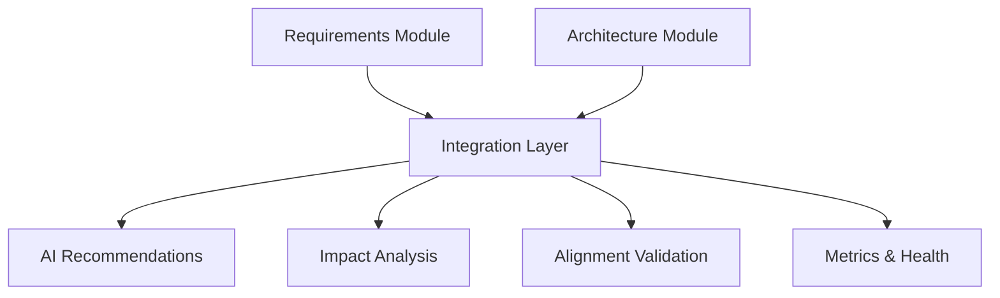

# LANKA API Documentation

## Overview

Welcome to the comprehensive API documentation for LANKA - the Revolutionary Graph-Based AI Development Environment. This documentation provides everything you need to integrate with LANKA's Architecture Intelligence module and its seamless integration with the Requirements module.

## 🚀 Quick Start

### 1. Get API Access
```bash
curl -X POST https://api.lanka.ai/v2/auth/register \
  -H "Content-Type: application/json" \
  -d '{"email": "your@email.com", "organization": "Your Company"}'
```

### 2. Authenticate
```bash
curl -X POST https://api.lanka.ai/v2/auth/login \
  -H "Content-Type: application/json" \
  -d '{"email": "your@email.com", "password": "your-password"}'
```

### 3. Make Your First API Call
```bash
curl -H "Authorization: Bearer YOUR_JWT_TOKEN" \
  https://api.lanka.ai/v2/health
```

## 📚 Documentation Structure

### Core Documentation

| Document | Description | Use Case |
|----------|-------------|----------|
| [**OpenAPI Specification**](./openapi.yaml) | Complete REST API reference with schemas, examples, and interactive documentation | REST API integration, code generation, testing |
| [**GraphQL Schema Guide**](./graphql-schema.md) | Comprehensive GraphQL API documentation with queries, mutations, and subscriptions | GraphQL integration, complex data queries |
| [**Integration Guide**](./integration-guide.md) | Step-by-step guide for cross-module integration scenarios | Full platform integration, workflows |
| [**Authentication Guide**](./authentication.md) | Security, authentication methods, permissions, and best practices | Authentication setup, security implementation |

### Specialized Guides

| Document | Description | Use Case |
|----------|-------------|----------|
| [**Error Handling Guide**](./error-handling.md) | Comprehensive error responses, codes, and recovery strategies | Error handling, debugging, resilience |
| [**Rate Limiting Guide**](./rate-limiting.md) | Rate limits, usage guidelines, and optimization strategies | Performance optimization, usage planning |
| [**Testing Guide**](./testing-guide.md) | Testing strategies, examples, and automation | Quality assurance, CI/CD integration |
| [**Postman Collection**](./postman-collection.json) | Ready-to-use API testing collection | Manual testing, exploration, validation |

---

## 🏗️ Architecture Intelligence Features

### Core Capabilities

- **🧠 AI-Powered Recommendations**: Generate architecture patterns and technology stack suggestions based on requirements
- **🔄 Cross-Module Integration**: Seamless bidirectional mapping between requirements and architecture decisions  
- **📊 Impact Analysis**: Analyze cascading changes across requirements and architecture components
- **🎯 Alignment Validation**: Validate and score alignment between requirements and architecture decisions
- **📈 Real-time Metrics**: Monitor integration health, coverage, and recommendation accuracy
- **🔍 Similarity Detection**: Find similar requirements and architecture patterns across projects

### Integration Points



---

## 🛠️ API Endpoints Overview

### Requirements Management
- `GET /requirements` - List and search requirements
- `POST /requirements` - Create requirement with AI analysis
- `GET /requirements/{id}/similar` - Find similar requirements
- `GET /requirements/{id}/conflicts` - Detect requirement conflicts
- `GET /requirements/{id}/impact` - Analyze requirement change impact

### Architecture Intelligence
- `GET /architecture/decisions` - List architecture decisions
- `POST /architecture/decisions` - Create architecture decision records
- `GET /architecture/patterns` - Browse architecture patterns
- `GET /architecture/technology-stacks` - Explore technology stacks

### Cross-Module Integration
- `GET /integration/recommendations/{id}` - Generate AI recommendations
- `POST /integration/mappings` - Create requirement-architecture mappings
- `POST /integration/validation` - Validate alignment between modules
- `GET /integration/metrics` - Get integration health metrics
- `GET /integration/health` - Perform comprehensive health checks

### Advanced Features
- `GET /search` - Cross-module intelligent search
- `POST /graphql` - GraphQL endpoint for complex queries
- `WebSocket /ws` - Real-time updates and notifications

---

## 📋 Common Use Cases

### 1. Requirements-Driven Architecture
```javascript
// Create requirement
const requirement = await api.post('/requirements', {
  title: "User Authentication System",
  description: "Secure authentication with MFA support",
  type: "FUNCTIONAL"
});

// Generate architecture recommendations
const recommendations = await api.get(
  `/integration/recommendations/${requirement.id}`
);

// Create architecture decision based on recommendations
const decision = await api.post('/architecture/decisions', {
  title: "OAuth 2.0 + JWT Architecture",
  rationale: recommendations.reasoning[0],
  requirementIds: [requirement.id]
});
```

### 2. Impact Analysis Workflow
```javascript
// Analyze impact of requirement changes
const impact = await api.get(`/requirements/${reqId}/impact`);

console.log(`Change complexity: ${impact.changeComplexity}`);
console.log(`Affected decisions: ${impact.impactedArchitectureDecisions.length}`);
console.log(`Estimated effort: ${impact.estimatedEffort} hours`);
```

### 3. Cross-Module Search
```javascript
// Search across requirements and architecture
const results = await api.get('/search', {
  params: { 
    query: "authentication security",
    type: "all"
  }
});

console.log('Requirements:', results.requirements.length);
console.log('Architecture Decisions:', results.architectureDecisions.length);
```

---

## 🔧 SDK and Tools

### Official SDKs

| Language | Installation | Documentation |
|----------|-------------|---------------|
| **JavaScript/Node.js** | `npm install lanka-sdk` | [JS SDK Guide](./sdks/javascript.md) |
| **Python** | `pip install lanka-python-sdk` | [Python SDK Guide](./sdks/python.md) |
| **Java** | `maven: com.lanka:lanka-java-sdk` | [Java SDK Guide](./sdks/java.md) |
| **C#** | `NuGet: Lanka.SDK` | [C# SDK Guide](./sdks/csharp.md) |

### Development Tools

- **[Postman Collection](./postman-collection.json)** - Ready-to-use API testing collection
- **[OpenAPI Generator](https://openapi-generator.tech)** - Generate client SDKs from OpenAPI spec
- **[GraphQL Playground](https://api.lanka.ai/v2/graphql)** - Interactive GraphQL explorer
- **[API Explorer](https://docs.lanka.ai/explorer)** - Interactive REST API documentation

---

## 📊 Rate Limits & Plans

### Free Tier
- 1,000 requests/hour
- 10,000 requests/month  
- Basic AI recommendations
- Community support

### Professional Tier
- 5,000 requests/hour
- 500,000 requests/month
- Advanced AI features
- Priority support

### Enterprise Tier
- 20,000 requests/hour
- Custom limits available
- Dedicated resources
- 24/7 support & SLA

[View detailed rate limiting guide →](./rate-limiting.md)

---

## 🔒 Security & Compliance

### Security Features
- **JWT-based Authentication** with refresh token rotation
- **Role-based Access Control (RBAC)** with granular permissions  
- **API Key Management** with IP whitelisting
- **Request Signing** for high-security scenarios
- **Rate Limiting** and DDoS protection

### Compliance Standards
- **SOC 2 Type II** certified
- **ISO 27001** compliant  
- **GDPR** compliant data processing
- **HIPAA** ready for healthcare implementations

[View authentication guide →](./authentication.md)

---

## 📈 Monitoring & Analytics

### Built-in Metrics
```javascript
// Get integration health metrics
const health = await api.get('/integration/health');
console.log(`Status: ${health.status}`);
console.log(`Mapping coverage: ${health.metrics.validationCoverage * 100}%`);

// Get usage analytics  
const metrics = await api.get('/integration/metrics');
console.log(`Requirements mapped: ${metrics.mappedRequirements}/${metrics.totalRequirements}`);
```

### Available Metrics
- **Request Performance** - Response times, throughput, error rates
- **Integration Health** - Mapping coverage, validation status, recommendation accuracy
- **Usage Analytics** - API consumption patterns, feature adoption
- **Business Metrics** - Requirements completion, architecture decision effectiveness

---

## 🚀 Performance Optimization

### Best Practices

1. **Batch Operations**
   ```javascript
   // ✅ Good: Batch multiple requirements
   const requirements = await api.post('/requirements/batch', { ids: [id1, id2, id3] });
   
   // ❌ Bad: Multiple individual requests  
   const req1 = await api.get(`/requirements/${id1}`);
   const req2 = await api.get(`/requirements/${id2}`);
   ```

2. **Efficient Pagination**
   ```javascript
   // Optimal batch size for performance
   const requirements = await api.get('/requirements?limit=100&offset=0');
   ```

3. **GraphQL Field Selection**
   ```graphql
   # ✅ Request only needed fields
   query GetRequirements {
     requirements(limit: 20) {
       id
       title
       status
     }
   }
   ```

4. **Caching Strategy**
   ```javascript
   // Cache frequently accessed data
   const cachedPatterns = await cache.get('architecture-patterns', async () => {
     return api.get('/architecture/patterns');
   }, 300000); // 5 minute TTL
   ```

---

## 🔄 Real-time Updates

### WebSocket Integration
```javascript
const ws = new WebSocket('wss://api.lanka.ai/v2/ws?token=JWT_TOKEN');

ws.on('message', (event) => {
  const message = JSON.parse(event.data);
  
  switch (message.type) {
    case 'requirement.updated':
      handleRequirementUpdate(message.data);
      break;
    case 'recommendation.generated':  
      handleNewRecommendation(message.data);
      break;
    case 'mapping.validated':
      handleMappingValidation(message.data);
      break;
  }
});
```

### Webhook Support
```javascript
// Register webhook for requirement changes
await api.post('/webhooks/register', {
  url: 'https://yourapp.com/lanka-webhook',
  events: ['requirement.created', 'architecture.decision.updated'],
  secret: 'webhook-secret-key'
});
```

---

## 🆘 Support & Community

### Getting Help

- **📖 Documentation**: [https://docs.lanka.ai](https://docs.lanka.ai)
- **💬 Community Forum**: [https://community.lanka.ai](https://community.lanka.ai)  
- **🐛 Bug Reports**: [https://github.com/lanka-ai/api-issues](https://github.com/lanka-ai/api-issues)
- **📧 Support Email**: [support@lanka.ai](mailto:support@lanka.ai)

### Response Times
- **Free Tier**: Community support (best effort)
- **Professional**: < 24 hours business days
- **Enterprise**: < 4 hours with dedicated support engineer

### Status & Uptime
- **Status Page**: [https://status.lanka.ai](https://status.lanka.ai)
- **SLA**: 99.9% uptime (Enterprise tier)
- **Maintenance Window**: Saturdays 2-4 AM UTC (announced 48h in advance)

---

## 🔮 Roadmap & Updates

### Coming Soon
- **Multi-language NLP** support for requirements analysis
- **Advanced ML models** for pattern recognition  
- **Custom workflow** automation
- **Enhanced GraphQL** subscriptions
- **Terraform provider** for infrastructure-as-code

### Recent Updates
- **v2.1.0** - Enhanced AI recommendation accuracy by 23%
- **v2.0.5** - Added batch operations for improved performance
- **v2.0.0** - Major release with Architecture Intelligence integration

[View complete changelog →](./CHANGELOG.md)

---

## 🏁 Next Steps

1. **[Explore the OpenAPI Specification](./openapi.yaml)** - Complete REST API reference
2. **[Try the Postman Collection](./postman-collection.json)** - Hands-on API exploration  
3. **[Follow the Integration Guide](./integration-guide.md)** - Build your first integration
4. **[Set up Authentication](./authentication.md)** - Secure your API access
5. **[Join the Community](https://community.lanka.ai)** - Connect with other developers

---

*For technical questions or feedback, reach out to our developer support team at [developers@lanka.ai](mailto:developers@lanka.ai)*