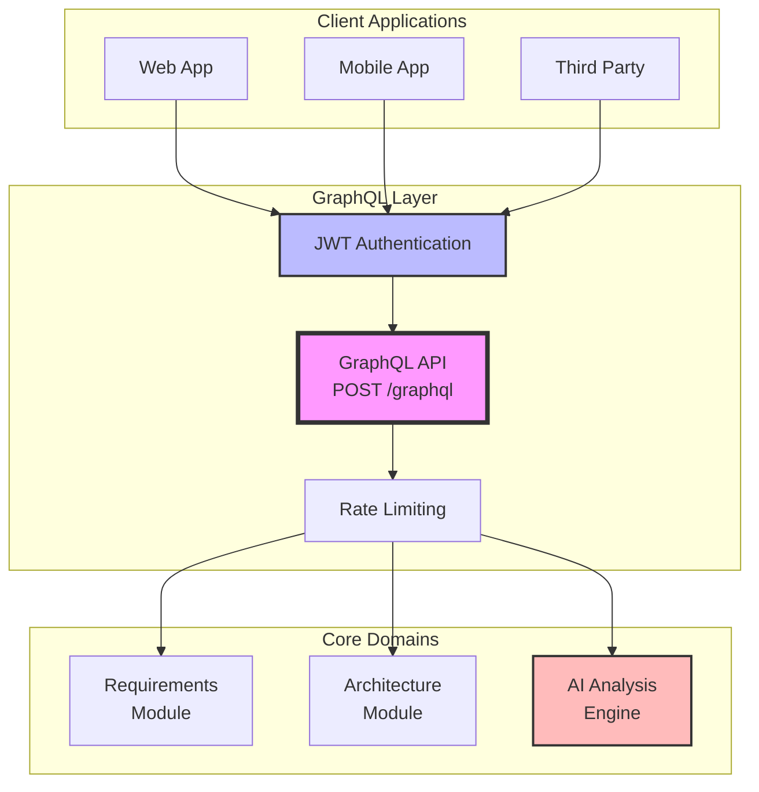
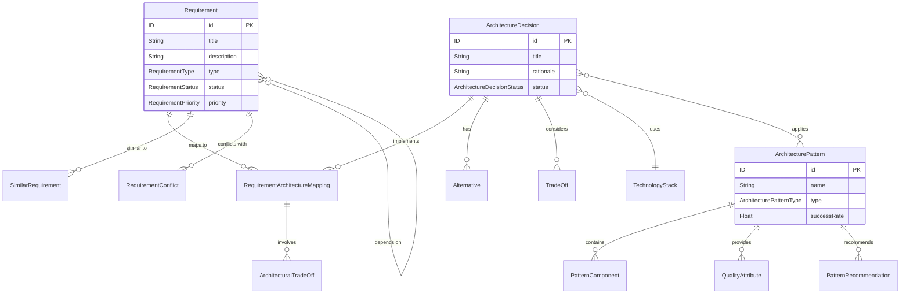
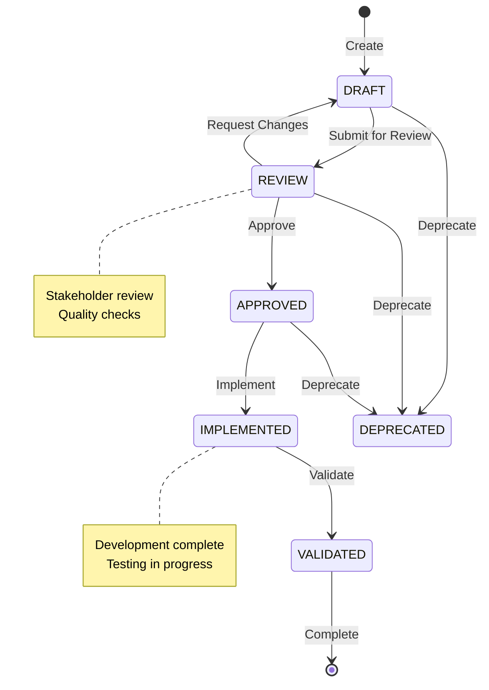
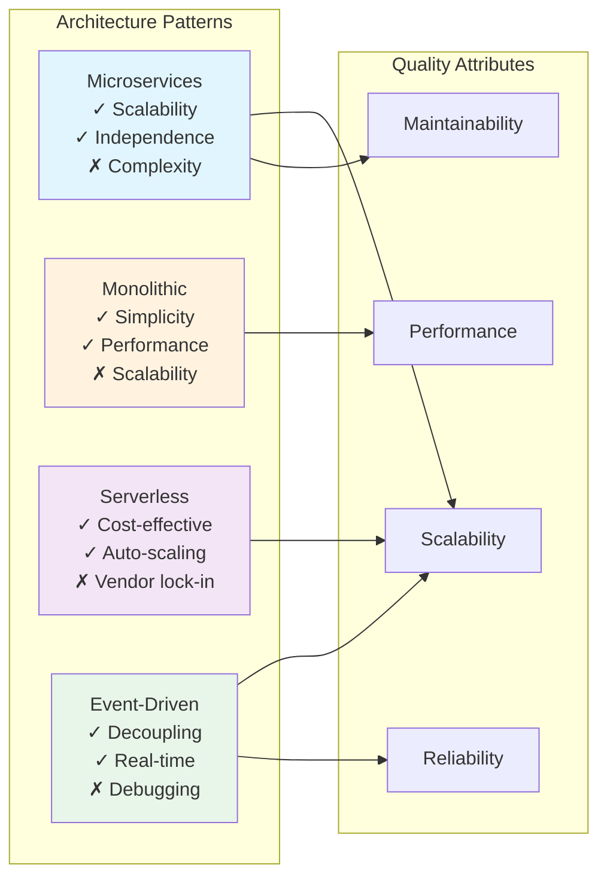
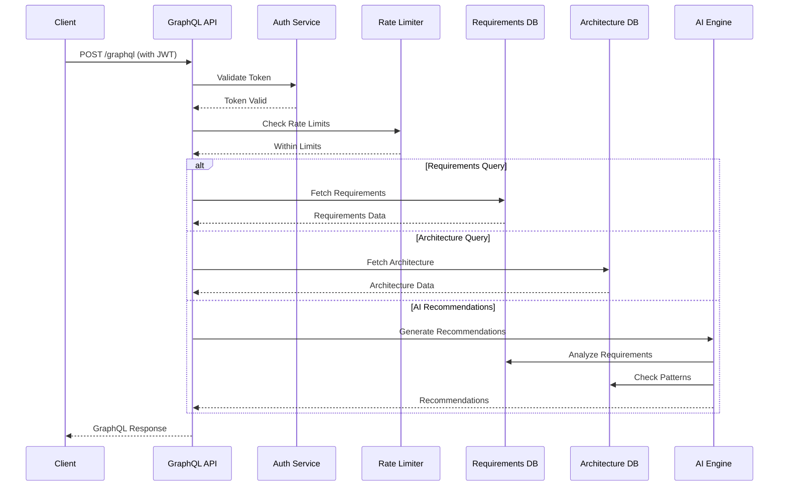
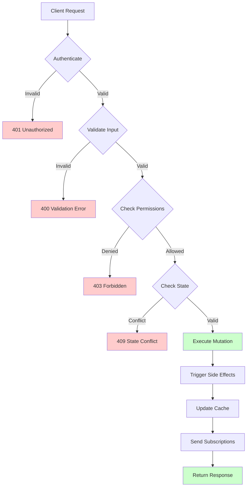
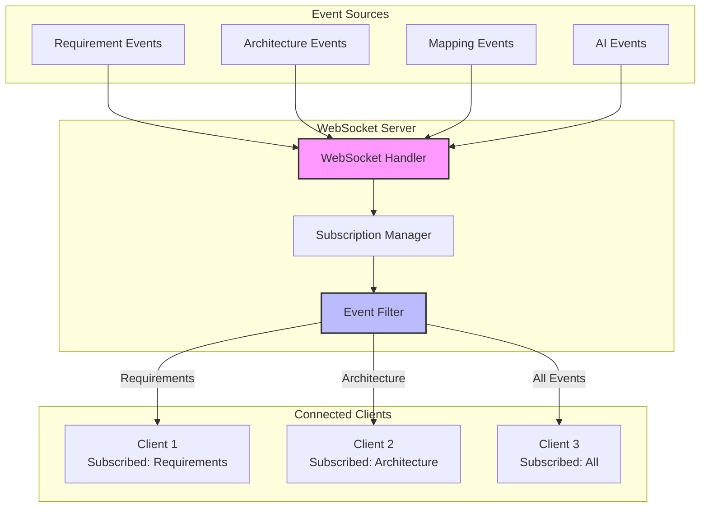
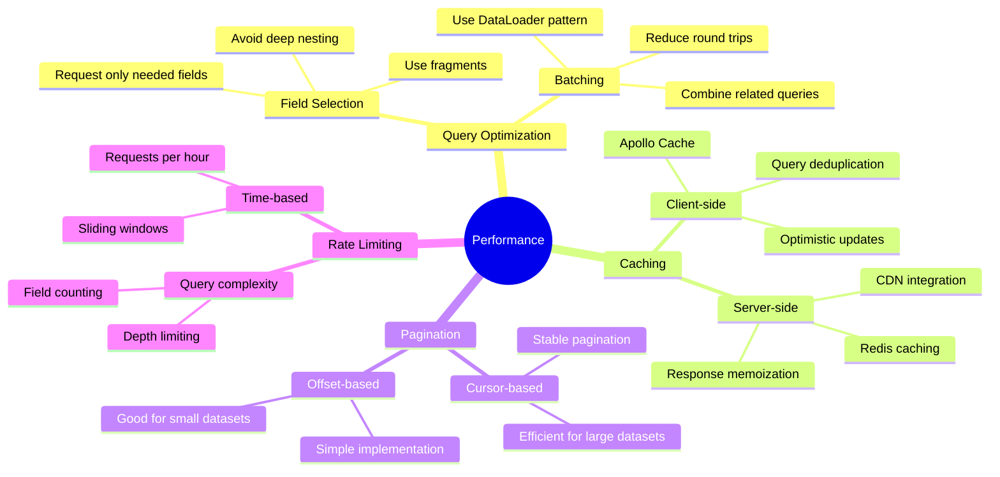
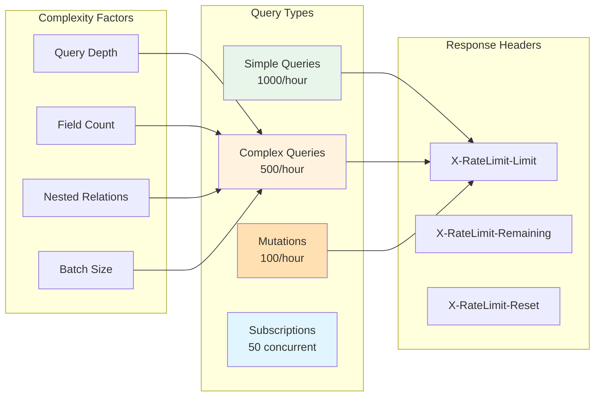

# LANKA GraphQL API Schema Documentation

## Overview

The LANKA GraphQL API provides a powerful, flexible interface for querying requirements and architecture data with rich relationship traversal capabilities. The schema supports both standalone operations and cross-module integration queries.



## Endpoint

```
POST /graphql
Content-Type: application/json
Authorization: Bearer <your-jwt-token>
```

## Schema Features

- **Type Safety**: Strongly typed schema with comprehensive validation
- **Rich Relations**: Deep relationship traversal between requirements and architecture
- **Real-time Updates**: Subscription support for live data updates
- **Cross-Module Queries**: Unified queries across requirements and architecture domains
- **AI Integration**: Built-in AI recommendations and analysis
- **Batch Operations**: Efficient batch mutations for bulk operations

---

## Core Types

### Type Relationships Overview



### Requirement

```graphql
type Requirement {
  id: ID!
  title: String!
  description: String!
  type: RequirementType!
  status: RequirementStatus!
  priority: RequirementPriority
  createdAt: Date!
  updatedAt: Date
  project: Project
  stakeholder: Stakeholder
  completenessScore: Float
  qualityScore: Float
  acceptanceCriteria: [String]
  businessValue: String
  dependencies: [Requirement]
  similarRequirements: [SimilarRequirement]
  conflicts: [RequirementConflict]
}

enum RequirementType {
  BUSINESS
  FUNCTIONAL
  NON_FUNCTIONAL
  USER_STORY
  ACCEPTANCE_CRITERIA
  BUSINESS_RULE
  COMPLIANCE
}

enum RequirementStatus {
  DRAFT
  REVIEW
  APPROVED
  IMPLEMENTED
  VALIDATED
  DEPRECATED
}

enum RequirementPriority {
  CRITICAL
  HIGH
  MEDIUM
  LOW
}
```

#### Requirement Lifecycle Flow



### Architecture Decision

```graphql
type ArchitectureDecision {
  id: ID!
  title: String!
  description: String!
  rationale: String!
  status: ArchitectureDecisionStatus!
  alternatives: [Alternative!]!
  consequences: [String!]!
  tradeOffs: [TradeOff!]!
  createdAt: Date!
  updatedAt: Date
  approvedAt: Date
  deprecatedAt: Date
  project: Project
  requirements: [Requirement!]!
  patterns: [ArchitecturePattern!]
  technologyStack: TechnologyStack
  mappings: [RequirementArchitectureMapping!]!
  alignments: [ArchitectureRequirementAlignment!]!
}

enum ArchitectureDecisionStatus {
  DRAFT
  PROPOSED
  APPROVED
  IMPLEMENTED
  DEPRECATED
  SUPERSEDED
}
```

### Architecture Pattern

```graphql
type ArchitecturePattern {
  id: ID!
  name: String!
  type: ArchitecturePatternType!
  description: String!
  applicabilityConditions: [String!]!
  components: [PatternComponent!]!
  qualityAttributes: [QualityAttribute!]!
  knownUses: [String!]!
  successRate: Float!
  adoptionCount: Int!
  createdAt: Date!
  updatedAt: Date
  decisions: [ArchitectureDecision!]!
  recommendations: [PatternRecommendation!]!
}

enum ArchitecturePatternType {
  MICROSERVICES
  MONOLITHIC
  SERVERLESS
  EVENT_DRIVEN
  LAYERED
  HEXAGONAL
  CQRS
  SAGA
}
```

#### Architecture Pattern Comparison



### Integration Types

```graphql
type RequirementArchitectureMapping {
  id: ID!
  requirement: Requirement!
  architectureDecision: ArchitectureDecision
  architecturePattern: ArchitecturePattern
  technologyStack: TechnologyStack
  mappingType: RequirementMappingType!
  confidence: Float!
  rationale: String!
  implementationGuidance: String
  tradeOffs: [ArchitecturalTradeOff!]
  createdAt: Date!
  updatedAt: Date
  validatedAt: Date
  validatedBy: String
}

enum RequirementMappingType {
  DIRECT
  DERIVED
  INFLUENCED
  CONSTRAINT
  QUALITY_ATTRIBUTE
}
```

---

## Query Examples

### Query Flow Visualization



### 1. Basic Requirement Query

```graphql
query GetRequirement($id: ID!) {
  requirement(id: $id) {
    id
    title
    description
    type
    status
    priority
    completenessScore
    qualityScore
    acceptanceCriteria
    businessValue
    createdAt
    updatedAt
    project {
      id
      name
      description
    }
    stakeholder {
      id
      name
      email
      role
    }
  }
}
```

**Variables:**
```json
{
  "id": "req-123e4567-e89b-12d3-a456-426614174000"
}
```

**Response:**
```json
{
  "data": {
    "requirement": {
      "id": "req-123e4567-e89b-12d3-a456-426614174000",
      "title": "User Authentication System",
      "description": "Implement secure user authentication with multi-factor support",
      "type": "FUNCTIONAL",
      "status": "APPROVED",
      "priority": "HIGH",
      "completenessScore": 0.85,
      "qualityScore": 0.92,
      "acceptanceCriteria": [
        "Support email/password login",
        "Implement 2FA options",
        "Session management",
        "Password reset functionality"
      ],
      "businessValue": "Enable secure access to platform features",
      "createdAt": "2024-01-10T09:00:00Z",
      "updatedAt": "2024-01-12T14:30:00Z",
      "project": {
        "id": "proj-123",
        "name": "E-commerce Platform",
        "description": "Modern e-commerce solution"
      },
      "stakeholder": {
        "id": "user-456",
        "name": "John Product Manager",
        "email": "john@company.com",
        "role": "Product Manager"
      }
    }
  }
}
```

### 2. Requirements with Similar Requirements

```graphql
query GetRequirementWithSimilar($id: ID!) {
  requirement(id: $id) {
    id
    title
    description
    similarRequirements {
      requirement {
        id
        title
        description
        project {
          name
        }
      }
      similarity
      projectName
      successMetrics {
        implementationTime
        defectRate
        stakeholderSatisfaction
      }
      adaptationGuidelines
    }
  }
}
```

### 3. Architecture Decision with Related Requirements

```graphql
query GetArchitectureDecision($id: ID!) {
  architectureDecision(id: $id) {
    id
    title
    description
    rationale
    status
    alternatives {
      title
      description
      pros
      cons
      rejectionReason
    }
    consequences
    tradeOffs {
      aspect
      gain
      loss
      mitigation
    }
    requirements {
      id
      title
      type
      priority
    }
    patterns {
      id
      name
      type
      successRate
    }
    technologyStack {
      id
      name
      description
      performanceMetrics {
        throughput
        latency
        scalability
        reliability
      }
    }
    createdAt
    approvedAt
  }
}
```

### 4. Cross-Module Integration Query

```graphql
query GetRequirementArchitectureMapping($requirementId: ID!) {
  requirement(id: $requirementId) {
    id
    title
    description
    type
  }
  
  requirementArchitectureMappings(requirementId: $requirementId) {
    id
    mappingType
    confidence
    rationale
    implementationGuidance
    architectureDecision {
      id
      title
      status
      rationale
    }
    architecturePattern {
      id
      name
      type
      applicabilityConditions
    }
    technologyStack {
      id
      name
      layers {
        name
        purpose
        technologies {
          name
          version
          maturity
        }
      }
    }
    tradeOffs {
      aspect
      benefit
      cost
      riskLevel
      mitigationStrategy
    }
    createdAt
    validatedAt
    validatedBy
  }
}
```

### 5. AI-Powered Recommendations

```graphql
query GetArchitectureRecommendations($requirementId: ID!) {
  generateArchitectureRecommendations(requirementId: $requirementId) {
    confidence
    reasoning
    recommendedPatterns {
      pattern {
        id
        name
        type
        description
      }
      applicabilityScore
      benefits
      risks
      implementationComplexity
      prerequisites
    }
    recommendedTechnologies {
      technologyStack {
        id
        name
        description
      }
      suitabilityScore
      alignmentReason
      implementationEffort
      learningCurveImpact
      riskFactors
    }
    architecturalConstraints {
      type
      description
      impact
      mandatory
      validationCriteria
    }
    implementationStrategy {
      approach
      phases {
        name
        description
        estimatedDuration
        deliverables
        dependencies
      }
      estimatedEffort
      timeline
    }
    alternativeApproaches {
      name
      description
      patterns
      technologies
      pros
      cons
      suitabilityConditions
    }
  }
}
```

### 6. Impact Analysis Query

```graphql
query AnalyzeRequirementImpact($requirementId: ID!) {
  analyzeRequirementImpact(requirementId: $requirementId) {
    changeComplexity
    estimatedEffort
    impactedArchitectureDecisions {
      id
      title
      status
    }
    impactedPatterns {
      id
      name
      type
    }
    impactedTechnologies {
      id
      name
    }
    cascadingChanges {
      targetType
      targetId
      changeType
      reason
      priority
    }
    riskAssessment {
      overallRisk
      riskFactors {
        category
        description
        probability
        impact
        score
      }
      mitigationStrategies
      contingencyPlan
    }
  }
}
```

### 7. Integration Metrics Query

```graphql
query GetIntegrationMetrics($projectId: ID) {
  getIntegrationMetrics(projectId: $projectId) {
    totalRequirements
    mappedRequirements
    unmappedRequirements
    averageConfidence
    alignmentDistribution
    validationCoverage
    recommendationAccuracy
    implementationProgress
  }
  
  performIntegrationHealthCheck {
    status
    lastChecked
    issues {
      type
      description
      severity
      affectedItems
      suggestedActions
    }
    recommendations
  }
}
```

### 8. Complex Search Query

```graphql
query SearchArchitectureByRequirement(
  $requirementId: ID!,
  $includePatterns: Boolean = true,
  $includeTechnologies: Boolean = true
) {
  searchArchitectureByRequirement(
    requirementId: $requirementId,
    includePatterns: $includePatterns,
    includeTechnologies: $includeTechnologies
  ) {
    id
    title
    description
    status
    rationale
    patterns @include(if: $includePatterns) {
      id
      name
      type
      successRate
    }
    technologyStack @include(if: $includeTechnologies) {
      id
      name
      teamExpertise
      costEstimate {
        monthly
        yearly
        currency
      }
    }
  }
  
  searchRequirementsByArchitecture(
    architectureDecisionId: $requirementId,
    includeRelated: true
  ) {
    id
    title
    type
    priority
    status
    completenessScore
  }
}
```

---

## Mutation Examples

### Mutation Operation Flow



### 1. Create Requirement

```graphql
mutation CreateRequirement($input: CreateRequirementInput!) {
  createRequirement(input: $input) {
    id
    title
    description
    type
    status
    priority
    completenessScore
    qualityScore
    acceptanceCriteria
    businessValue
    createdAt
    project {
      id
      name
    }
    stakeholder {
      id
      name
    }
  }
}
```

**Variables:**
```json
{
  "input": {
    "title": "Payment Processing Integration",
    "description": "The system must integrate with Stripe and PayPal to process customer payments securely with PCI compliance",
    "type": "FUNCTIONAL",
    "priority": "HIGH",
    "projectId": "proj-123e4567-e89b-12d3-a456-426614174000",
    "stakeholderId": "user-456e4567-e89b-12d3-a456-426614174000",
    "acceptanceCriteria": [
      "Support Stripe and PayPal payment methods",
      "Implement PCI DSS compliance",
      "Handle payment failures gracefully",
      "Generate payment receipts"
    ],
    "businessValue": "Enable secure payment processing to increase customer conversion rates"
  }
}
```

### 2. Create Architecture Decision

```graphql
mutation CreateArchitectureDecision($input: CreateArchitectureDecisionInput!) {
  createArchitectureDecision(input: $input) {
    id
    title
    description
    rationale
    status
    alternatives {
      title
      description
      pros
      cons
      rejectionReason
    }
    consequences
    tradeOffs {
      aspect
      gain
      loss
      mitigation
    }
    requirements {
      id
      title
    }
    createdAt
  }
}
```

**Variables:**
```json
{
  "input": {
    "title": "Microservices Architecture for Payment System",
    "description": "Implement payment processing as separate microservices for scalability and maintainability",
    "rationale": "Separate payment processing allows for independent scaling, better fault isolation, and compliance boundary management",
    "requirementIds": ["req-123e4567-e89b-12d3-a456-426614174000"],
    "patternIds": ["pattern-microservices-001"],
    "technologyStackId": "tech-node-docker-k8s-001",
    "alternatives": [
      {
        "title": "Monolithic Integration",
        "description": "Integrate payment processing directly into main application",
        "pros": ["Simpler deployment", "Fewer network calls"],
        "cons": ["Tight coupling", "Harder to scale", "Compliance complexity"],
        "rejectionReason": "Does not provide required isolation for PCI compliance"
      }
    ],
    "consequences": [
      "Increased system complexity",
      "Better scalability for payment operations",
      "Clearer compliance boundaries",
      "Additional operational overhead"
    ],
    "tradeOffs": [
      {
        "aspect": "Complexity vs Scalability",
        "gain": "Independent scaling and fault isolation",
        "loss": "Increased system complexity and operational overhead",
        "mitigation": "Implement comprehensive monitoring and automated deployment pipelines"
      }
    ]
  }
}
```

### 3. Create Requirement-Architecture Mapping

```graphql
mutation CreateMapping($input: CreateMappingInput!) {
  createRequirementArchitectureMapping(input: $input) {
    id
    requirement {
      id
      title
    }
    architectureDecision {
      id
      title
    }
    mappingType
    confidence
    rationale
    implementationGuidance
    tradeOffs {
      aspect
      benefit
      cost
      riskLevel
      mitigationStrategy
    }
    createdAt
  }
}
```

**Variables:**
```json
{
  "input": {
    "requirementId": "req-123e4567-e89b-12d3-a456-426614174000",
    "architectureDecisionId": "arch-456e4567-e89b-12d3-a456-426614174000",
    "mappingType": "DIRECT",
    "confidence": 0.92,
    "rationale": "Payment processing requirement directly drives the microservices architecture decision for better compliance isolation",
    "implementationGuidance": "Implement payment service as separate microservice with dedicated database, API gateway integration, and compliance monitoring"
  }
}
```

### 4. Batch Create Mappings

```graphql
mutation BatchCreateMappings($mappings: [CreateMappingInput!]!) {
  batchCreateMappings(mappings: $mappings) {
    id
    requirement {
      id
      title
    }
    architectureDecision {
      id
      title
    }
    mappingType
    confidence
    rationale
    createdAt
  }
}
```

### 5. Update Requirement

```graphql
mutation UpdateRequirement($id: ID!, $input: UpdateRequirementInput!) {
  updateRequirement(id: $id, input: $input) {
    id
    title
    description
    type
    status
    priority
    acceptanceCriteria
    businessValue
    updatedAt
  }
}
```

### 6. Validate Mapping

```graphql
mutation ValidateMapping($id: ID!, $validated: Boolean!, $validatorId: ID!, $notes: String) {
  validateMapping(
    id: $id, 
    validated: $validated, 
    validatorId: $validatorId, 
    notes: $notes
  ) {
    id
    requirement {
      id
      title
    }
    architectureDecision {
      id
      title
    }
    validatedAt
    validatedBy
  }
}
```

---

## Subscription Examples

### Real-time Event Flow



### 1. Architecture Decision Updates

```graphql
subscription ArchitectureDecisionUpdates($projectId: ID!) {
  architectureDecisionCreated(projectId: $projectId) {
    id
    title
    description
    status
    createdAt
    requirements {
      id
      title
    }
  }
  
  architectureDecisionUpdated(projectId: $projectId) {
    id
    title
    status
    updatedAt
  }
}
```

### 2. Mapping Events

```graphql
subscription MappingEvents($requirementId: ID) {
  mappingCreated(requirementId: $requirementId) {
    id
    requirement {
      id
      title
    }
    architectureDecision {
      id
      title
    }
    mappingType
    confidence
    createdAt
  }
  
  mappingValidated(requirementId: $requirementId) {
    id
    validatedAt
    validatedBy
  }
}
```

### 3. Recommendation Updates

```graphql
subscription RecommendationUpdates($requirementId: ID!) {
  recommendationGenerated(requirementId: $requirementId) {
    confidence
    reasoning
    recommendedPatterns {
      pattern {
        name
        type
      }
      applicabilityScore
    }
    recommendedTechnologies {
      technologyStack {
        name
      }
      suitabilityScore
    }
  }
}
```

### 4. Integration Health Monitoring

```graphql
subscription IntegrationHealthUpdates {
  integrationHealthUpdated {
    status
    lastChecked
    issues {
      type
      description
      severity
    }
    metrics {
      totalRequirements
      mappedRequirements
      averageConfidence
    }
    recommendations
  }
}
```

---

## Error Handling

### GraphQL Error Format

```json
{
  "errors": [
    {
      "message": "Requirement not found",
      "locations": [
        {
          "line": 2,
          "column": 3
        }
      ],
      "path": ["requirement"],
      "extensions": {
        "code": "RESOURCE_NOT_FOUND",
        "resourceType": "Requirement",
        "resourceId": "req-invalid-id",
        "timestamp": "2024-01-15T10:30:00Z",
        "requestId": "req-123e4567-e89b-12d3-a456-426614174000"
      }
    }
  ],
  "data": {
    "requirement": null
  }
}
```

### Common Error Codes

- `AUTHENTICATION_REQUIRED` - Authentication token missing
- `ACCESS_DENIED` - Insufficient permissions
- `RESOURCE_NOT_FOUND` - Requested resource doesn't exist
- `VALIDATION_ERROR` - Input validation failed
- `STATE_CONFLICT` - Operation conflicts with current state
- `RATE_LIMIT_EXCEEDED` - Too many requests
- `INTERNAL_SERVER_ERROR` - Unexpected server error

---

## Best Practices

### Performance Optimization Strategy



### 1. Query Optimization

```graphql
# Good: Request only needed fields
query GetRequirements {
  requirements(limit: 20) {
    id
    title
    status
    priority
  }
}

# Avoid: Requesting unnecessary nested data
query GetRequirements {
  requirements(limit: 20) {
    id
    title
    status
    priority
    project {
      id
      name
      description
      requirements {
        # This creates N+1 queries
        id
        title
      }
    }
  }
}
```

### 2. Using Fragments

```graphql
fragment RequirementSummary on Requirement {
  id
  title
  description
  type
  status
  priority
  completenessScore
  qualityScore
  createdAt
  updatedAt
}

fragment ProjectInfo on Project {
  id
  name
  description
}

query GetRequirement($id: ID!) {
  requirement(id: $id) {
    ...RequirementSummary
    project {
      ...ProjectInfo
    }
    similarRequirements {
      requirement {
        ...RequirementSummary
      }
      similarity
      projectName
    }
  }
}
```

### 3. Pagination

```graphql
query GetRequirementsPaginated($limit: Int!, $offset: Int!) {
  requirements(limit: $limit, offset: $offset) {
    id
    title
    status
    priority
    createdAt
  }
}
```

### 4. Error Handling in Client

```javascript
const client = new ApolloClient({
  uri: 'https://api.lanka.ai/graphql',
  headers: {
    Authorization: `Bearer ${token}`
  },
  errorPolicy: 'all' // Return both data and errors
});

const { data, error, loading } = useQuery(GET_REQUIREMENT, {
  variables: { id: requirementId },
  onError: (error) => {
    // Handle GraphQL errors
    if (error.graphQLErrors.length > 0) {
      error.graphQLErrors.forEach(({ message, extensions }) => {
        if (extensions.code === 'RESOURCE_NOT_FOUND') {
          // Handle not found
        } else if (extensions.code === 'ACCESS_DENIED') {
          // Handle permission error
        }
      });
    }
    
    // Handle network errors
    if (error.networkError) {
      console.error('Network error:', error.networkError);
    }
  }
});
```

---

## Rate Limiting

### Rate Limit Tiers



GraphQL queries are rate-limited based on query complexity and depth:

- **Simple queries**: 1000 requests/hour
- **Complex queries**: 500 requests/hour
- **Mutations**: 100 requests/hour
- **Subscriptions**: 50 concurrent connections

Rate limit headers are returned in the response:
- `X-RateLimit-Limit`
- `X-RateLimit-Remaining`
- `X-RateLimit-Reset`

---

## Authentication

All GraphQL requests require JWT authentication:

```javascript
const headers = {
  'Authorization': 'Bearer your-jwt-token',
  'Content-Type': 'application/json'
};

fetch('https://api.lanka.ai/graphql', {
  method: 'POST',
  headers,
  body: JSON.stringify({
    query: `
      query GetRequirement($id: ID!) {
        requirement(id: $id) {
          id
          title
          description
        }
      }
    `,
    variables: { id: 'req-123' }
  })
});
```

For more information on authentication, see the [Authentication Guide](./authentication.md).