# LANKA System Architecture
## Enterprise-Grade Intelligent Software Development Lifecycle Platform

---

## Table of Contents

1. [Executive Summary](#1-executive-summary)
2. [System Overview](#2-system-overview)
3. [Core Architecture Components](#3-core-architecture-components)
4. [Data Flow Architecture](#4-data-flow-architecture)
5. [Module Deep Dives](#5-module-deep-dives)
6. [Technology Stack](#6-technology-stack)
7. [API Architecture](#7-api-architecture)
8. [Security Architecture](#8-security-architecture)
9. [Deployment Architecture](#9-deployment-architecture)
10. [Integration Patterns](#10-integration-patterns)
11. [Performance & Scalability](#11-performance--scalability)
12. [Monitoring & Observability](#12-monitoring--observability)
13. [Development Guidelines](#13-development-guidelines)
14. [Troubleshooting Guide](#14-troubleshooting-guide)
15. [Implementation Roadmap](#15-implementation-roadmap)

---

## 1. Executive Summary

### 1.1 Vision Statement

LANKA transforms traditional software development by creating an intelligent, graph-based knowledge ecosystem that captures, connects, and leverages organizational knowledge across the entire SDLC. Unlike traditional tools that operate in silos, LANKA creates a unified intelligence layer that learns from every project, requirement, and line of code.

### 1.2 Core Value Propositions

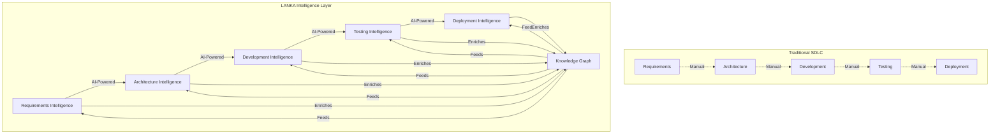

### 1.3 Key Differentiators

| Aspect | Traditional Tools | LANKA Platform |
|--------|------------------|----------------|
| **Knowledge Management** | File-based, siloed | Graph-based, interconnected |
| **Intelligence** | Rule-based automation | AI-powered insights |
| **Learning** | Manual processes | Continuous self-improvement |
| **Reusability** | Copy-paste patterns | Intelligent knowledge transfer |
| **Traceability** | Manual documentation | Automatic relationship mapping |
| **Scale** | Linear complexity | Logarithmic efficiency gains |

---

## 2. System Overview

### 2.1 High-Level Architecture

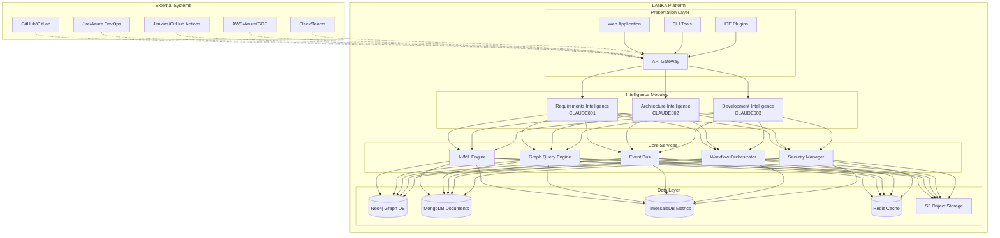

### 2.2 Component Interaction Flow

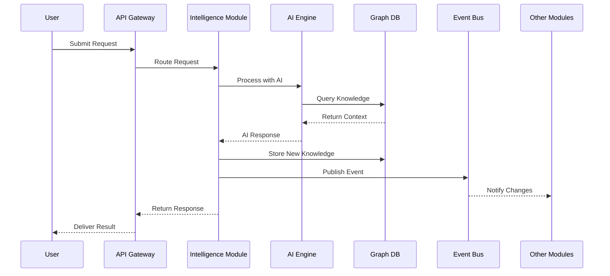

---

## 3. Core Architecture Components

### 3.1 Intelligence Modules

#### 3.1.1 Requirements Intelligence (CLAUDE001)

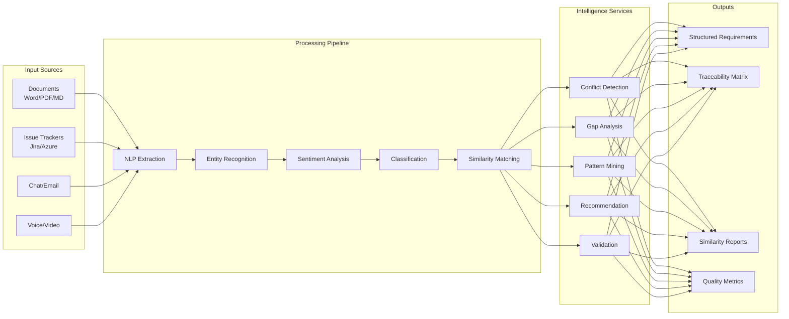

**Key Capabilities:**
- **Natural Language Processing**: Extracts structured requirements from unstructured text using transformer models
- **Semantic Analysis**: Understands context and meaning beyond keywords
- **Cross-Project Learning**: Identifies patterns across all organizational projects
- **Stakeholder Collaboration**: Real-time collaboration with conflict resolution
- **Automated Validation**: Ensures completeness, consistency, and feasibility

#### 3.1.2 Architecture Intelligence (CLAUDE002)

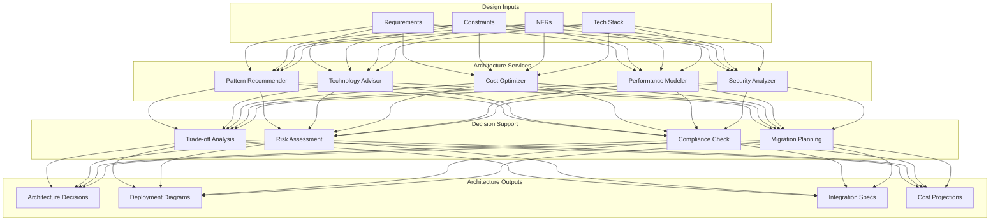

**Key Capabilities:**
- **Pattern Library**: Maintains and recommends proven architecture patterns
- **Multi-Cloud Optimization**: Optimizes deployments across cloud providers
- **Performance Modeling**: Simulates architecture performance under various loads
- **Cost Analysis**: Projects and optimizes infrastructure costs
- **Compliance Validation**: Ensures regulatory and security compliance

#### 3.1.3 Development Intelligence (CLAUDE003)

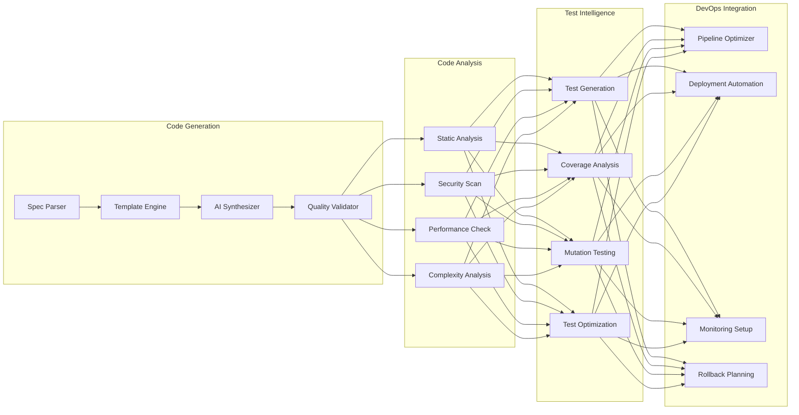

**Key Capabilities:**
- **AI Code Synthesis**: Generates production-ready code from specifications
- **Semantic Code Search**: Finds code by intent, not just text matching
- **Bug Pattern Detection**: Identifies potential issues before they occur
- **Test Generation**: Creates comprehensive test suites automatically
- **Pipeline Optimization**: Optimizes CI/CD for speed and reliability

### 3.2 Core Services Layer

#### 3.2.1 AI/ML Engine

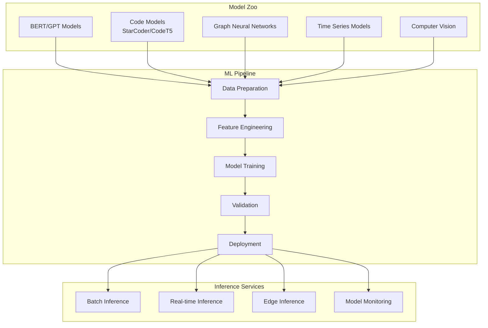

**Components:**
- **Model Management**: Version control and lifecycle management for ML models
- **Training Infrastructure**: Distributed training on GPU clusters
- **Inference Optimization**: Low-latency serving with model compression
- **Feature Store**: Centralized feature engineering and management
- **Experiment Tracking**: MLflow for reproducible experiments

#### 3.2.2 Graph Query Engine

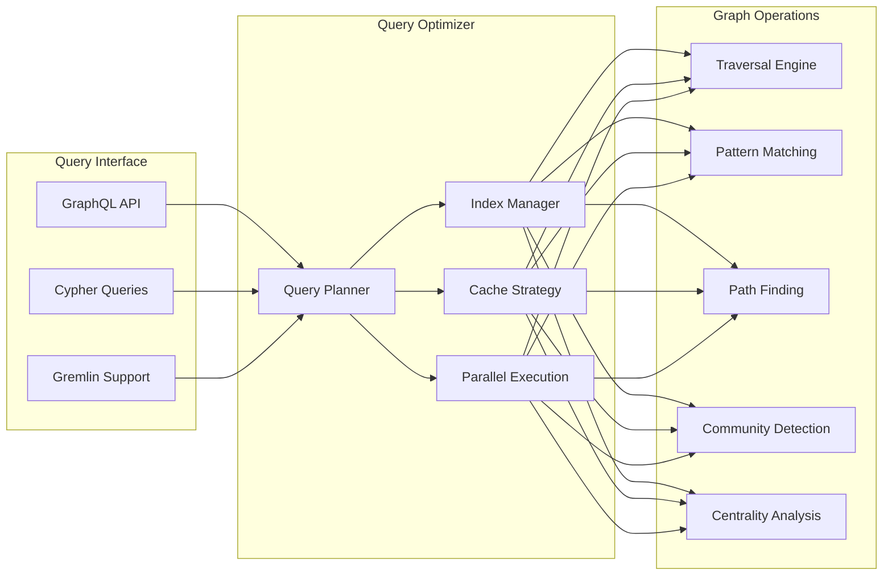

**Features:**
- **Multi-Model Support**: Supports property graphs, RDF, and hypergraphs
- **Graph Algorithms**: Built-in algorithms for pattern detection and analysis
- **Query Optimization**: Intelligent query planning and caching
- **Real-time Updates**: Supports live queries with change notifications
- **Federation**: Query across distributed graph databases

---

## 4. Data Flow Architecture

### 4.1 End-to-End Data Flow

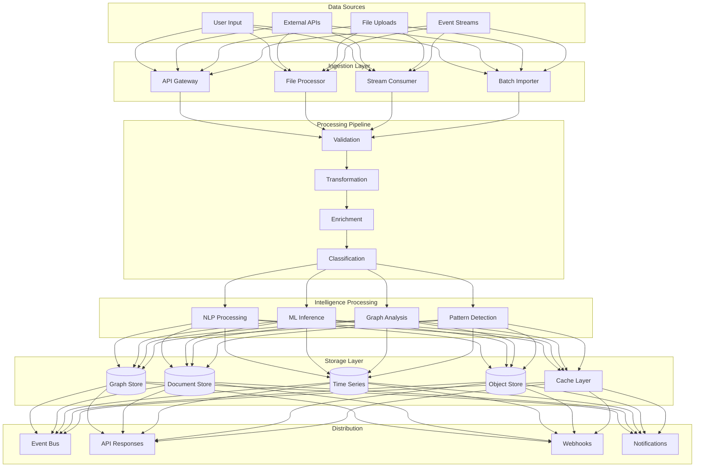

### 4.2 Real-time Event Processing

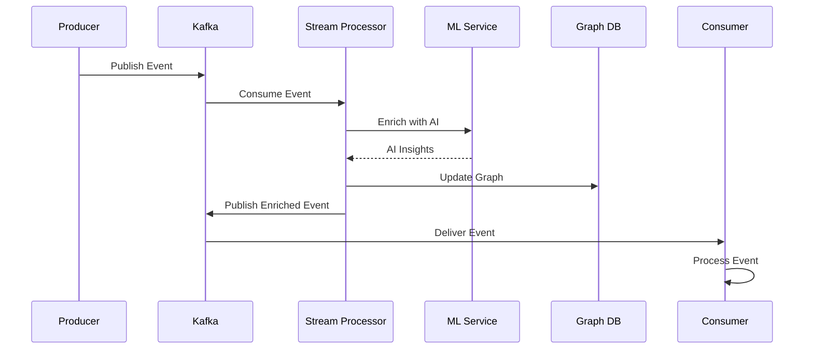

---

## 5. Module Deep Dives

### 5.1 Requirements Intelligence Module

#### 5.1.1 Component Architecture

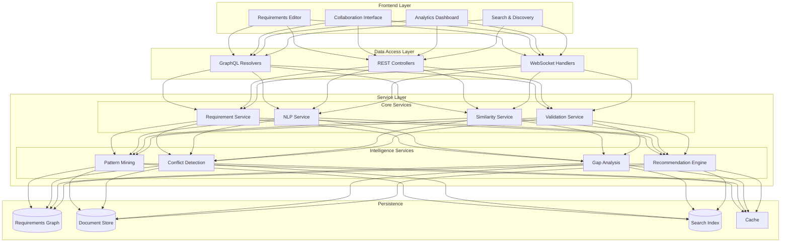

#### 5.1.2 NLP Processing Pipeline

```python
class RequirementProcessor:
    """
    Core NLP processing pipeline for requirements analysis
    """
    
    def process_requirement(self, text: str) -> RequirementEntity:
        # Step 1: Text Preprocessing
        cleaned_text = self.preprocess(text)
        
        # Step 2: Entity Extraction
        entities = self.extract_entities(cleaned_text)
        
        # Step 3: Classification
        requirement_type = self.classify(cleaned_text)
        
        # Step 4: Sentiment Analysis
        sentiment = self.analyze_sentiment(cleaned_text)
        
        # Step 5: Generate Embeddings
        embedding = self.generate_embedding(cleaned_text)
        
        # Step 6: Find Similar Requirements
        similar = self.find_similar(embedding)
        
        # Step 7: Detect Conflicts
        conflicts = self.detect_conflicts(entities, similar)
        
        # Step 8: Validate Completeness
        validation = self.validate(entities, requirement_type)
        
        return RequirementEntity(
            text=text,
            entities=entities,
            type=requirement_type,
            sentiment=sentiment,
            embedding=embedding,
            similar_requirements=similar,
            conflicts=conflicts,
            validation_status=validation
        )
```

#### 5.1.3 Graph Schema

```cypher
// Core Requirement Node
CREATE (r:Requirement {
    id: 'REQ-001',
    title: 'User Authentication',
    description: 'System shall provide secure user authentication',
    type: 'FUNCTIONAL',
    priority: 'HIGH',
    status: 'APPROVED',
    created_at: datetime(),
    embedding: [0.1, 0.2, ...], // 768-dimensional vector
    metadata: {
        source: 'JIRA-1234',
        author: 'john.doe@company.com',
        version: '1.0'
    }
})

// Relationships
CREATE (r1:Requirement)-[:DEPENDS_ON]->(r2:Requirement)
CREATE (r1:Requirement)-[:CONFLICTS_WITH {reason: 'Mutually exclusive'}]->(r2:Requirement)
CREATE (r1:Requirement)-[:SIMILAR_TO {score: 0.85}]->(r2:Requirement)
CREATE (r:Requirement)-[:BELONGS_TO]->(p:Project)
CREATE (r:Requirement)-[:ASSIGNED_TO]->(u:User)
CREATE (r:Requirement)-[:DRIVES]->(d:ArchitectureDecision)
```

### 5.2 Architecture Intelligence Module

#### 5.2.1 Pattern Recognition System

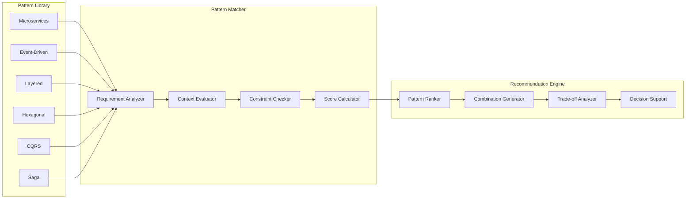

#### 5.2.2 Cost Optimization Engine

```python
class CostOptimizer:
    """
    Multi-cloud cost optimization engine
    """
    
    def optimize_deployment(self, 
                           architecture: Architecture,
                           constraints: List[Constraint]) -> OptimizedDeployment:
        
        # Analyze resource requirements
        resources = self.analyze_resources(architecture)
        
        # Get pricing from cloud providers
        aws_cost = self.calculate_aws_cost(resources)
        azure_cost = self.calculate_azure_cost(resources)
        gcp_cost = self.calculate_gcp_cost(resources)
        
        # Consider constraints
        valid_options = self.apply_constraints(
            [aws_cost, azure_cost, gcp_cost],
            constraints
        )
        
        # Optimize for cost and performance
        optimal = self.multi_objective_optimization(
            valid_options,
            weights={'cost': 0.4, 'performance': 0.3, 
                    'reliability': 0.3}
        )
        
        # Generate deployment configuration
        deployment = self.generate_deployment_config(optimal)
        
        return OptimizedDeployment(
            provider=optimal.provider,
            services=optimal.services,
            estimated_cost=optimal.cost,
            performance_metrics=optimal.metrics,
            configuration=deployment
        )
```

### 5.3 Development Intelligence Module

#### 5.3.1 Code Generation Pipeline

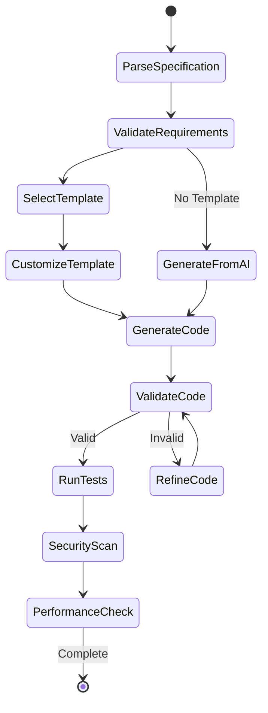

#### 5.3.2 Test Generation Strategy

```python
class TestGenerator:
    """
    Intelligent test generation system
    """
    
    def generate_test_suite(self, component: CodeComponent) -> TestSuite:
        tests = []
        
        # Unit Tests
        unit_tests = self.generate_unit_tests(component)
        tests.extend(unit_tests)
        
        # Integration Tests
        if component.has_dependencies():
            integration_tests = self.generate_integration_tests(component)
            tests.extend(integration_tests)
        
        # Property-based Tests
        property_tests = self.generate_property_tests(component)
        tests.extend(property_tests)
        
        # Mutation Tests
        mutation_tests = self.generate_mutation_tests(component)
        tests.extend(mutation_tests)
        
        # Performance Tests
        if component.is_critical():
            perf_tests = self.generate_performance_tests(component)
            tests.extend(perf_tests)
        
        return TestSuite(
            component=component,
            tests=tests,
            coverage=self.calculate_coverage(tests, component),
            quality_score=self.assess_quality(tests)
        )
```

---

## 6. Technology Stack

### 6.1 Technology Selection Matrix

| Layer | Technology | Purpose | Justification |
|-------|------------|---------|---------------|
| **Frontend** | React 18 + TypeScript | Web UI | Modern, type-safe, large ecosystem |
| **API Gateway** | Kong | API Management | High performance, extensible, cloud-native |
| **Backend Services** | Node.js + TypeScript | Core Services | Async performance, shared language with frontend |
| **ML Services** | Python + FastAPI | AI/ML APIs | ML ecosystem, async support, auto-documentation |
| **Graph Database** | Neo4j Community | Knowledge Graph | Native graph, ACID, mature ecosystem |
| **Document Store** | MongoDB | Flexible Documents | Schema flexibility, horizontal scaling |
| **Time Series** | TimescaleDB | Metrics Storage | PostgreSQL compatible, time-series optimized |
| **Cache** | Redis | Performance Cache | In-memory speed, data structures, pub/sub |
| **Message Queue** | Apache Kafka | Event Streaming | High throughput, durability, ecosystem |
| **Search** | Elasticsearch | Full-text Search | Powerful search, analytics, scalable |
| **ML Framework** | TensorFlow/PyTorch | Model Training | Industry standard, GPU support, ecosystem |
| **Container** | Docker | Containerization | Standard, portable, reproducible |
| **Orchestration** | Kubernetes | Container Management | Industry standard, auto-scaling, self-healing |
| **CI/CD** | GitHub Actions | Automation | Native GitHub integration, YAML config |
| **Monitoring** | Prometheus + Grafana | Metrics & Visualization | Time-series metrics, alerting, dashboards |
| **Tracing** | Jaeger | Distributed Tracing | OpenTracing compatible, visual analysis |
| **Logging** | ELK Stack | Log Management | Centralized logging, search, analysis |

### 6.2 Development Stack

```yaml
# Development Environment Configuration
version: '3.8'

services:
  # Core Services
  api-gateway:
    image: kong:3.4
    environment:
      KONG_DATABASE: postgres
      KONG_PG_HOST: postgres
      KONG_PROXY_ACCESS_LOG: /dev/stdout
      KONG_ADMIN_ACCESS_LOG: /dev/stdout
      KONG_PROXY_ERROR_LOG: /dev/stderr
      KONG_ADMIN_ERROR_LOG: /dev/stderr
    ports:
      - "8000:8000"  # Proxy
      - "8001:8001"  # Admin API
      
  neo4j:
    image: neo4j:5.13
    environment:
      NEO4J_AUTH: neo4j/password
      NEO4J_dbms_memory_pagecache_size: 1G
      NEO4J_dbms_memory_heap_max__size: 1G
    ports:
      - "7474:7474"  # HTTP
      - "7687:7687"  # Bolt
    volumes:
      - neo4j_data:/data
      
  mongodb:
    image: mongo:7.0
    environment:
      MONGO_INITDB_ROOT_USERNAME: admin
      MONGO_INITDB_ROOT_PASSWORD: password
    ports:
      - "27017:27017"
    volumes:
      - mongo_data:/data/db
      
  redis:
    image: redis:7.2-alpine
    command: redis-server --appendonly yes
    ports:
      - "6379:6379"
    volumes:
      - redis_data:/data
      
  kafka:
    image: confluentinc/cp-kafka:7.5.0
    depends_on:
      - zookeeper
    environment:
      KAFKA_BROKER_ID: 1
      KAFKA_ZOOKEEPER_CONNECT: zookeeper:2181
      KAFKA_ADVERTISED_LISTENERS: PLAINTEXT://localhost:9092
      KAFKA_OFFSETS_TOPIC_REPLICATION_FACTOR: 1
    ports:
      - "9092:9092"
      
  elasticsearch:
    image: elasticsearch:8.11.0
    environment:
      - discovery.type=single-node
      - xpack.security.enabled=false
    ports:
      - "9200:9200"
    volumes:
      - es_data:/usr/share/elasticsearch/data

volumes:
  neo4j_data:
  mongo_data:
  redis_data:
  es_data:
```

---

## 7. API Architecture

### 7.1 API Design Principles

1. **RESTful Design**: Resource-oriented URLs, standard HTTP methods
2. **GraphQL Flexibility**: Complex queries with single request
3. **Versioning**: URL-based versioning (v1, v2)
4. **Pagination**: Cursor-based for large datasets
5. **Rate Limiting**: Token bucket algorithm
6. **Authentication**: JWT with refresh tokens
7. **Documentation**: OpenAPI 3.0 specification

### 7.2 Core API Endpoints

#### 7.2.1 REST API Structure

```yaml
openapi: 3.0.0
info:
  title: LANKA API
  version: 1.0.0
  
paths:
  /api/v1/requirements:
    get:
      summary: List requirements
      parameters:
        - name: project_id
          in: query
          schema:
            type: string
        - name: status
          in: query
          schema:
            type: string
            enum: [draft, approved, implemented]
        - name: page
          in: query
          schema:
            type: integer
        - name: limit
          in: query
          schema:
            type: integer
      responses:
        200:
          description: Requirements list
          content:
            application/json:
              schema:
                type: object
                properties:
                  data:
                    type: array
                    items:
                      $ref: '#/components/schemas/Requirement'
                  pagination:
                    $ref: '#/components/schemas/Pagination'
                    
    post:
      summary: Create requirement
      requestBody:
        required: true
        content:
          application/json:
            schema:
              $ref: '#/components/schemas/RequirementInput'
      responses:
        201:
          description: Created requirement
          content:
            application/json:
              schema:
                $ref: '#/components/schemas/Requirement'
                
  /api/v1/requirements/{id}:
    get:
      summary: Get requirement by ID
      parameters:
        - name: id
          in: path
          required: true
          schema:
            type: string
      responses:
        200:
          description: Requirement details
          content:
            application/json:
              schema:
                $ref: '#/components/schemas/Requirement'
                
    put:
      summary: Update requirement
      parameters:
        - name: id
          in: path
          required: true
          schema:
            type: string
      requestBody:
        required: true
        content:
          application/json:
            schema:
              $ref: '#/components/schemas/RequirementInput'
      responses:
        200:
          description: Updated requirement
          
    delete:
      summary: Delete requirement
      parameters:
        - name: id
          in: path
          required: true
          schema:
            type: string
      responses:
        204:
          description: Deleted successfully
          
  /api/v1/requirements/{id}/similar:
    get:
      summary: Find similar requirements
      parameters:
        - name: id
          in: path
          required: true
          schema:
            type: string
        - name: threshold
          in: query
          schema:
            type: number
            minimum: 0
            maximum: 1
            default: 0.7
      responses:
        200:
          description: Similar requirements
          content:
            application/json:
              schema:
                type: array
                items:
                  type: object
                  properties:
                    requirement:
                      $ref: '#/components/schemas/Requirement'
                    similarity_score:
                      type: number

components:
  schemas:
    Requirement:
      type: object
      properties:
        id:
          type: string
        title:
          type: string
        description:
          type: string
        type:
          type: string
          enum: [functional, non_functional, business]
        priority:
          type: string
          enum: [critical, high, medium, low]
        status:
          type: string
          enum: [draft, approved, implemented]
        project_id:
          type: string
        created_at:
          type: string
          format: date-time
        updated_at:
          type: string
          format: date-time
```

#### 7.2.2 GraphQL Schema

```graphql
type Query {
  # Requirements
  requirement(id: ID!): Requirement
  requirements(
    filter: RequirementFilter
    sort: RequirementSort
    pagination: PaginationInput
  ): RequirementConnection!
  
  searchRequirements(
    query: String!
    limit: Int = 10
  ): [Requirement!]!
  
  similarRequirements(
    requirementId: ID!
    threshold: Float = 0.7
  ): [SimilarityResult!]!
  
  # Architecture
  architectureDecision(id: ID!): ArchitectureDecision
  architecturePatterns(
    context: ArchitectureContext!
  ): [PatternRecommendation!]!
  
  # Development
  codeComponent(id: ID!): CodeComponent
  searchCode(
    query: String!
    language: String
    limit: Int = 10
  ): [CodeSearchResult!]!
}

type Mutation {
  # Requirements
  createRequirement(input: RequirementInput!): Requirement!
  updateRequirement(id: ID!, input: RequirementInput!): Requirement!
  deleteRequirement(id: ID!): Boolean!
  approveRequirement(id: ID!): Requirement!
  
  # Architecture
  createArchitectureDecision(
    input: ArchitectureDecisionInput!
  ): ArchitectureDecision!
  
  # Development
  generateCode(
    specification: CodeSpecification!
  ): GeneratedCode!
  generateTests(
    componentId: ID!
    strategy: TestStrategy
  ): TestSuite!
}

type Subscription {
  requirementUpdated(projectId: ID!): Requirement!
  architectureDecisionMade(projectId: ID!): ArchitectureDecision!
  codeGenerated(projectId: ID!): CodeComponent!
}

type Requirement {
  id: ID!
  title: String!
  description: String!
  type: RequirementType!
  priority: Priority!
  status: RequirementStatus!
  project: Project!
  author: User!
  createdAt: DateTime!
  updatedAt: DateTime!
  
  # Relationships
  dependencies: [Requirement!]!
  conflicts: [Conflict!]!
  similarRequirements(threshold: Float): [SimilarityResult!]!
  architectureDecisions: [ArchitectureDecision!]!
  implementations: [CodeComponent!]!
  
  # Computed fields
  completeness: Float!
  quality: QualityMetrics!
  riskLevel: RiskLevel!
}

enum RequirementType {
  FUNCTIONAL
  NON_FUNCTIONAL
  BUSINESS
}

enum Priority {
  CRITICAL
  HIGH
  MEDIUM
  LOW
}

enum RequirementStatus {
  DRAFT
  REVIEW
  APPROVED
  IMPLEMENTED
  DEPRECATED
}
```

#### 7.2.3 WebSocket Events

```typescript
// WebSocket Event Types
interface WebSocketEvents {
  // Connection Events
  'connection': (socket: Socket) => void;
  'disconnect': (reason: string) => void;
  
  // Requirement Events
  'requirement:created': (requirement: Requirement) => void;
  'requirement:updated': (requirement: Requirement) => void;
  'requirement:deleted': (requirementId: string) => void;
  'requirement:approved': (requirement: Requirement) => void;
  
  // Collaboration Events
  'collaboration:join': (room: string, user: User) => void;
  'collaboration:leave': (room: string, user: User) => void;
  'collaboration:edit': (edit: CollaborativeEdit) => void;
  'collaboration:cursor': (cursor: CursorPosition) => void;
  
  // AI Events
  'ai:processing': (taskId: string, progress: number) => void;
  'ai:complete': (taskId: string, result: any) => void;
  'ai:error': (taskId: string, error: Error) => void;
  
  // System Events
  'system:notification': (notification: Notification) => void;
  'system:alert': (alert: Alert) => void;
}

// Client Connection Example
const socket = io('wss://api.lanka.io', {
  auth: {
    token: 'JWT_TOKEN'
  }
});

socket.on('requirement:updated', (requirement) => {
  console.log('Requirement updated:', requirement);
  updateUI(requirement);
});

socket.emit('collaboration:join', 'project-123');
```

---

## 8. Security Architecture

### 8.1 Security Layers

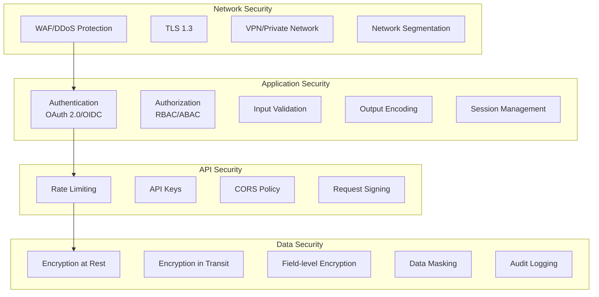

### 8.2 Authentication & Authorization

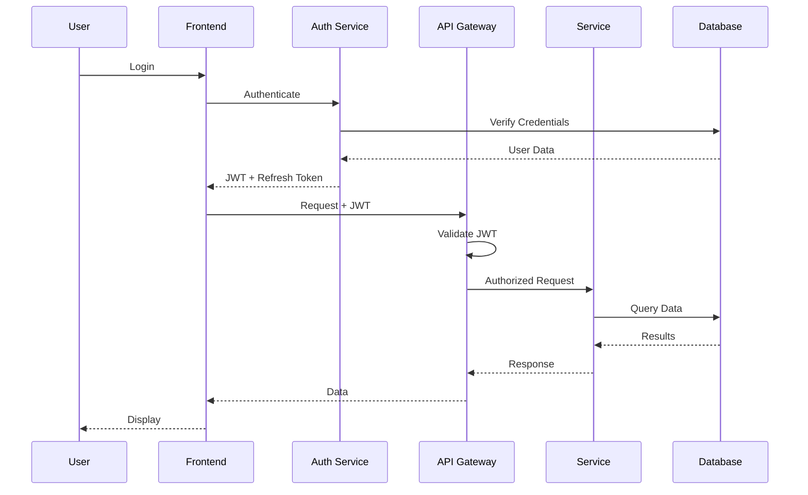

### 8.3 Security Implementation

```typescript
// JWT Configuration
interface JWTConfig {
  algorithm: 'RS256';
  issuer: 'https://auth.lanka.io';
  audience: 'https://api.lanka.io';
  accessTokenExpiry: '15m';
  refreshTokenExpiry: '7d';
  publicKey: string;
  privateKey: string;
}

// RBAC Configuration
interface RBACConfig {
  roles: {
    admin: Permission[];
    architect: Permission[];
    developer: Permission[];
    viewer: Permission[];
  };
  permissions: {
    'requirements:read': Resource[];
    'requirements:write': Resource[];
    'architecture:read': Resource[];
    'architecture:write': Resource[];
    'code:read': Resource[];
    'code:write': Resource[];
  };
}

// Security Middleware
class SecurityMiddleware {
  authenticate(req: Request): Promise<User> {
    const token = this.extractToken(req);
    const payload = this.verifyJWT(token);
    return this.loadUser(payload.sub);
  }
  
  authorize(user: User, resource: string, action: string): boolean {
    const permissions = this.getUserPermissions(user);
    return permissions.includes(`${resource}:${action}`);
  }
  
  validateInput(data: any, schema: Schema): ValidationResult {
    return this.validator.validate(data, schema);
  }
  
  sanitizeOutput(data: any, user: User): any {
    return this.sanitizer.clean(data, user.clearanceLevel);
  }
}
```

---

## 9. Deployment Architecture

### 9.1 Kubernetes Deployment

```yaml
# Deployment Configuration
apiVersion: apps/v1
kind: Deployment
metadata:
  name: requirements-service
  namespace: lanka
  labels:
    app: requirements-service
    version: v1.0.0
spec:
  replicas: 3
  strategy:
    type: RollingUpdate
    rollingUpdate:
      maxSurge: 1
      maxUnavailable: 0
  selector:
    matchLabels:
      app: requirements-service
  template:
    metadata:
      labels:
        app: requirements-service
        version: v1.0.0
      annotations:
        prometheus.io/scrape: "true"
        prometheus.io/port: "9090"
    spec:
      containers:
      - name: requirements-service
        image: lanka/requirements-service:v1.0.0
        ports:
        - containerPort: 8080
          name: http
        - containerPort: 9090
          name: metrics
        env:
        - name: NODE_ENV
          value: "production"
        - name: NEO4J_URI
          valueFrom:
            secretKeyRef:
              name: neo4j-credentials
              key: uri
        - name: MONGODB_URI
          valueFrom:
            secretKeyRef:
              name: mongodb-credentials
              key: uri
        - name: REDIS_URI
          valueFrom:
            secretKeyRef:
              name: redis-credentials
              key: uri
        resources:
          requests:
            memory: "512Mi"
            cpu: "250m"
          limits:
            memory: "1Gi"
            cpu: "1000m"
        livenessProbe:
          httpGet:
            path: /health/live
            port: 8080
          initialDelaySeconds: 30
          periodSeconds: 10
        readinessProbe:
          httpGet:
            path: /health/ready
            port: 8080
          initialDelaySeconds: 10
          periodSeconds: 5
        volumeMounts:
        - name: config
          mountPath: /app/config
          readOnly: true
      volumes:
      - name: config
        configMap:
          name: requirements-service-config
---
# Service Configuration
apiVersion: v1
kind: Service
metadata:
  name: requirements-service
  namespace: lanka
spec:
  selector:
    app: requirements-service
  ports:
  - name: http
    port: 80
    targetPort: 8080
  - name: metrics
    port: 9090
    targetPort: 9090
  type: ClusterIP
---
# HorizontalPodAutoscaler
apiVersion: autoscaling/v2
kind: HorizontalPodAutoscaler
metadata:
  name: requirements-service-hpa
  namespace: lanka
spec:
  scaleTargetRef:
    apiVersion: apps/v1
    kind: Deployment
    name: requirements-service
  minReplicas: 3
  maxReplicas: 10
  metrics:
  - type: Resource
    resource:
      name: cpu
      target:
        type: Utilization
        averageUtilization: 70
  - type: Resource
    resource:
      name: memory
      target:
        type: Utilization
        averageUtilization: 80
```

### 9.2 CI/CD Pipeline

```yaml
# GitHub Actions Workflow
name: CI/CD Pipeline

on:
  push:
    branches: [main, develop]
  pull_request:
    branches: [main]

jobs:
  test:
    runs-on: ubuntu-latest
    steps:
    - uses: actions/checkout@v3
    
    - name: Setup Node.js
      uses: actions/setup-node@v3
      with:
        node-version: '20'
        cache: 'npm'
    
    - name: Install dependencies
      run: npm ci
    
    - name: Run linting
      run: npm run lint
    
    - name: Run tests
      run: npm run test:coverage
    
    - name: Upload coverage
      uses: codecov/codecov-action@v3
      with:
        file: ./coverage/lcov.info
    
    - name: SonarCloud Scan
      uses: SonarSource/sonarcloud-github-action@master
      env:
        GITHUB_TOKEN: ${{ secrets.GITHUB_TOKEN }}
        SONAR_TOKEN: ${{ secrets.SONAR_TOKEN }}

  build:
    needs: test
    runs-on: ubuntu-latest
    if: github.ref == 'refs/heads/main'
    steps:
    - uses: actions/checkout@v3
    
    - name: Set up Docker Buildx
      uses: docker/setup-buildx-action@v2
    
    - name: Login to Container Registry
      uses: docker/login-action@v2
      with:
        registry: ${{ secrets.REGISTRY_URL }}
        username: ${{ secrets.REGISTRY_USERNAME }}
        password: ${{ secrets.REGISTRY_PASSWORD }}
    
    - name: Build and push Docker image
      uses: docker/build-push-action@v4
      with:
        context: .
        push: true
        tags: |
          ${{ secrets.REGISTRY_URL }}/lanka/requirements-service:latest
          ${{ secrets.REGISTRY_URL }}/lanka/requirements-service:${{ github.sha }}
        cache-from: type=registry,ref=${{ secrets.REGISTRY_URL }}/lanka/requirements-service:buildcache
        cache-to: type=registry,ref=${{ secrets.REGISTRY_URL }}/lanka/requirements-service:buildcache,mode=max

  deploy:
    needs: build
    runs-on: ubuntu-latest
    if: github.ref == 'refs/heads/main'
    steps:
    - name: Deploy to Kubernetes
      uses: azure/k8s-deploy@v4
      with:
        manifests: |
          k8s/deployment.yaml
          k8s/service.yaml
        images: |
          ${{ secrets.REGISTRY_URL }}/lanka/requirements-service:${{ github.sha }}
        namespace: lanka-production
```

---

## 10. Integration Patterns

### 10.1 External System Integration

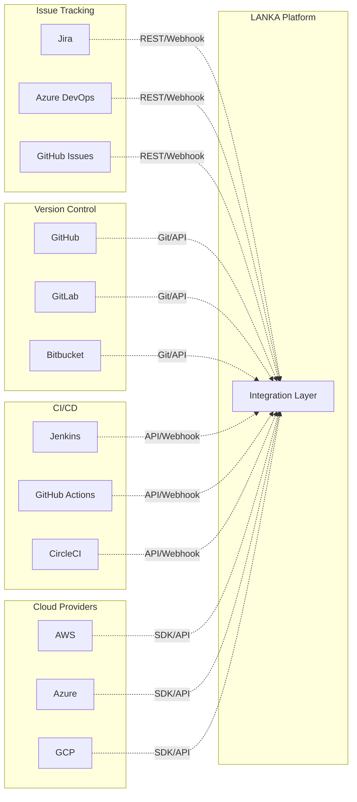

### 10.2 Integration Implementation

```typescript
// Integration Adapter Pattern
interface IntegrationAdapter {
  connect(): Promise<void>;
  disconnect(): Promise<void>;
  sync(): Promise<SyncResult>;
  subscribe(event: string, handler: EventHandler): void;
  transform(data: any): StandardFormat;
}

// Jira Integration Example
class JiraAdapter implements IntegrationAdapter {
  private client: JiraClient;
  
  async connect(): Promise<void> {
    this.client = new JiraClient({
      host: process.env.JIRA_HOST,
      username: process.env.JIRA_USERNAME,
      apiToken: process.env.JIRA_API_TOKEN
    });
  }
  
  async sync(): Promise<SyncResult> {
    const issues = await this.client.searchIssues({
      jql: 'project = LANKA AND updated >= -1d'
    });
    
    const requirements = issues.map(issue => 
      this.transform(issue)
    );
    
    return {
      total: requirements.length,
      synced: await this.saveRequirements(requirements),
      errors: []
    };
  }
  
  transform(jiraIssue: JiraIssue): Requirement {
    return {
      externalId: jiraIssue.key,
      title: jiraIssue.fields.summary,
      description: jiraIssue.fields.description,
      type: this.mapIssueType(jiraIssue.fields.issuetype),
      priority: this.mapPriority(jiraIssue.fields.priority),
      status: this.mapStatus(jiraIssue.fields.status),
      metadata: {
        source: 'jira',
        originalData: jiraIssue
      }
    };
  }
  
  subscribe(event: string, handler: EventHandler): void {
    // Setup Jira webhook
    this.client.createWebhook({
      url: `${process.env.WEBHOOK_URL}/jira/${event}`,
      events: [event],
      filters: {
        'issue-related-events-section': true
      }
    });
  }
}
```

---

## 11. Performance & Scalability

### 11.1 Performance Architecture

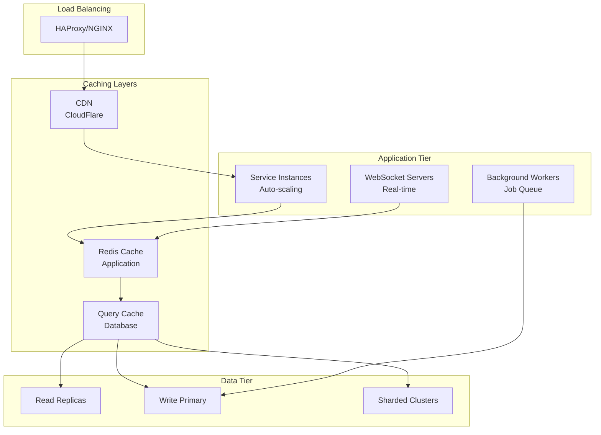

### 11.2 Performance Optimization Strategies

```typescript
// Caching Strategy
class CacheManager {
  private l1Cache: Map<string, CacheEntry>; // In-memory
  private l2Cache: RedisClient;             // Redis
  private l3Cache: CDNClient;               // CDN
  
  async get<T>(key: string): Promise<T | null> {
    // L1: Check in-memory cache
    const l1Result = this.l1Cache.get(key);
    if (l1Result && !this.isExpired(l1Result)) {
      return l1Result.value;
    }
    
    // L2: Check Redis cache
    const l2Result = await this.l2Cache.get(key);
    if (l2Result) {
      this.l1Cache.set(key, l2Result); // Populate L1
      return l2Result;
    }
    
    // L3: Check CDN cache (for static content)
    if (this.isCDNCacheable(key)) {
      const l3Result = await this.l3Cache.get(key);
      if (l3Result) {
        await this.l2Cache.set(key, l3Result); // Populate L2
        this.l1Cache.set(key, l3Result);       // Populate L1
        return l3Result;
      }
    }
    
    return null;
  }
  
  async set<T>(key: string, value: T, ttl?: number): Promise<void> {
    const entry = { value, ttl, timestamp: Date.now() };
    
    // Update all cache layers
    this.l1Cache.set(key, entry);
    await this.l2Cache.set(key, value, ttl);
    
    if (this.isCDNCacheable(key)) {
      await this.l3Cache.set(key, value, ttl);
    }
  }
}

// Query Optimization
class QueryOptimizer {
  optimizeGraphQuery(cypher: string): OptimizedQuery {
    // Analyze query
    const analysis = this.analyzeQuery(cypher);
    
    // Add indexes if missing
    if (analysis.missingIndexes.length > 0) {
      this.createIndexes(analysis.missingIndexes);
    }
    
    // Rewrite query for performance
    const optimized = this.rewriteQuery(cypher, {
      useIndexHints: true,
      limitTraversal: true,
      parallelExecution: true
    });
    
    // Add caching directive
    return {
      query: optimized,
      cacheKey: this.generateCacheKey(optimized),
      cacheTTL: this.calculateTTL(analysis)
    };
  }
}
```

### 11.3 Scalability Metrics

| Metric | Target | Current | Strategy |
|--------|--------|---------|----------|
| **Concurrent Users** | 10,000 | 5,000 | Horizontal scaling |
| **Requests/Second** | 50,000 | 25,000 | Caching, CDN |
| **Graph Query Latency** | <500ms | 300ms | Query optimization |
| **Code Generation Time** | <5s | 3s | GPU inference |
| **Data Processing** | 100k req/hr | 50k req/hr | Stream processing |
| **Storage Growth** | 1TB/month | 500GB/month | Data archival |

---

## 12. Monitoring & Observability

### 12.1 Monitoring Stack

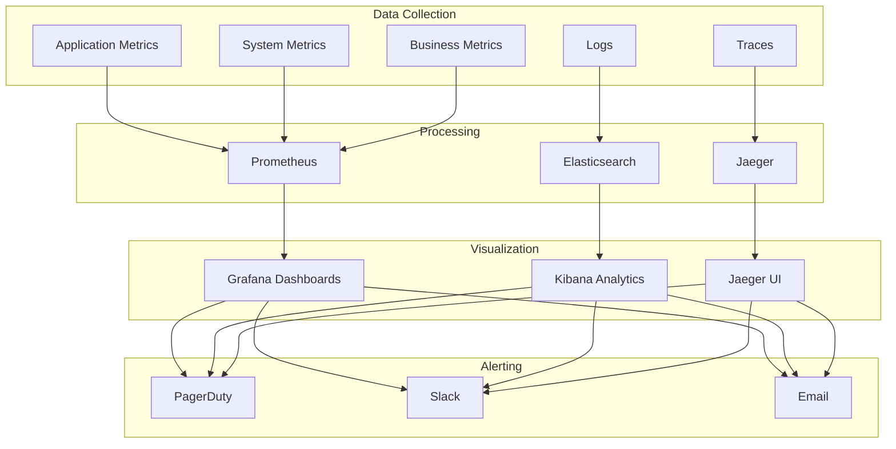

### 12.2 Key Metrics & Dashboards

```typescript
// Metrics Collection
class MetricsCollector {
  // Business Metrics
  @Counter({ name: 'requirements_processed_total' })
  requirementsProcessed: number;
  
  @Histogram({ name: 'requirement_processing_duration_seconds' })
  processingDuration: number;
  
  @Gauge({ name: 'active_projects' })
  activeProjects: number;
  
  // Performance Metrics
  @Histogram({ 
    name: 'http_request_duration_seconds',
    labels: ['method', 'endpoint', 'status']
  })
  httpRequestDuration: number;
  
  @Counter({
    name: 'graph_queries_total',
    labels: ['query_type', 'status']
  })
  graphQueries: number;
  
  // AI Metrics
  @Histogram({
    name: 'ml_inference_duration_seconds',
    labels: ['model', 'operation']
  })
  mlInferenceDuration: number;
  
  @Counter({
    name: 'code_generation_total',
    labels: ['language', 'status']
  })
  codeGeneration: number;
}

// Health Checks
class HealthChecker {
  async checkHealth(): Promise<HealthStatus> {
    const checks = await Promise.all([
      this.checkDatabase(),
      this.checkCache(),
      this.checkMessageQueue(),
      this.checkMLServices(),
      this.checkExternalAPIs()
    ]);
    
    return {
      status: checks.every(c => c.healthy) ? 'healthy' : 'unhealthy',
      checks: checks,
      timestamp: new Date(),
      version: process.env.APP_VERSION
    };
  }
  
  private async checkDatabase(): Promise<ComponentHealth> {
    try {
      const start = Date.now();
      await this.neo4j.query('MATCH (n) RETURN n LIMIT 1');
      const latency = Date.now() - start;
      
      return {
        component: 'neo4j',
        healthy: latency < 100,
        latency,
        message: `Database responding in ${latency}ms`
      };
    } catch (error) {
      return {
        component: 'neo4j',
        healthy: false,
        error: error.message
      };
    }
  }
}
```

---

## 13. Development Guidelines

### 13.1 Code Organization

```
lanka/
├── packages/                 # Monorepo packages
│   ├── common/              # Shared utilities
│   │   ├── src/
│   │   ├── tests/
│   │   └── package.json
│   ├── requirements-service/
│   │   ├── src/
│   │   │   ├── controllers/
│   │   │   ├── services/
│   │   │   ├── models/
│   │   │   ├── repositories/
│   │   │   └── index.ts
│   │   ├── tests/
│   │   └── package.json
│   ├── architecture-service/
│   ├── development-service/
│   └── web-app/
├── infrastructure/          # Infrastructure as Code
│   ├── terraform/
│   ├── kubernetes/
│   └── docker/
├── docs/                   # Documentation
│   ├── api/
│   ├── architecture/
│   └── guides/
├── scripts/                # Build and deployment scripts
├── .github/               # GitHub Actions workflows
├── docker-compose.yml     # Local development
├── lerna.json            # Monorepo configuration
└── package.json
```

### 13.2 Development Standards

```typescript
// Code Style Guidelines
/**
 * Service Implementation Pattern
 * 
 * 1. Use dependency injection
 * 2. Implement interfaces
 * 3. Handle errors gracefully
 * 4. Add comprehensive logging
 * 5. Write unit tests
 */
export class RequirementService implements IRequirementService {
  constructor(
    private readonly repository: IRequirementRepository,
    private readonly nlpService: INLPService,
    private readonly eventBus: IEventBus,
    private readonly logger: ILogger
  ) {}
  
  async createRequirement(
    input: CreateRequirementInput
  ): Promise<Requirement> {
    this.logger.info('Creating requirement', { input });
    
    try {
      // Validate input
      const validation = await this.validateInput(input);
      if (!validation.valid) {
        throw new ValidationError(validation.errors);
      }
      
      // Process with NLP
      const processed = await this.nlpService.process(input.description);
      
      // Check for duplicates
      const duplicates = await this.findDuplicates(processed);
      if (duplicates.length > 0) {
        this.logger.warn('Potential duplicates found', { duplicates });
      }
      
      // Create in database
      const requirement = await this.repository.create({
        ...input,
        ...processed,
        metadata: {
          duplicates: duplicates.map(d => d.id)
        }
      });
      
      // Publish event
      await this.eventBus.publish('requirement.created', requirement);
      
      this.logger.info('Requirement created', { id: requirement.id });
      return requirement;
      
    } catch (error) {
      this.logger.error('Failed to create requirement', { error });
      throw new ServiceError('Failed to create requirement', error);
    }
  }
}
```

### 13.3 Testing Strategy

```typescript
// Unit Test Example
describe('RequirementService', () => {
  let service: RequirementService;
  let mockRepository: jest.Mocked<IRequirementRepository>;
  let mockNLPService: jest.Mocked<INLPService>;
  
  beforeEach(() => {
    mockRepository = createMock<IRequirementRepository>();
    mockNLPService = createMock<INLPService>();
    
    service = new RequirementService(
      mockRepository,
      mockNLPService,
      createMock<IEventBus>(),
      createMock<ILogger>()
    );
  });
  
  describe('createRequirement', () => {
    it('should create requirement successfully', async () => {
      // Arrange
      const input = {
        title: 'User Authentication',
        description: 'Users should be able to login',
        type: RequirementType.FUNCTIONAL
      };
      
      mockNLPService.process.mockResolvedValue({
        entities: ['user', 'authentication'],
        sentiment: 0.8,
        embedding: [0.1, 0.2, 0.3]
      });
      
      mockRepository.create.mockResolvedValue({
        id: 'req-123',
        ...input
      });
      
      // Act
      const result = await service.createRequirement(input);
      
      // Assert
      expect(result.id).toBe('req-123');
      expect(mockNLPService.process).toHaveBeenCalledWith(
        input.description
      );
      expect(mockRepository.create).toHaveBeenCalled();
    });
    
    it('should handle validation errors', async () => {
      // Arrange
      const invalidInput = {
        title: '', // Invalid: empty title
        description: 'Test',
        type: RequirementType.FUNCTIONAL
      };
      
      // Act & Assert
      await expect(
        service.createRequirement(invalidInput)
      ).rejects.toThrow(ValidationError);
    });
  });
});

// Integration Test Example
describe('Requirements API Integration', () => {
  let app: Application;
  let neo4j: Neo4jConnection;
  
  beforeAll(async () => {
    app = await createTestApp();
    neo4j = await createTestDatabase();
  });
  
  afterAll(async () => {
    await neo4j.close();
    await app.close();
  });
  
  it('should create and retrieve requirement', async () => {
    // Create requirement
    const createResponse = await request(app)
      .post('/api/v1/requirements')
      .send({
        title: 'Test Requirement',
        description: 'Test description',
        type: 'functional'
      })
      .expect(201);
    
    const requirementId = createResponse.body.id;
    
    // Retrieve requirement
    const getResponse = await request(app)
      .get(`/api/v1/requirements/${requirementId}`)
      .expect(200);
    
    expect(getResponse.body.title).toBe('Test Requirement');
    
    // Verify in database
    const dbResult = await neo4j.query(
      'MATCH (r:Requirement {id: $id}) RETURN r',
      { id: requirementId }
    );
    
    expect(dbResult.records).toHaveLength(1);
  });
});
```

---

## 14. Troubleshooting Guide

### 14.1 Common Issues & Solutions

| Issue | Symptoms | Diagnosis | Solution |
|-------|----------|-----------|----------|
| **High Graph Query Latency** | Slow response times | Check query complexity and indexes | Optimize queries, add indexes |
| **Memory Leaks** | Increasing memory usage | Profile heap dumps | Fix memory leaks, tune GC |
| **Connection Pool Exhaustion** | Connection timeout errors | Check pool configuration | Increase pool size, fix leaks |
| **ML Model Drift** | Decreasing accuracy | Monitor model metrics | Retrain models with new data |
| **Event Processing Lag** | Delayed notifications | Check Kafka consumer lag | Scale consumers, optimize processing |
| **API Rate Limiting** | 429 errors | Check rate limit configuration | Adjust limits, implement caching |

### 14.2 Debugging Tools

```bash
# Check service health
curl http://localhost:8080/health

# View service logs
kubectl logs -f deployment/requirements-service -n lanka

# Check database connections
kubectl exec -it neo4j-0 -- cypher-shell \
  "CALL dbms.listConnections()"

# Monitor Kafka consumer lag
kafka-consumer-groups --bootstrap-server localhost:9092 \
  --group requirements-consumer --describe

# Profile application performance
kubectl port-forward service/requirements-service 6060:6060
go tool pprof http://localhost:6060/debug/pprof/profile

# Trace distributed requests
open http://localhost:16686  # Jaeger UI

# Query metrics
curl http://localhost:9090/api/v1/query \
  -d 'query=rate(http_requests_total[5m])'
```

### 14.3 Emergency Procedures

```typescript
// Circuit Breaker Implementation
class CircuitBreaker {
  private state: 'closed' | 'open' | 'half-open' = 'closed';
  private failures: number = 0;
  private lastFailureTime: number = 0;
  
  async execute<T>(
    operation: () => Promise<T>
  ): Promise<T> {
    if (this.state === 'open') {
      if (this.shouldAttemptReset()) {
        this.state = 'half-open';
      } else {
        throw new Error('Circuit breaker is open');
      }
    }
    
    try {
      const result = await operation();
      this.onSuccess();
      return result;
    } catch (error) {
      this.onFailure();
      throw error;
    }
  }
  
  private onSuccess(): void {
    this.failures = 0;
    this.state = 'closed';
  }
  
  private onFailure(): void {
    this.failures++;
    this.lastFailureTime = Date.now();
    
    if (this.failures >= this.threshold) {
      this.state = 'open';
      this.logger.error('Circuit breaker opened', {
        failures: this.failures
      });
    }
  }
}

// Graceful Shutdown
class GracefulShutdown {
  private shuttingDown = false;
  
  async shutdown(): Promise<void> {
    if (this.shuttingDown) return;
    this.shuttingDown = true;
    
    this.logger.info('Starting graceful shutdown');
    
    // Stop accepting new requests
    this.server.close();
    
    // Wait for ongoing requests to complete
    await this.waitForRequests();
    
    // Close database connections
    await this.closeConnections();
    
    // Flush logs and metrics
    await this.flushTelemetry();
    
    this.logger.info('Graceful shutdown complete');
    process.exit(0);
  }
}
```

---

## 15. Implementation Roadmap

### 15.1 Phased Implementation Plan

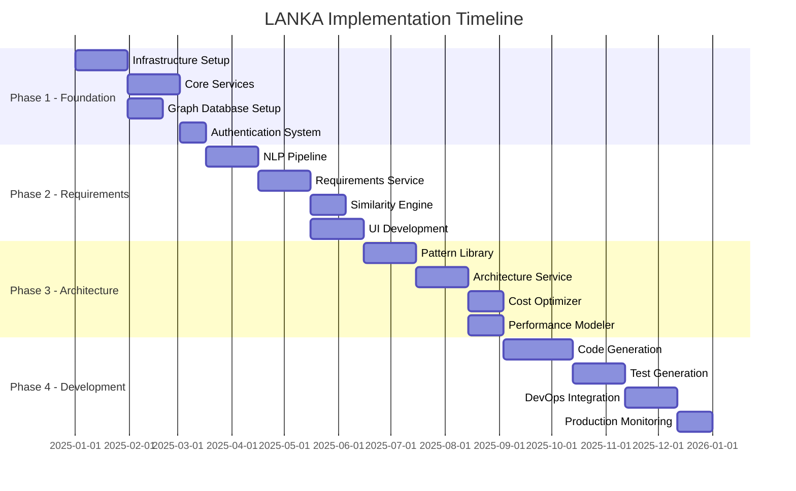

### 15.2 Success Criteria

| Phase | Success Metrics | Validation Method |
|-------|----------------|-------------------|
| **Phase 1** | Infrastructure operational, 99.9% uptime | Health checks, monitoring |
| **Phase 2** | Process 1000+ requirements/day | Load testing, user feedback |
| **Phase 3** | Generate valid architectures 85% accuracy | Expert review, testing |
| **Phase 4** | Generate working code 80% success rate | Automated testing, compilation |

### 15.3 Risk Mitigation

| Risk | Impact | Probability | Mitigation Strategy |
|------|--------|-------------|-------------------|
| **Technology Complexity** | High | Medium | Phased approach, POCs, training |
| **Data Quality** | High | Medium | Validation rules, cleansing, monitoring |
| **User Adoption** | High | Low | Change management, training, incentives |
| **Scalability Issues** | Medium | Low | Load testing, auto-scaling, optimization |
| **Security Vulnerabilities** | High | Low | Security audits, penetration testing |

---

## Conclusion

This architecture document provides a comprehensive blueprint for building LANKA as an enterprise-grade intelligent software development lifecycle platform. The modular design, modern technology stack, and focus on AI-powered intelligence create a system that will transform how organizations approach software development.

The architecture emphasizes:
- **Scalability** through microservices and horizontal scaling
- **Intelligence** through integrated AI/ML capabilities
- **Flexibility** through modular design and extensive APIs
- **Reliability** through comprehensive monitoring and fault tolerance
- **Security** through defense-in-depth strategies

Success depends on careful implementation following the phased roadmap, continuous optimization based on real-world usage, and strong organizational commitment to the transformation journey.

---

**Document Version**: 2.0.0  
**Last Updated**: 2025-01-13  
**Status**: Production-Ready Architecture  
**Review Cycle**: Quarterly

**Contributors**:
- Architecture Team
- Development Team
- Security Team
- DevOps Team
- AI/ML Team

**Change Log**:
- v2.0.0 (2025-01-13): Complete rewrite with comprehensive details
- v1.0.0 (2025-01-10): Initial architecture specification