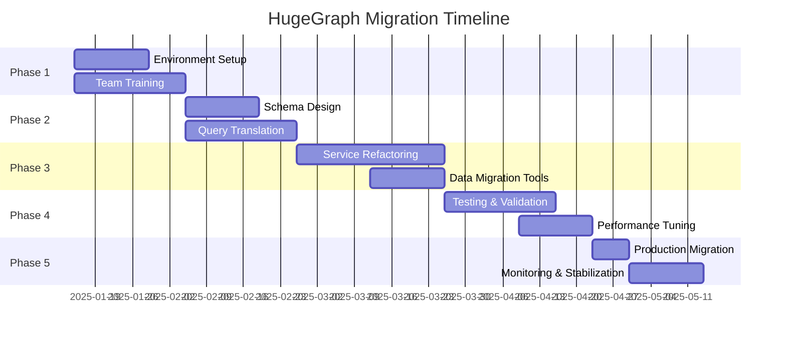

# 🚀 Apache HugeGraph Migration Plan - Comprehensive Playbook

## Executive Summary

This document provides a comprehensive, production-ready migration plan from Neo4j to Apache HugeGraph for the LANKA project. The migration will require **12-16 weeks** of dedicated effort with a team of **4-6 engineers** and carries **significant technical risk**.

**Total Estimated Effort**: 2,400 - 3,200 engineering hours  
**Total Estimated Cost**: $360,000 - $480,000  
**Risk Level**: HIGH ⚠️  
**Business Impact**: 3-4 months of reduced feature delivery

---

## 📊 Migration Overview

### Scope of Changes

| Component | Current (Neo4j) | Target (HugeGraph) | Impact Level |
|-----------|-----------------|-------------------|--------------|
| **Query Language** | Cypher | Gremlin | 🔴 High |
| **Driver** | neo4j-driver | gremlin-javascript | 🔴 High |
| **Schema Definition** | Constraints & Indexes | PropertyKeys & Labels | 🔴 High |
| **Full-text Search** | Built-in | External (Elasticsearch) | 🟡 Medium |
| **Transactions** | ACID | ACID with different semantics | 🟡 Medium |
| **Data Types** | Neo4j types | HugeGraph types | 🟡 Medium |
| **Query Patterns** | Pattern matching | Traversal-based | 🔴 High |

### Migration Phases



---

## 🏗️ Phase 1: Foundation (Weeks 1-3)

### 1.1 HugeGraph Environment Setup

#### Infrastructure Requirements

```yaml
# docker-compose.hugegraph.yml
version: '3.8'

services:
  # HugeGraph Server
  hugegraph-server:
    image: hugegraph/hugegraph:1.2.0
    container_name: lanka-hugegraph-server
    ports:
      - "8080:8080"  # REST API
      - "8182:8182"  # Gremlin Server
    environment:
      - HEAP_SIZE=4g
      - BACKEND=rocksdb  # or cassandra/hbase for production
    volumes:
      - hugegraph_data:/hugegraph/data
      - ./conf/hugegraph.properties:/hugegraph/conf/hugegraph.properties
      - ./conf/gremlin-server.yaml:/hugegraph/conf/gremlin-server.yaml
    networks:
      - lanka-network

  # HugeGraph Studio (UI)
  hugegraph-studio:
    image: hugegraph/hugegraph-studio:1.2.0
    container_name: lanka-hugegraph-studio
    ports:
      - "8088:8088"
    environment:
      - HUGEGRAPH_URL=http://hugegraph-server:8080
    depends_on:
      - hugegraph-server
    networks:
      - lanka-network

  # HugeGraph Loader (ETL Tool)
  hugegraph-loader:
    image: hugegraph/hugegraph-loader:1.2.0
    container_name: lanka-hugegraph-loader
    volumes:
      - ./loader/mappings:/loader/mappings
      - ./loader/data:/loader/data
    networks:
      - lanka-network

  # Backend Storage (RocksDB for development, Cassandra for production)
  cassandra:
    image: cassandra:4.1
    container_name: lanka-cassandra
    ports:
      - "9042:9042"
    environment:
      - CASSANDRA_CLUSTER_NAME=lanka-cluster
      - CASSANDRA_DC=datacenter1
      - CASSANDRA_HEAP_NEWSIZE=128M
      - CASSANDRA_HEAP_SIZE=512M
    volumes:
      - cassandra_data:/var/lib/cassandra
    networks:
      - lanka-network

  # Elasticsearch (Required for full-text search)
  elasticsearch:
    image: elasticsearch:8.11.3
    container_name: lanka-elasticsearch-hugegraph
    ports:
      - "9200:9200"
      - "9300:9300"
    environment:
      - discovery.type=single-node
      - xpack.security.enabled=false
      - ES_JAVA_OPTS=-Xms512m -Xmx512m
    volumes:
      - elasticsearch_data:/usr/share/elasticsearch/data
    networks:
      - lanka-network

volumes:
  hugegraph_data:
  cassandra_data:
  elasticsearch_data:

networks:
  lanka-network:
    driver: bridge
```

#### HugeGraph Configuration

```properties
# conf/hugegraph.properties
# Backend Configuration
backend=cassandra
serializer=cassandra

# Cassandra Configuration
cassandra.host=cassandra
cassandra.port=9042
cassandra.username=
cassandra.password=
cassandra.connect_timeout=5000
cassandra.read_timeout=20000

# Cache Configuration
cache.instance_size=10485760
cache.expiry_time=600

# Schema Cache
schema.cache_capacity=10000

# Vertex/Edge Cache
vertex.cache_capacity=10000000
edge.cache_capacity=10000000

# Elasticsearch Configuration
search.backend=elasticsearch
search.elasticsearch.host=elasticsearch
search.elasticsearch.port=9200
search.elasticsearch.index_prefix=hugegraph

# Performance Tuning
batch.insertion_threads=8
batch.queue_size=1000
```

### 1.2 Team Training Plan

#### Week 1: Fundamentals
- **Day 1-2**: Graph database concepts, HugeGraph architecture
- **Day 3-4**: Gremlin language basics
- **Day 5**: HugeGraph API and tools

#### Week 2: Advanced Topics
- **Day 1-2**: Complex Gremlin traversals
- **Day 3-4**: HugeGraph schema design
- **Day 5**: Performance optimization

#### Week 3: Hands-on Practice
- **Day 1-3**: Converting sample Neo4j queries to Gremlin
- **Day 4-5**: Building proof-of-concept

#### Training Resources
```bash
# Install Gremlin Console for practice
wget https://dlcdn.apache.org/tinkerpop/3.7.0/apache-tinkerpop-gremlin-console-3.7.0-bin.zip
unzip apache-tinkerpop-gremlin-console-3.7.0-bin.zip
cd apache-tinkerpop-gremlin-console-3.7.0

# Connect to HugeGraph
./bin/gremlin.sh
:remote connect tinkerpop.server conf/remote.yaml
:remote console
```

---

## 🔄 Phase 2: Query Translation (Weeks 4-6)

### 2.1 Cypher to Gremlin Mapping

#### Pattern 1: Basic Node Queries

```typescript
// ❌ OLD - Neo4j Cypher
const cypherQuery = `
  MATCH (r:Requirement {status: $status})
  WHERE r.priority = 'HIGH'
  RETURN r.id, r.title, r.description
  ORDER BY r.createdAt DESC
  LIMIT 10
`;

// ✅ NEW - HugeGraph Gremlin
const gremlinQuery = g.V()
  .hasLabel('Requirement')
  .has('status', status)
  .has('priority', 'HIGH')
  .order().by('createdAt', desc)
  .limit(10)
  .project('id', 'title', 'description')
    .by('id')
    .by('title')
    .by('description');
```

#### Pattern 2: Relationship Traversal

```typescript
// ❌ OLD - Neo4j Cypher
const cypherQuery = `
  MATCH (r:Requirement)-[:IMPLEMENTS]->(a:ArchitectureDecision)
  WHERE r.projectId = $projectId
  RETURN r, a
`;

// ✅ NEW - HugeGraph Gremlin
const gremlinQuery = g.V()
  .hasLabel('Requirement')
  .has('projectId', projectId)
  .out('IMPLEMENTS')
  .hasLabel('ArchitectureDecision')
  .path()
  .by(valueMap(true));
```

#### Pattern 3: Complex Pattern Matching

```typescript
// ❌ OLD - Neo4j Cypher
const cypherQuery = `
  MATCH (r:Requirement)-[:SIMILAR_TO]-(other:Requirement)
  WHERE r.id = $requirementId
    AND other.similarity > 0.8
  WITH other, count(*) as connections
  RETURN other
  ORDER BY connections DESC
`;

// ✅ NEW - HugeGraph Gremlin
const gremlinQuery = g.V()
  .has('Requirement', 'id', requirementId)
  .both('SIMILAR_TO')
  .has('similarity', gt(0.8))
  .groupCount()
  .order(local)
  .by(values, desc)
  .select(keys)
  .unfold();
```

#### Pattern 4: Aggregations

```typescript
// ❌ OLD - Neo4j Cypher
const cypherQuery = `
  MATCH (p:Project)-[:HAS_REQUIREMENT]->(r:Requirement)
  RETURN p.name, count(r) as requirementCount, 
         avg(r.complexity) as avgComplexity
  ORDER BY requirementCount DESC
`;

// ✅ NEW - HugeGraph Gremlin
const gremlinQuery = g.V()
  .hasLabel('Project')
  .project('name', 'requirementCount', 'avgComplexity')
    .by('name')
    .by(out('HAS_REQUIREMENT').count())
    .by(out('HAS_REQUIREMENT').values('complexity').mean());
```

### 2.2 Query Translation Matrix

| Operation | Cypher | Gremlin | Complexity |
|-----------|--------|---------|------------|
| **Find by ID** | `MATCH (n {id: $id})` | `g.V().has('id', id)` | Low |
| **Filter by property** | `WHERE n.prop = value` | `.has('prop', value)` | Low |
| **Multiple filters** | `WHERE n.a = x AND n.b = y` | `.has('a', x).has('b', y)` | Low |
| **Traverse relationship** | `MATCH (a)-[:REL]->(b)` | `g.V().out('REL')` | Low |
| **Variable length path** | `MATCH (a)-[:REL*1..3]->(b)` | `.repeat(out('REL')).times(3)` | Medium |
| **Optional match** | `OPTIONAL MATCH` | `.coalesce()` or `.optional()` | Medium |
| **Pattern matching** | `MATCH (a)--(b)--(c)` | `.match()` steps | High |
| **Aggregations** | `count()`, `avg()`, `sum()` | `.count()`, `.mean()`, `.sum()` | Medium |
| **Subqueries** | `CALL {} IN TRANSACTIONS` | `.local()` or `.sideEffect()` | High |
| **Full-text search** | `CONTAINS` or indexes | External Elasticsearch | High |

---

## 🛠️ Phase 3: Code Refactoring (Weeks 7-10)

### 3.1 New Database Abstraction Layer

```typescript
// src/core/database/hugegraph.ts
import { driver, process as gremlinProcess, structure } from 'gremlin';

const { Graph } = structure;
const { traversal, AnonymousTraversalSource } = gremlinProcess;

export interface HugeGraphConfig {
  host: string;
  port: number;
  graphName: string;
  username?: string;
  password?: string;
}

export class HugeGraphService {
  private connection: driver.DriverRemoteConnection;
  private g: gremlinProcess.GraphTraversalSource;
  private static instance: HugeGraphService;

  private constructor(config: HugeGraphConfig) {
    const { host, port, graphName, username, password } = config;
    
    const authenticator = username && password
      ? new driver.auth.PlainTextSaslAuthenticator(username, password)
      : undefined;

    this.connection = new driver.DriverRemoteConnection(
      `ws://${host}:${port}/gremlin`,
      {
        authenticator,
        traversalSource: 'g',
        rejectUnauthorized: false,
        mimeType: 'application/vnd.gremlin-v3.0+json'
      }
    );

    const graph = new Graph();
    this.g = traversal().withRemote(this.connection);
  }

  public static getInstance(config?: HugeGraphConfig): HugeGraphService {
    if (!HugeGraphService.instance) {
      if (!config) {
        throw new Error('Configuration required for first initialization');
      }
      HugeGraphService.instance = new HugeGraphService(config);
    }
    return HugeGraphService.instance;
  }

  public getTraversal(): gremlinProcess.GraphTraversalSource {
    return this.g;
  }

  // Transaction support
  public async executeInTransaction<T>(
    work: (tx: gremlinProcess.GraphTraversalSource) => Promise<T>
  ): Promise<T> {
    const tx = this.g.tx();
    try {
      await tx.open();
      const result = await work(tx);
      await tx.commit();
      return result;
    } catch (error) {
      await tx.rollback();
      throw error;
    }
  }

  // Schema management
  public async initializeSchema(): Promise<void> {
    const schema = await this.getSchema();
    
    // Create property keys
    await this.createPropertyKeys(schema);
    
    // Create vertex labels
    await this.createVertexLabels(schema);
    
    // Create edge labels
    await this.createEdgeLabels(schema);
    
    // Create indexes
    await this.createIndexes(schema);
  }

  private async createPropertyKeys(schema: any): Promise<void> {
    const propertyKeys = [
      { name: 'id', dataType: 'TEXT', cardinality: 'SINGLE' },
      { name: 'title', dataType: 'TEXT', cardinality: 'SINGLE' },
      { name: 'description', dataType: 'TEXT', cardinality: 'SINGLE' },
      { name: 'status', dataType: 'TEXT', cardinality: 'SINGLE' },
      { name: 'priority', dataType: 'TEXT', cardinality: 'SINGLE' },
      { name: 'createdAt', dataType: 'DATE', cardinality: 'SINGLE' },
      { name: 'updatedAt', dataType: 'DATE', cardinality: 'SINGLE' },
      { name: 'projectId', dataType: 'TEXT', cardinality: 'SINGLE' },
      { name: 'complexity', dataType: 'INT', cardinality: 'SINGLE' },
      { name: 'similarity', dataType: 'DOUBLE', cardinality: 'SINGLE' },
      { name: 'confidence', dataType: 'DOUBLE', cardinality: 'SINGLE' },
      { name: 'type', dataType: 'TEXT', cardinality: 'SINGLE' },
      { name: 'tags', dataType: 'TEXT', cardinality: 'SET' },
      { name: 'metadata', dataType: 'TEXT', cardinality: 'SINGLE' }
    ];

    for (const pk of propertyKeys) {
      await this.executeHugeGraphAPI('POST', '/schema/propertykeys', pk);
    }
  }

  private async createVertexLabels(schema: any): Promise<void> {
    const vertexLabels = [
      {
        name: 'Requirement',
        properties: ['id', 'title', 'description', 'status', 'priority', 
                    'projectId', 'createdAt', 'updatedAt', 'complexity'],
        primaryKeys: ['id'],
        enableLabelIndex: true
      },
      {
        name: 'ArchitectureDecision',
        properties: ['id', 'title', 'description', 'status', 'rationale',
                    'projectId', 'createdAt', 'updatedAt'],
        primaryKeys: ['id'],
        enableLabelIndex: true
      },
      {
        name: 'ArchitecturePattern',
        properties: ['id', 'name', 'description', 'type', 'metadata'],
        primaryKeys: ['id'],
        enableLabelIndex: true
      },
      {
        name: 'TechnologyStack',
        properties: ['id', 'name', 'description', 'type', 'metadata'],
        primaryKeys: ['id'],
        enableLabelIndex: true
      },
      {
        name: 'CodeComponent',
        properties: ['id', 'name', 'language', 'type', 'projectId'],
        primaryKeys: ['id'],
        enableLabelIndex: true
      },
      {
        name: 'Project',
        properties: ['id', 'name', 'description', 'status'],
        primaryKeys: ['id'],
        enableLabelIndex: true
      },
      {
        name: 'Stakeholder',
        properties: ['id', 'name', 'email', 'role'],
        primaryKeys: ['id'],
        enableLabelIndex: true
      }
    ];

    for (const vl of vertexLabels) {
      await this.executeHugeGraphAPI('POST', '/schema/vertexlabels', vl);
    }
  }

  private async createEdgeLabels(schema: any): Promise<void> {
    const edgeLabels = [
      {
        name: 'IMPLEMENTS',
        sourceLabel: 'Requirement',
        targetLabel: 'ArchitectureDecision',
        properties: ['confidence', 'createdAt'],
        sortKeys: ['createdAt']
      },
      {
        name: 'USES_PATTERN',
        sourceLabel: 'ArchitectureDecision',
        targetLabel: 'ArchitecturePattern',
        properties: ['createdAt'],
        sortKeys: ['createdAt']
      },
      {
        name: 'USES_TECHNOLOGY',
        sourceLabel: 'ArchitectureDecision',
        targetLabel: 'TechnologyStack',
        properties: ['createdAt'],
        sortKeys: ['createdAt']
      },
      {
        name: 'SIMILAR_TO',
        sourceLabel: 'Requirement',
        targetLabel: 'Requirement',
        properties: ['similarity', 'createdAt'],
        sortKeys: ['similarity']
      },
      {
        name: 'HAS_REQUIREMENT',
        sourceLabel: 'Project',
        targetLabel: 'Requirement',
        properties: ['createdAt'],
        sortKeys: ['createdAt']
      },
      {
        name: 'OWNED_BY',
        sourceLabel: 'Requirement',
        targetLabel: 'Stakeholder',
        properties: ['role', 'createdAt'],
        sortKeys: ['createdAt']
      }
    ];

    for (const el of edgeLabels) {
      await this.executeHugeGraphAPI('POST', '/schema/edgelabels', el);
    }
  }

  private async createIndexes(schema: any): Promise<void> {
    const indexes = [
      {
        name: 'requirementByStatus',
        baseType: 'VERTEX_LABEL',
        baseValue: 'Requirement',
        indexType: 'SECONDARY',
        fields: ['status']
      },
      {
        name: 'requirementByPriority',
        baseType: 'VERTEX_LABEL',
        baseValue: 'Requirement',
        indexType: 'SECONDARY',
        fields: ['priority']
      },
      {
        name: 'requirementByProject',
        baseType: 'VERTEX_LABEL',
        baseValue: 'Requirement',
        indexType: 'SECONDARY',
        fields: ['projectId']
      },
      {
        name: 'requirementFullText',
        baseType: 'VERTEX_LABEL',
        baseValue: 'Requirement',
        indexType: 'SEARCH',
        fields: ['title', 'description']
      }
    ];

    for (const idx of indexes) {
      await this.executeHugeGraphAPI('POST', '/schema/indexlabels', idx);
    }
  }

  private async executeHugeGraphAPI(
    method: string,
    endpoint: string,
    data?: any
  ): Promise<any> {
    const response = await fetch(`http://localhost:8080/graphs/hugegraph${endpoint}`, {
      method,
      headers: {
        'Content-Type': 'application/json',
      },
      body: data ? JSON.stringify(data) : undefined,
    });

    if (!response.ok) {
      throw new Error(`HugeGraph API error: ${response.statusText}`);
    }

    return response.json();
  }

  public async close(): Promise<void> {
    await this.connection.close();
  }
}
```

### 3.2 Service Layer Refactoring

```typescript
// src/modules/requirements/services/requirements.service.hugegraph.ts
import { HugeGraphService } from '@/core/database/hugegraph';
import { statics } from 'gremlin';

const { __, P, TextP, Order } = statics;

export class RequirementsServiceHugeGraph {
  private db: HugeGraphService;
  private g: any;

  constructor() {
    this.db = HugeGraphService.getInstance();
    this.g = this.db.getTraversal();
  }

  async createRequirement(data: CreateRequirementDto): Promise<Requirement> {
    const id = generateId();
    const timestamp = new Date().toISOString();

    const vertex = await this.g
      .addV('Requirement')
      .property('id', id)
      .property('title', data.title)
      .property('description', data.description)
      .property('status', data.status || 'DRAFT')
      .property('priority', data.priority || 'MEDIUM')
      .property('projectId', data.projectId)
      .property('complexity', data.complexity || 1)
      .property('createdAt', timestamp)
      .property('updatedAt', timestamp)
      .next();

    // Add relationships
    if (data.stakeholderIds) {
      for (const stakeholderId of data.stakeholderIds) {
        await this.g
          .V().has('Requirement', 'id', id)
          .addE('OWNED_BY')
          .to(__.V().has('Stakeholder', 'id', stakeholderId))
          .property('role', 'owner')
          .property('createdAt', timestamp)
          .iterate();
      }
    }

    return this.vertexToRequirement(vertex.value);
  }

  async findRequirementById(id: string): Promise<Requirement | null> {
    const result = await this.g
      .V()
      .has('Requirement', 'id', id)
      .valueMap(true)
      .next();

    if (result.done) {
      return null;
    }

    return this.mapToRequirement(result.value);
  }

  async findSimilarRequirements(
    requirementId: string,
    threshold: number = 0.7
  ): Promise<SimilarRequirement[]> {
    const results = await this.g
      .V()
      .has('Requirement', 'id', requirementId)
      .both('SIMILAR_TO')
      .has('similarity', P.gte(threshold))
      .project('requirement', 'similarity')
        .by(valueMap(true))
        .by(__.inE('SIMILAR_TO').values('similarity'))
      .order()
        .by(select('similarity'), Order.desc)
      .limit(10)
      .toList();

    return results.map(r => ({
      requirement: this.mapToRequirement(r.requirement),
      similarity: r.similarity
    }));
  }

  async searchRequirements(query: SearchQuery): Promise<PaginatedResult<Requirement>> {
    let traversal = this.g.V().hasLabel('Requirement');

    // Apply filters
    if (query.status) {
      traversal = traversal.has('status', query.status);
    }
    if (query.priority) {
      traversal = traversal.has('priority', query.priority);
    }
    if (query.projectId) {
      traversal = traversal.has('projectId', query.projectId);
    }
    if (query.searchText) {
      // Use Elasticsearch integration for full-text search
      const ids = await this.searchFullText(query.searchText);
      traversal = traversal.has('id', P.within(ids));
    }

    // Count total
    const total = await traversal.clone().count().next();

    // Apply pagination and get results
    const results = await traversal
      .order()
        .by(query.sortBy || 'createdAt', query.sortOrder === 'asc' ? Order.asc : Order.desc)
      .range(query.offset || 0, (query.offset || 0) + (query.limit || 20))
      .valueMap(true)
      .toList();

    return {
      items: results.map(r => this.mapToRequirement(r)),
      total: total.value,
      offset: query.offset || 0,
      limit: query.limit || 20
    };
  }

  async updateRequirement(id: string, data: UpdateRequirementDto): Promise<Requirement> {
    const traversal = this.g.V().has('Requirement', 'id', id);

    // Check if exists
    const exists = await traversal.clone().hasNext();
    if (!exists) {
      throw new Error('Requirement not found');
    }

    // Update properties
    for (const [key, value] of Object.entries(data)) {
      if (value !== undefined) {
        traversal.property(key, value);
      }
    }
    traversal.property('updatedAt', new Date().toISOString());

    const updated = await traversal.valueMap(true).next();
    return this.mapToRequirement(updated.value);
  }

  async deleteRequirement(id: string): Promise<void> {
    await this.g
      .V()
      .has('Requirement', 'id', id)
      .drop()
      .iterate();
  }

  async createSimilarityRelationship(
    req1Id: string,
    req2Id: string,
    similarity: number
  ): Promise<void> {
    await this.g
      .V().has('Requirement', 'id', req1Id)
      .addE('SIMILAR_TO')
      .to(__.V().has('Requirement', 'id', req2Id))
      .property('similarity', similarity)
      .property('createdAt', new Date().toISOString())
      .iterate();
  }

  private async searchFullText(query: string): Promise<string[]> {
    // Integration with Elasticsearch
    const response = await fetch('http://localhost:9200/hugegraph_requirement/_search', {
      method: 'POST',
      headers: { 'Content-Type': 'application/json' },
      body: JSON.stringify({
        query: {
          multi_match: {
            query,
            fields: ['title^2', 'description'],
            type: 'best_fields',
            fuzziness: 'AUTO'
          }
        }
      })
    });

    const results = await response.json();
    return results.hits.hits.map((hit: any) => hit._id);
  }

  private mapToRequirement(vertex: any): Requirement {
    return {
      id: vertex.id[0],
      title: vertex.title[0],
      description: vertex.description[0],
      status: vertex.status[0],
      priority: vertex.priority[0],
      projectId: vertex.projectId[0],
      complexity: vertex.complexity[0],
      createdAt: vertex.createdAt[0],
      updatedAt: vertex.updatedAt[0]
    };
  }

  private vertexToRequirement(vertex: any): Requirement {
    return {
      id: vertex.properties.id[0].value,
      title: vertex.properties.title[0].value,
      description: vertex.properties.description[0].value,
      status: vertex.properties.status[0].value,
      priority: vertex.properties.priority[0].value,
      projectId: vertex.properties.projectId[0].value,
      complexity: vertex.properties.complexity[0].value,
      createdAt: vertex.properties.createdAt[0].value,
      updatedAt: vertex.properties.updatedAt[0].value
    };
  }
}
```

---

## 📦 Phase 4: Data Migration (Weeks 11-12)

### 4.1 ETL Pipeline

```typescript
// scripts/neo4j-to-hugegraph-migration.ts
import neo4j from 'neo4j-driver';
import { HugeGraphService } from '../src/core/database/hugegraph';
import { chunk } from 'lodash';

export class Neo4jToHugeGraphMigrator {
  private neo4jDriver: neo4j.Driver;
  private hugeGraph: HugeGraphService;
  private batchSize = 1000;
  private progress = {
    vertices: { total: 0, processed: 0 },
    edges: { total: 0, processed: 0 },
    errors: []
  };

  constructor(neo4jConfig: any, hugeGraphConfig: any) {
    this.neo4jDriver = neo4j.driver(
      neo4jConfig.uri,
      neo4j.auth.basic(neo4jConfig.user, neo4jConfig.password)
    );
    this.hugeGraph = HugeGraphService.getInstance(hugeGraphConfig);
  }

  async migrate(): Promise<void> {
    console.log('Starting migration from Neo4j to HugeGraph...');
    
    try {
      // Phase 1: Schema creation
      await this.createHugeGraphSchema();
      
      // Phase 2: Migrate vertices
      await this.migrateVertices();
      
      // Phase 3: Migrate edges
      await this.migrateEdges();
      
      // Phase 4: Create indexes
      await this.createIndexes();
      
      // Phase 5: Validation
      await this.validateMigration();
      
      console.log('Migration completed successfully!');
      console.log(this.progress);
    } catch (error) {
      console.error('Migration failed:', error);
      throw error;
    } finally {
      await this.cleanup();
    }
  }

  private async migrateVertices(): Promise<void> {
    const labels = [
      'Requirement',
      'ArchitectureDecision',
      'ArchitecturePattern',
      'TechnologyStack',
      'CodeComponent',
      'Project',
      'Stakeholder'
    ];

    for (const label of labels) {
      await this.migrateVerticesByLabel(label);
    }
  }

  private async migrateVerticesByLabel(label: string): Promise<void> {
    console.log(`Migrating ${label} vertices...`);
    
    const session = this.neo4jDriver.session();
    const g = this.hugeGraph.getTraversal();

    try {
      // Count total
      const countResult = await session.run(
        `MATCH (n:${label}) RETURN count(n) as count`
      );
      const total = countResult.records[0].get('count').toNumber();
      this.progress.vertices.total += total;

      // Migrate in batches
      let offset = 0;
      while (offset < total) {
        const result = await session.run(
          `MATCH (n:${label}) 
           RETURN n 
           SKIP $offset 
           LIMIT $limit`,
          { offset, limit: this.batchSize }
        );

        const batch = result.records.map(record => record.get('n').properties);
        
        // Bulk insert to HugeGraph
        await this.bulkInsertVertices(label, batch);
        
        offset += this.batchSize;
        this.progress.vertices.processed += batch.length;
        
        console.log(`Progress: ${this.progress.vertices.processed}/${this.progress.vertices.total}`);
      }
    } finally {
      await session.close();
    }
  }

  private async bulkInsertVertices(label: string, vertices: any[]): Promise<void> {
    const g = this.hugeGraph.getTraversal();
    
    // Use HugeGraph Loader API for bulk insert
    const data = vertices.map(v => ({
      label,
      properties: this.transformProperties(v)
    }));

    const response = await fetch('http://localhost:8080/graphs/hugegraph/graph/vertices/batch', {
      method: 'POST',
      headers: { 'Content-Type': 'application/json' },
      body: JSON.stringify(data)
    });

    if (!response.ok) {
      throw new Error(`Bulk insert failed: ${response.statusText}`);
    }
  }

  private async migrateEdges(): Promise<void> {
    const relationships = [
      'IMPLEMENTS',
      'USES_PATTERN',
      'USES_TECHNOLOGY',
      'SIMILAR_TO',
      'HAS_REQUIREMENT',
      'OWNED_BY'
    ];

    for (const rel of relationships) {
      await this.migrateEdgesByType(rel);
    }
  }

  private async migrateEdgesByType(relType: string): Promise<void> {
    console.log(`Migrating ${relType} edges...`);
    
    const session = this.neo4jDriver.session();

    try {
      // Count total
      const countResult = await session.run(
        `MATCH ()-[r:${relType}]->() RETURN count(r) as count`
      );
      const total = countResult.records[0].get('count').toNumber();
      this.progress.edges.total += total;

      // Migrate in batches
      let offset = 0;
      while (offset < total) {
        const result = await session.run(
          `MATCH (a)-[r:${relType}]->(b) 
           RETURN a.id as sourceId, b.id as targetId, r 
           SKIP $offset 
           LIMIT $limit`,
          { offset, limit: this.batchSize }
        );

        const batch = result.records.map(record => ({
          sourceId: record.get('sourceId'),
          targetId: record.get('targetId'),
          properties: record.get('r').properties
        }));
        
        // Bulk insert edges to HugeGraph
        await this.bulkInsertEdges(relType, batch);
        
        offset += this.batchSize;
        this.progress.edges.processed += batch.length;
        
        console.log(`Progress: ${this.progress.edges.processed}/${this.progress.edges.total}`);
      }
    } finally {
      await session.close();
    }
  }

  private async bulkInsertEdges(label: string, edges: any[]): Promise<void> {
    const data = edges.map(e => ({
      label,
      outV: e.sourceId,
      inV: e.targetId,
      properties: this.transformProperties(e.properties)
    }));

    const response = await fetch('http://localhost:8080/graphs/hugegraph/graph/edges/batch', {
      method: 'POST',
      headers: { 'Content-Type': 'application/json' },
      body: JSON.stringify(data)
    });

    if (!response.ok) {
      throw new Error(`Bulk edge insert failed: ${response.statusText}`);
    }
  }

  private transformProperties(props: any): any {
    // Transform Neo4j properties to HugeGraph format
    const transformed: any = {};
    
    for (const [key, value] of Object.entries(props)) {
      if (value !== null && value !== undefined) {
        // Handle Neo4j temporal types
        if (value.constructor && value.constructor.name === 'DateTime') {
          transformed[key] = value.toString();
        } else if (Array.isArray(value)) {
          // HugeGraph handles arrays differently
          transformed[key] = value.join(',');
        } else {
          transformed[key] = value;
        }
      }
    }
    
    return transformed;
  }

  private async validateMigration(): Promise<void> {
    console.log('Validating migration...');
    
    // Compare counts
    const neo4jSession = this.neo4jDriver.session();
    const g = this.hugeGraph.getTraversal();

    try {
      // Validate vertex counts
      const neo4jVertexCount = await neo4jSession.run(
        'MATCH (n) RETURN count(n) as count'
      );
      const hugeGraphVertexCount = await g.V().count().next();

      if (neo4jVertexCount.records[0].get('count').toNumber() !== hugeGraphVertexCount.value) {
        throw new Error('Vertex count mismatch');
      }

      // Validate edge counts
      const neo4jEdgeCount = await neo4jSession.run(
        'MATCH ()-[r]->() RETURN count(r) as count'
      );
      const hugeGraphEdgeCount = await g.E().count().next();

      if (neo4jEdgeCount.records[0].get('count').toNumber() !== hugeGraphEdgeCount.value) {
        throw new Error('Edge count mismatch');
      }

      console.log('Validation passed!');
    } finally {
      await neo4jSession.close();
    }
  }

  private async cleanup(): Promise<void> {
    await this.neo4jDriver.close();
    await this.hugeGraph.close();
  }
}

// Run migration
const migrator = new Neo4jToHugeGraphMigrator(
  {
    uri: 'bolt://localhost:7687',
    user: 'neo4j',
    password: 'lanka2025'
  },
  {
    host: 'localhost',
    port: 8182,
    graphName: 'hugegraph'
  }
);

migrator.migrate().catch(console.error);
```

---

## 🧪 Phase 5: Testing & Validation (Weeks 13-14)

### 5.1 Testing Strategy

```typescript
// tests/hugegraph/requirements.service.test.ts
import { RequirementsServiceHugeGraph } from '@/modules/requirements/services/requirements.service.hugegraph';
import { HugeGraphService } from '@/core/database/hugegraph';

describe('RequirementsService - HugeGraph', () => {
  let service: RequirementsServiceHugeGraph;
  let hugeGraph: HugeGraphService;

  beforeAll(async () => {
    // Setup test database
    hugeGraph = HugeGraphService.getInstance({
      host: 'localhost',
      port: 8182,
      graphName: 'test'
    });
    
    await hugeGraph.initializeSchema();
    service = new RequirementsServiceHugeGraph();
  });

  afterAll(async () => {
    // Cleanup
    const g = hugeGraph.getTraversal();
    await g.V().drop().iterate();
    await hugeGraph.close();
  });

  describe('CRUD Operations', () => {
    test('should create a requirement', async () => {
      const data = {
        title: 'Test Requirement',
        description: 'Test Description',
        status: 'DRAFT',
        priority: 'HIGH',
        projectId: 'proj-1'
      };

      const requirement = await service.createRequirement(data);
      
      expect(requirement).toBeDefined();
      expect(requirement.id).toBeDefined();
      expect(requirement.title).toBe(data.title);
    });

    test('should find requirement by id', async () => {
      const created = await service.createRequirement({
        title: 'Find Test',
        description: 'Description',
        projectId: 'proj-1'
      });

      const found = await service.findRequirementById(created.id);
      
      expect(found).toBeDefined();
      expect(found?.id).toBe(created.id);
    });

    test('should update requirement', async () => {
      const created = await service.createRequirement({
        title: 'Update Test',
        description: 'Description',
        projectId: 'proj-1'
      });

      const updated = await service.updateRequirement(created.id, {
        status: 'APPROVED'
      });
      
      expect(updated.status).toBe('APPROVED');
    });

    test('should delete requirement', async () => {
      const created = await service.createRequirement({
        title: 'Delete Test',
        description: 'Description',
        projectId: 'proj-1'
      });

      await service.deleteRequirement(created.id);
      const found = await service.findRequirementById(created.id);
      
      expect(found).toBeNull();
    });
  });

  describe('Graph Traversals', () => {
    test('should find similar requirements', async () => {
      // Create requirements
      const req1 = await service.createRequirement({
        title: 'Requirement 1',
        description: 'Description 1',
        projectId: 'proj-1'
      });

      const req2 = await service.createRequirement({
        title: 'Requirement 2',
        description: 'Description 2',
        projectId: 'proj-1'
      });

      // Create similarity relationship
      await service.createSimilarityRelationship(req1.id, req2.id, 0.85);

      // Find similar
      const similar = await service.findSimilarRequirements(req1.id, 0.8);
      
      expect(similar).toHaveLength(1);
      expect(similar[0].requirement.id).toBe(req2.id);
      expect(similar[0].similarity).toBe(0.85);
    });
  });

  describe('Search and Filtering', () => {
    test('should search requirements with filters', async () => {
      // Create test data
      for (let i = 0; i < 25; i++) {
        await service.createRequirement({
          title: `Requirement ${i}`,
          description: `Description ${i}`,
          status: i % 2 === 0 ? 'DRAFT' : 'APPROVED',
          priority: i % 3 === 0 ? 'HIGH' : 'MEDIUM',
          projectId: `proj-${i % 3}`
        });
      }

      // Search with filters
      const result = await service.searchRequirements({
        status: 'DRAFT',
        priority: 'HIGH',
        limit: 10,
        offset: 0
      });
      
      expect(result.items).toBeDefined();
      expect(result.total).toBeGreaterThan(0);
      expect(result.items.every(r => r.status === 'DRAFT')).toBe(true);
    });
  });
});
```

### 5.2 Performance Testing

```typescript
// tests/performance/hugegraph-benchmark.ts
import { performance } from 'perf_hooks';

export class HugeGraphBenchmark {
  async runBenchmarks(): Promise<BenchmarkResults> {
    const results: BenchmarkResults = {
      createVertex: await this.benchmarkCreateVertex(),
      findById: await this.benchmarkFindById(),
      complexTraversal: await this.benchmarkComplexTraversal(),
      bulkInsert: await this.benchmarkBulkInsert(),
      fullTextSearch: await this.benchmarkFullTextSearch()
    };

    return results;
  }

  private async benchmarkCreateVertex(): Promise<BenchmarkResult> {
    const iterations = 1000;
    const start = performance.now();

    for (let i = 0; i < iterations; i++) {
      await this.g.addV('Requirement')
        .property('id', `bench-${i}`)
        .property('title', `Benchmark ${i}`)
        .property('description', `Description ${i}`)
        .iterate();
    }

    const end = performance.now();
    const avgTime = (end - start) / iterations;

    return {
      operation: 'Create Vertex',
      iterations,
      totalTime: end - start,
      avgTime,
      opsPerSecond: 1000 / avgTime
    };
  }

  private async benchmarkFindById(): Promise<BenchmarkResult> {
    // Prepare test data
    const ids = [];
    for (let i = 0; i < 100; i++) {
      const v = await this.g.addV('Requirement')
        .property('id', `find-${i}`)
        .next();
      ids.push(`find-${i}`);
    }

    const iterations = 1000;
    const start = performance.now();

    for (let i = 0; i < iterations; i++) {
      const id = ids[i % ids.length];
      await this.g.V().has('Requirement', 'id', id).next();
    }

    const end = performance.now();
    const avgTime = (end - start) / iterations;

    return {
      operation: 'Find by ID',
      iterations,
      totalTime: end - start,
      avgTime,
      opsPerSecond: 1000 / avgTime
    };
  }

  private async benchmarkComplexTraversal(): Promise<BenchmarkResult> {
    // Setup graph with relationships
    await this.setupComplexGraph();

    const iterations = 100;
    const start = performance.now();

    for (let i = 0; i < iterations; i++) {
      await this.g.V()
        .hasLabel('Project')
        .out('HAS_REQUIREMENT')
        .has('status', 'APPROVED')
        .out('IMPLEMENTS')
        .hasLabel('ArchitectureDecision')
        .groupCount()
        .by('status')
        .next();
    }

    const end = performance.now();
    const avgTime = (end - start) / iterations;

    return {
      operation: 'Complex Traversal',
      iterations,
      totalTime: end - start,
      avgTime,
      opsPerSecond: 1000 / avgTime
    };
  }
}
```

---

## 🚨 Risk Assessment & Mitigation

### Technical Risks

| Risk | Probability | Impact | Mitigation Strategy |
|------|------------|--------|-------------------|
| **Query Translation Errors** | High | High | Extensive testing, gradual rollout |
| **Performance Degradation** | Medium | High | Performance testing, optimization phase |
| **Data Loss During Migration** | Low | Critical | Multiple backups, validation checks |
| **Team Learning Curve** | High | Medium | Comprehensive training, pair programming |
| **Integration Issues** | Medium | High | Adapter pattern, gradual migration |
| **Full-text Search Complexity** | High | Medium | Elasticsearch expertise, testing |

### Business Risks

| Risk | Impact | Mitigation |
|------|--------|-----------|
| **Project Delays** | 3-4 months feature freeze | Phased migration, feature flags |
| **Budget Overrun** | $100K-200K additional cost | Fixed-price contracts, clear milestones |
| **Team Morale** | Reduced productivity | Clear communication, training support |
| **Customer Impact** | Service disruptions | Blue-green deployment, rollback plan |

---

## 📈 Resource Requirements

### Team Composition

| Role | Count | Duration | Skills Required |
|------|-------|----------|----------------|
| **Technical Lead** | 1 | 16 weeks | HugeGraph, Neo4j, Architecture |
| **Senior Backend Engineers** | 2 | 16 weeks | TypeScript, Gremlin, Graph databases |
| **DevOps Engineer** | 1 | 16 weeks | Docker, Kubernetes, HugeGraph ops |
| **QA Engineers** | 2 | 8 weeks | Testing, Performance, Automation |
| **Database Administrator** | 1 | 16 weeks | HugeGraph, Cassandra, Elasticsearch |

### Infrastructure

| Component | Development | Staging | Production |
|-----------|------------|---------|------------|
| **HugeGraph Servers** | 1 node | 3 nodes | 5 nodes |
| **Cassandra Cluster** | 1 node | 3 nodes | 5 nodes |
| **Elasticsearch** | 1 node | 3 nodes | 3 nodes |
| **Memory per Node** | 8GB | 16GB | 32GB |
| **Storage per Node** | 100GB | 500GB | 1TB |

### Training & Documentation

| Item | Duration | Cost |
|------|----------|------|
| **Gremlin Training** | 2 weeks | $10,000 |
| **HugeGraph Training** | 1 week | $5,000 |
| **Documentation** | 4 weeks | $20,000 |
| **Knowledge Transfer** | 2 weeks | $10,000 |

---

## 🔄 Rollback Strategy

### Rollback Triggers
1. Performance degradation > 30%
2. Data integrity issues
3. Critical bugs in production
4. Team unable to maintain velocity

### Rollback Plan

```bash
#!/bin/bash
# Emergency rollback script

# 1. Stop HugeGraph services
docker-compose -f docker-compose.hugegraph.yml down

# 2. Restore Neo4j
docker-compose -f docker-compose.neo4j.yml up -d

# 3. Switch application configuration
cp .env.neo4j .env

# 4. Restart application
pm2 restart all

# 5. Verify
./scripts/health-check.sh
```

---

## ✅ Success Criteria

### Technical Metrics
- [ ] All queries successfully translated
- [ ] Performance within 10% of Neo4j
- [ ] 100% data migration accuracy
- [ ] Zero data loss
- [ ] All tests passing

### Business Metrics
- [ ] No customer-facing downtime
- [ ] Team velocity restored within 2 sprints
- [ ] Cost savings of $36,000/year achieved
- [ ] Full feature parity maintained

---

## 📅 Implementation Timeline

### Week-by-Week Breakdown

| Week | Phase | Deliverables | Milestone |
|------|-------|--------------|-----------|
| 1-2 | Foundation | HugeGraph environment, Training materials | Environment ready |
| 3 | Training | Team trained on Gremlin and HugeGraph | Team ready |
| 4-5 | Query Translation | Query mapping document, Examples | Queries mapped |
| 6 | Schema Design | HugeGraph schema, Migration scripts | Schema ready |
| 7-9 | Service Refactoring | New service layer, Database abstraction | Code refactored |
| 10 | Code Review | Review completed, Issues fixed | Code approved |
| 11-12 | Data Migration | ETL pipelines, Migration tools | Tools ready |
| 13 | Testing | Test suite, Performance benchmarks | Tests passing |
| 14 | Validation | Data validation, Performance validation | Validation complete |
| 15 | Production Prep | Deployment scripts, Monitoring | Production ready |
| 16 | Go-Live | Production migration, Monitoring | Migration complete |

---

## 🎯 Final Recommendation

### ⚠️ Migration Feasibility Assessment

**Verdict: TECHNICALLY FEASIBLE BUT NOT RECOMMENDED**

**Pros:**
- Eliminates licensing costs
- Open-source with Apache 2.0 license
- Good performance for large graphs
- Active development community

**Cons:**
- 12-16 weeks of development effort
- $360,000-$480,000 total cost
- High technical risk
- Significant learning curve
- Less mature ecosystem
- Limited TypeScript/Node.js support

### 🎯 Alternative Recommendation

**STRONGLY RECOMMEND: Stay with Neo4j Community Edition**
- 1 hour migration effort
- Zero code changes
- No learning curve
- Same performance
- Mature ecosystem
- Excellent TypeScript support

**Only proceed with HugeGraph migration if:**
1. You need features not available in Neo4j Community
2. You have specific performance requirements Neo4j can't meet
3. You have budget and time for the migration
4. Your team is excited about learning new technology

---

**Document Version**: 1.0  
**Date**: August 12, 2025  
**Prepared by**: LANKA Migration Team  
**Status**: Planning Complete - Awaiting Decision