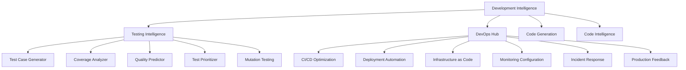

# LANKA Development Intelligence Module - Technical Documentation

## Table of Contents
1. [Overview](#overview)
2. [Architecture](#architecture)
3. [Core Services](#core-services)
4. [Testing Intelligence](#testing-intelligence)
5. [DevOps Automation](#devops-automation)
6. [API Reference](#api-reference)
7. [Integration Patterns](#integration-patterns)
8. [Best Practices](#best-practices)
9. [Troubleshooting](#troubleshooting)

## Overview

The Development Intelligence Module is the third and most comprehensive component of LANKA, providing AI-powered development workflow automation, intelligent testing, DevOps pipeline optimization, and production feedback analysis. This module completes the Requirements → Architecture → Development cycle, enabling organizations to automate their entire software development lifecycle.

### Key Capabilities

- **🤖 AI-Powered Code Generation:** Automatic code generation from requirements and architecture
- **🧪 Testing Intelligence:** Comprehensive test generation, optimization, and quality prediction
- **🚀 DevOps Automation:** Complete CI/CD pipeline and infrastructure management
- **📊 Production Feedback:** Real-time production insights and automated improvements
- **🔄 Workflow Orchestration:** End-to-end development workflow automation
- **📈 Quality Intelligence:** Comprehensive quality analysis and recommendations

## Architecture

### Module Structure

```
src/modules/development/
├── services/                    # Core business logic services
│   ├── development.service.ts           # Main orchestration service
│   ├── testing-intelligence.service.ts  # Testing AI coordination
│   ├── devops-hub.service.ts           # DevOps automation hub
│   ├── code-generation.service.ts      # AI code generation
│   ├── code-intelligence.service.ts    # Code analysis and insights
│   ├── test-case-generator.service.ts  # Automated test generation
│   ├── coverage-analyzer.service.ts    # Coverage analysis and gaps
│   ├── quality-predictor.service.ts    # ML-based quality prediction
│   ├── test-prioritizer.service.ts     # Intelligent test prioritization
│   ├── mutation-testing.service.ts     # Test effectiveness validation
│   ├── cicd-optimization.service.ts    # CI/CD pipeline optimization
│   ├── deployment-automation.service.ts # Automated deployment strategies
│   ├── infrastructure-as-code.service.ts # IaC generation and management
│   ├── monitoring-configuration.service.ts # Monitoring setup automation
│   ├── incident-response.service.ts    # Automated incident handling
│   └── production-feedback.service.ts  # Production insights and feedback
├── graphql/                    # GraphQL API layer
│   ├── devops.schema.ts       # Complete GraphQL schema (850+ lines)
│   └── devops.resolvers.ts    # GraphQL resolvers
├── types/                     # TypeScript definitions
│   ├── development.types.ts   # Core development types
│   └── code-generation.types.ts # Code generation types
└── development.module.ts      # NestJS module configuration
```

### Service Dependencies



## Core Services

### 1. Development Service

**File:** `src/modules/development/services/development.service.ts`

The main orchestration service that coordinates all development intelligence operations.

```typescript
export class DevelopmentService {
  async generateCode(requirementId: string, architectureId: string): Promise<GeneratedCode>
  async generateTests(codeComponentId: string): Promise<TestCase[]>
  async analyzeCICD(projectId: string): Promise<CICDAnalysis>
}
```

**Key Features:**
- **Code Generation Orchestration:** Coordinates AI-powered code generation
- **Test Strategy Planning:** Automated test suite planning and execution
- **DevOps Integration:** CI/CD pipeline analysis and optimization

### 2. Code Generation Service

**File:** `src/modules/development/services/code-generation.service.ts`

Provides AI-powered code generation capabilities using advanced language models.

```typescript
export class CodeGenerationService {
  async generateFromRequirements(requirements: Requirement[], architecture: ArchitectureDecision[]): Promise<GeneratedCode>
  async generateFromTemplate(template: CodeTemplate, context: GenerationContext): Promise<GeneratedCode>
  async validateGeneratedCode(code: GeneratedCode): Promise<ValidationResult>
}
```

**Key Features:**
- **Multi-Language Support:** TypeScript, JavaScript, Python, Java code generation
- **Template-Based Generation:** Customizable code templates and patterns
- **Quality Validation:** Automated code quality assessment and improvement
- **Pattern Integration:** Architecture pattern-based code structure generation

### 3. Code Intelligence Service

**File:** `src/modules/development/services/code-intelligence.service.ts`

Provides comprehensive code analysis, insights, and improvement recommendations.

```typescript
export class CodeIntelligenceService {
  async analyzeCodebase(projectId: string): Promise<CodebaseAnalysis>
  async detectPatterns(sourceCode: string): Promise<DetectedPattern[]>
  async suggestImprovements(codeAnalysis: CodebaseAnalysis): Promise<ImprovementSuggestion[]>
  async calculateComplexity(sourceCode: string): Promise<ComplexityMetrics>
}
```

**Key Features:**
- **Static Analysis:** Comprehensive codebase analysis and metrics
- **Pattern Detection:** Automatic identification of design patterns and anti-patterns
- **Quality Metrics:** Code quality scoring and improvement recommendations
- **Technical Debt Analysis:** Identification and quantification of technical debt

## Testing Intelligence

### Testing Intelligence Service

**File:** `src/modules/development/services/testing-intelligence.service.ts`

The main orchestrator for all AI-powered testing capabilities, coordinating multiple specialized testing services.

```typescript
export class TestingIntelligenceService {
  async generateTestCases(request: TestGenerationRequest): Promise<TestGenerationResponse>
  async analyzeCoverage(testSuiteId: string): Promise<CoverageAnalysis>
  async predictQuality(testId: string): Promise<QualityPrediction>
  async prioritizeTests(tests: TestCase[]): Promise<PrioritizedTest[]>
  async runMutationTesting(config: MutationTestConfig): Promise<MutationTestResult>
  async optimizeTestExecution(metrics: TestIntelligenceMetrics): Promise<TestOptimization>
}
```

### 1. Test Case Generator Service

**File:** `src/modules/development/services/test-case-generator.service.ts`

Generates comprehensive test cases using AI analysis of source code and requirements.

```typescript
export class TestCaseGeneratorService {
  async generateFromSourceCode(request: TestGenerationRequest): Promise<TestCase[]>
  async generateUnitTests(sourceCode: string, language: string): Promise<TestCase[]>
  async generateIntegrationTests(modules: string[], dependencies: Dependency[]): Promise<TestCase[]>
  async generateE2ETests(userStories: UserStory[]): Promise<TestCase[]>
  async generatePerformanceTests(specifications: PerformanceSpec[]): Promise<TestCase[]>
}
```

**AI-Powered Features:**
- **Context-Aware Generation:** Understanding code context for relevant test creation
- **Edge Case Detection:** Automatic identification of edge cases and boundary conditions
- **Test Type Optimization:** Selection of appropriate test types (unit, integration, e2e)
- **Assertion Generation:** Intelligent creation of test assertions based on code analysis

**Example Usage:**

```typescript
// Generate test cases for a user authentication service
const request: TestGenerationRequest = {
  sourceCode: `
    class AuthService {
      async login(email: string, password: string): Promise<User> {
        if (!email || !password) throw new Error('Missing credentials');
        const user = await this.userRepository.findByEmail(email);
        if (!user || !await this.hashService.compare(password, user.password)) {
          throw new Error('Invalid credentials');
        }
        return user;
      }
    }
  `,
  language: 'typescript',
  framework: TestFramework.JEST,
  testType: TestCaseType.UNIT,
  complexity: 3
};

const response = await testingService.generateTestCases(request);

// Generated test cases will include:
// - Valid login scenario
// - Missing email/password scenarios  
// - Invalid credentials scenarios
// - User not found scenarios
// - Password comparison failure scenarios
```

### 2. Coverage Analyzer Service

**File:** `src/modules/development/services/coverage-analyzer.service.ts`

Analyzes test coverage and identifies gaps for comprehensive testing strategies.

```typescript
export class CoverageAnalyzerService {
  async analyzeCoverage(coverage: Coverage, thresholds: CoverageThresholds): Promise<CoverageAnalysis>
  async identifyGaps(sourceCode: string, testCases: TestCase[]): Promise<CoverageGap[]>
  async suggestCoverageImprovements(analysis: CoverageAnalysis): Promise<CoverageImprovement[]>
  async trackCoverageTrends(projectId: string): Promise<CoverageTrend[]>
}
```

**Key Features:**
- **Multi-Dimensional Analysis:** Statement, branch, function, and line coverage analysis
- **Gap Identification:** Automatic identification of uncovered code paths
- **Trend Analysis:** Coverage improvement/degradation tracking over time
- **Priority-Based Recommendations:** Risk-based coverage improvement suggestions

### 3. Quality Predictor Service

**File:** `src/modules/development/services/quality-predictor.service.ts`

Uses machine learning to predict test quality and effectiveness.

```typescript
export class QualityPredictorService {
  async predictTestQuality(testId: string): Promise<QualityPrediction>
  async assessTestEffectiveness(testSuite: TestSuite): Promise<EffectivenessScore>
  async predictMaintenanceBurden(tests: TestCase[]): Promise<MaintenancePrediction>
  async forecastQualityTrends(projectId: string): Promise<QualityTrend[]>
}
```

**ML Features:**
- **Historical Analysis:** Learning from past test execution patterns
- **Failure Prediction:** Predicting which tests are likely to become problematic
- **Maintenance Scoring:** Estimating test maintenance effort and burden
- **Quality Trend Forecasting:** Predicting future quality metrics based on current trends

### 4. Test Prioritizer Service

**File:** `src/modules/development/services/test-prioritizer.service.ts`

Intelligently prioritizes tests based on risk, coverage, and business impact.

```typescript
export class TestPrioritizerService {
  async prioritizeTests(tests: TestCase[], weights: PriorityWeights): Promise<PrioritizedTest[]>
  async calculateRiskScore(test: TestCase): Promise<RiskScore>
  async optimizeExecutionOrder(tests: TestCase[]): Promise<ExecutionPlan>
  async suggestParallelExecution(tests: TestCase[]): Promise<ParallelExecutionPlan>
}
```

**Prioritization Factors:**
- **Risk Assessment:** Code change impact and failure probability
- **Coverage Impact:** Test coverage contribution and overlap
- **Execution Time:** Test duration and resource requirements
- **Business Criticality:** Feature importance and user impact
- **Historical Performance:** Past failure rates and reliability

### 5. Mutation Testing Service

**File:** `src/modules/development/services/mutation-testing.service.ts`

Validates test suite effectiveness through mutation testing techniques.

```typescript
export class MutationTestingService {
  async runMutationTesting(config: MutationTestConfig): Promise<MutationTestResult>
  async generateMutants(sourceCode: string): Promise<Mutant[]>
  async analyzeMutationScore(results: MutationTestResult): Promise<MutationAnalysis>
  async suggestTestImprovements(analysis: MutationAnalysis): Promise<TestImprovement[]>
}
```

**Mutation Types:**
- **Arithmetic Operators:** +, -, *, / mutations
- **Comparison Operators:** <, >, ==, != mutations  
- **Logical Operators:** &&, ||, ! mutations
- **Boundary Conditions:** Off-by-one error detection
- **Null/Undefined Handling:** Null pointer and undefined mutations

## DevOps Automation

### DevOps Hub Service

**File:** `src/modules/development/services/devops-hub.service.ts`

The central orchestration service for all DevOps automation capabilities.

```typescript
export class DevOpsHubService {
  async orchestrateDevOpsPipeline(config: DevOpsConfiguration): Promise<DevOpsPipeline>
  async generateSecurityStrategy(requirements: SecurityRequirements): Promise<SecurityStrategy>
  async analyzeDevOpsMaturity(currentState: DevOpsState): Promise<MaturityAssessment>
  async optimizeResourceAllocation(infrastructure: Infrastructure): Promise<ResourceOptimization>
}
```

### 1. CI/CD Optimization Service

**File:** `src/modules/development/services/cicd-optimization.service.ts`

Optimizes CI/CD pipelines for performance, reliability, and efficiency.

```typescript
export class CICDOptimizationService {
  async optimizePipeline(config: CICDConfiguration): Promise<PipelineOptimization>
  async analyzeBottlenecks(pipeline: Pipeline): Promise<Bottleneck[]>
  async suggestParallelization(stages: PipelineStage[]): Promise<ParallelizationPlan>
  async optimizeCacheStrategy(pipeline: Pipeline): Promise<CacheStrategy>
}
```

**Optimization Areas:**
- **Build Time Reduction:** Parallel execution, dependency caching, incremental builds
- **Resource Optimization:** Efficient resource allocation and scaling
- **Cache Strategy:** Intelligent caching for dependencies and artifacts
- **Pipeline Reliability:** Failure recovery and retry strategies
- **Cost Optimization:** Resource usage optimization for cloud CI/CD platforms

**Example Pipeline Optimization:**

```yaml
# Original Pipeline (Sequential)
name: Original CI/CD
stages:
  - test:
      - unit-tests (5 min)
      - integration-tests (8 min) 
      - e2e-tests (12 min)
  - build: (4 min)
  - deploy: (3 min)
# Total: 32 minutes

# Optimized Pipeline (Parallel)
name: Optimized CI/CD  
stages:
  - test (parallel):
      - unit-tests (5 min)
      - integration-tests (8 min)
      - e2e-tests (12 min)  # 12 min total (parallel)
  - build: (4 min with caching - reduced from 6 min)
  - deploy: (3 min)
# Total: 19 minutes (40% reduction)
```

### 2. Deployment Automation Service

**File:** `src/modules/development/services/deployment-automation.service.ts`

Automates deployment strategies with zero-downtime and rollback capabilities.

```typescript
export class DeploymentAutomationService {
  async generateDeploymentStrategy(config: DeploymentConfig): Promise<DeploymentStrategy>
  async automateBlueGreenDeployment(application: Application): Promise<BlueGreenDeployment>
  async automateCanaryDeployment(application: Application): Promise<CanaryDeployment>
  async automateRollingDeployment(application: Application): Promise<RollingDeployment>
}
```

**Deployment Strategies:**

#### Blue-Green Deployment
```typescript
const blueGreenStrategy: DeploymentStrategy = {
  type: 'blue-green',
  configuration: {
    blueEnvironment: 'production-blue',
    greenEnvironment: 'production-green',
    trafficSwitchMethod: 'load-balancer',
    validationSteps: [
      'health-check',
      'smoke-tests',
      'performance-validation'
    ]
  },
  automationSteps: [
    {
      step: 'deploy-to-green',
      validation: { healthCheck: '/health', expectedStatus: 200 }
    },
    {
      step: 'run-smoke-tests',
      validation: { testSuite: 'smoke', minimumPassRate: 100 }
    },
    {
      step: 'switch-traffic',
      trafficWeight: 100
    }
  ],
  rollbackProcedure: {
    trigger: 'health-check-failure OR error-rate > 5%',
    steps: ['switch-traffic-to-blue', 'investigate-green-issues'],
    timeLimit: 300 // 5 minutes
  }
};
```

#### Canary Deployment
```typescript
const canaryStrategy: DeploymentStrategy = {
  type: 'canary',
  configuration: {
    canaryTrafficPercentage: [10, 25, 50, 100],
    progressionCriteria: {
      errorRate: { max: 0.01 },
      responseTime: { max: 200 },
      successRate: { min: 99.9 }
    }
  }
};
```

### 3. Infrastructure as Code Service

**File:** `src/modules/development/services/infrastructure-as-code.service.ts`

Generates and manages Infrastructure as Code configurations for multiple cloud providers.

```typescript
export class InfrastructureAsCodeService {
  async generateTerraformConfig(requirements: InfrastructureRequirements): Promise<TerraformConfiguration>
  async generateKubernetesManifests(application: Application): Promise<KubernetesManifests>
  async generateDockerConfig(application: Application): Promise<DockerConfiguration>
  async generateHelmChart(application: Application): Promise<HelmChart>
}
```

**Generated Configurations:**

#### Terraform Configuration Example
```hcl
# Auto-generated Terraform configuration for AWS EKS
provider "aws" {
  region = var.aws_region
}

module "vpc" {
  source = "terraform-aws-modules/vpc/aws"
  
  name = "${var.project_name}-vpc"
  cidr = "10.0.0.0/16"
  
  azs             = ["${var.aws_region}a", "${var.aws_region}b", "${var.aws_region}c"]
  private_subnets = ["10.0.1.0/24", "10.0.2.0/24", "10.0.3.0/24"]
  public_subnets  = ["10.0.101.0/24", "10.0.102.0/24", "10.0.103.0/24"]
  
  enable_nat_gateway = true
  enable_vpn_gateway = true
  
  tags = {
    Project     = var.project_name
    Environment = var.environment
    ManagedBy   = "LANKA"
  }
}

module "eks" {
  source = "terraform-aws-modules/eks/aws"
  
  cluster_name    = "${var.project_name}-cluster"
  cluster_version = "1.24"
  
  vpc_id     = module.vpc.vpc_id
  subnet_ids = module.vpc.private_subnets
  
  node_groups = {
    main = {
      desired_capacity = 3
      max_capacity     = 10
      min_capacity     = 1
      
      instance_types = ["t3.medium"]
      
      k8s_labels = {
        Environment = var.environment
        NodeGroup   = "main"
      }
    }
  }
}
```

#### Kubernetes Manifests Example
```yaml
# Auto-generated Kubernetes deployment manifest
apiVersion: apps/v1
kind: Deployment
metadata:
  name: {{ .Values.app.name }}
  labels:
    app: {{ .Values.app.name }}
    version: {{ .Values.app.version }}
    managed-by: lanka
spec:
  replicas: {{ .Values.app.replicas }}
  selector:
    matchLabels:
      app: {{ .Values.app.name }}
  template:
    metadata:
      labels:
        app: {{ .Values.app.name }}
        version: {{ .Values.app.version }}
    spec:
      containers:
      - name: {{ .Values.app.name }}
        image: {{ .Values.image.repository }}:{{ .Values.image.tag }}
        ports:
        - containerPort: {{ .Values.app.port }}
        env:
        - name: NODE_ENV
          value: {{ .Values.app.environment }}
        resources:
          limits:
            cpu: {{ .Values.resources.limits.cpu }}
            memory: {{ .Values.resources.limits.memory }}
          requests:
            cpu: {{ .Values.resources.requests.cpu }}
            memory: {{ .Values.resources.requests.memory }}
        livenessProbe:
          httpGet:
            path: /health
            port: {{ .Values.app.port }}
          initialDelaySeconds: 30
          periodSeconds: 10
        readinessProbe:
          httpGet:
            path: /ready
            port: {{ .Values.app.port }}
          initialDelaySeconds: 5
          periodSeconds: 5
---
apiVersion: v1
kind: Service
metadata:
  name: {{ .Values.app.name }}-service
spec:
  selector:
    app: {{ .Values.app.name }}
  ports:
  - protocol: TCP
    port: 80
    targetPort: {{ .Values.app.port }}
  type: ClusterIP
```

### 4. Monitoring Configuration Service

**File:** `src/modules/development/services/monitoring-configuration.service.ts`

Automatically configures monitoring, alerting, and observability stack.

```typescript
export class MonitoringConfigurationService {
  async generatePrometheusConfig(services: Service[]): Promise<PrometheusConfiguration>
  async generateGrafanaDashboard(application: Application): Promise<GrafanaDashboard>
  async generateAlertingRules(sla: SLA[]): Promise<AlertingRules>
  async configureSLIsSLOs(requirements: SLARequirements): Promise<SLIConfiguration>
}
```

**Generated Monitoring Stack:**

#### Prometheus Configuration
```yaml
# Auto-generated Prometheus configuration
global:
  scrape_interval: 15s
  evaluation_interval: 15s

rule_files:
  - "alert_rules.yml"

alerting:
  alertmanagers:
    - static_configs:
        - targets:
          - alertmanager:9093

scrape_configs:
  - job_name: 'application-metrics'
    static_configs:
      - targets: ['app:3000']
    metrics_path: /metrics
    scrape_interval: 15s
    
  - job_name: 'node-exporter'
    static_configs:
      - targets: ['node-exporter:9100']
      
  - job_name: 'kubernetes-pods'
    kubernetes_sd_configs:
      - role: pod
    relabel_configs:
      - source_labels: [__meta_kubernetes_pod_annotation_prometheus_io_scrape]
        action: keep
        regex: true
```

#### Grafana Dashboard Generation
```typescript
const dashboard: GrafanaDashboard = {
  dashboard: {
    id: null,
    title: `${applicationName} - Application Metrics`,
    tags: ['lanka-generated', 'application-metrics'],
    timezone: 'UTC',
    panels: [
      {
        id: 1,
        title: 'Request Rate (RPS)',
        type: 'graph',
        targets: [{
          expr: 'rate(http_requests_total[5m])',
          legendFormat: 'Requests/sec'
        }]
      },
      {
        id: 2,
        title: 'Response Time (95th percentile)',
        type: 'graph',
        targets: [{
          expr: 'histogram_quantile(0.95, rate(http_request_duration_seconds_bucket[5m]))',
          legendFormat: '95th percentile'
        }]
      },
      {
        id: 3,
        title: 'Error Rate',
        type: 'graph',
        targets: [{
          expr: 'rate(http_requests_total{status=~"5.."}[5m])',
          legendFormat: 'Error rate'
        }]
      }
    ]
  },
  alerts: [
    {
      name: 'High Error Rate',
      condition: [
        {
          query: { queryType: 'A' },
          reducer: { type: 'last' },
          evaluator: { params: [0.05], type: 'gt' }
        }
      ],
      frequency: '10s'
    }
  ]
};
```

### 5. Incident Response Service

**File:** `src/modules/development/services/incident-response.service.ts`

Automates incident detection, response, and resolution processes.

```typescript
export class IncidentResponseService {
  async createIncidentResponse(alert: IncidentAlert): Promise<IncidentResponse>
  async automateIncidentMitigation(incidentId: string, incidentType: string): Promise<MitigationResult>
  async generateRunbook(serviceName: string, serviceType: string): Promise<Runbook>
  async escalateIncident(incidentId: string): Promise<EscalationResult>
}
```

**Automated Incident Response:**

```typescript
// Example incident response for high error rate
const incidentResponse: IncidentResponse = {
  incident: {
    id: 'INC-2025-001',
    severity: AlertSeverity.CRITICAL,
    status: IncidentStatus.INVESTIGATING,
    title: 'High Error Rate in Authentication Service',
    createdAt: '2025-08-10T10:30:00Z',
    assignedTo: 'on-call-engineer',
    escalationLevel: 1
  },
  immediateActions: [
    {
      action: 'Scale up replicas',
      description: 'Increase service replicas from 3 to 6',
      automated: true,
      command: 'kubectl scale deployment auth-service --replicas=6',
      priority: Priority.HIGH
    },
    {
      action: 'Enable circuit breaker',
      description: 'Activate circuit breaker to prevent cascade failures',
      automated: true,
      command: 'enable-circuit-breaker auth-service',
      priority: Priority.HIGH
    }
  ],
  diagnostics: {
    automated: [
      {
        check: 'Service Health',
        command: 'curl -f https://api.example.com/health',
        expected: '200 OK'
      },
      {
        check: 'Database Connection',
        command: 'pg_isready -h db-host -p 5432',
        expected: 'accepting connections'
      }
    ],
    manual: [
      'Check recent deployments',
      'Review error logs for patterns',
      'Analyze database performance'
    ]
  }
};
```

### 6. Production Feedback Service

**File:** `src/modules/development/services/production-feedback.service.ts`

Collects production metrics and generates actionable development insights.

```typescript
export class ProductionFeedbackService {
  async collectProductionMetrics(config: ProductionMetricsConfig): Promise<ProductionMetrics>
  async generateFeedbackLoop(metricsData: ProductionMetrics): Promise<FeedbackLoop>
  async createDevelopmentTickets(feedback: FeedbackLoop): Promise<DevelopmentTicket[]>
  async generatePerformanceInsights(serviceName: string): Promise<PerformanceInsights>
}
```

**Production Feedback Loop:**

```typescript
const feedbackLoop: FeedbackLoop = {
  insights: [
    {
      category: 'performance',
      priority: Priority.HIGH,
      title: 'Database Query Performance Degradation',
      description: 'User registration queries taking 2.3s average (up from 0.8s)',
      metrics: {
        currentResponseTime: 2300,
        baselineResponseTime: 800,
        degradationPercentage: 187.5
      },
      recommendations: [
        {
          action: 'Add database index on user_email column',
          description: 'Create unique index to improve query performance',
          effort: EffortLevel.LOW,
          impact: ImpactLevel.HIGH
        },
        {
          action: 'Implement query caching',
          description: 'Cache user lookup queries for 5 minutes',
          effort: EffortLevel.MEDIUM,
          impact: ImpactLevel.MEDIUM
        }
      ]
    }
  ],
  developmentActions: [
    {
      type: 'bug_fix',
      priority: Priority.HIGH,
      title: 'Optimize user registration database queries',
      description: 'Add missing indexes and implement caching strategy',
      assignee: 'backend-team',
      sprint: 'Sprint-24',
      estimatedEffort: '3-5 hours'
    }
  ],
  monitoring: {
    newMetrics: [
      {
        name: 'user_registration_duration',
        description: 'Track user registration end-to-end duration',
        threshold: 1000 // milliseconds
      }
    ],
    alerts: [
      {
        condition: 'user_registration_duration > 2000',
        severity: AlertSeverity.WARNING
      }
    ]
  },
  testing: {
    scenarios: [
      {
        type: 'performance',
        description: 'Load test user registration under high concurrency',
        criteria: { responseTime: '<1s', throughput: '>100 rps' }
      }
    ],
    automation: [
      {
        test: 'User registration performance test',
        frequency: 'daily'
      }
    ]
  }
};
```

## API Reference

### GraphQL Schema

**File:** `src/modules/development/graphql/devops.schema.ts`

The Development Intelligence module provides a comprehensive GraphQL API with 100+ types covering all development operations.

#### Key Query Operations

```graphql
type Query {
  # DevOps Pipeline Operations
  getDevOpsPipeline(configuration: DevOpsConfigurationInput!): DevOpsPipeline!
  
  # Testing Intelligence
  generateTestCases(request: TestGenerationRequestInput!): TestGenerationResponse!
  analyzeCoverage(testSuiteId: ID!): CoverageAnalysis!
  predictTestQuality(testId: ID!): QualityPrediction!
  
  # CI/CD Operations  
  analyzeCICDPipeline(config: CICDConfigurationInput!): PipelineOptimization!
  generateWorkflowTemplate(
    projectName: String!
    technologies: [String!]!
    platform: CICDPlatform!
  ): WorkflowTemplate!
  
  # Infrastructure Operations
  generateTerraformConfig(
    provider: CloudProvider!
    region: String!
  ): TerraformConfiguration!
  
  generateKubernetesManifests(
    appName: String!
    image: String!
  ): KubernetesManifests!
  
  # Monitoring Operations
  generatePrometheusConfig(services: [String!]!): PrometheusConfiguration!
  generateGrafanaDashboard(
    appName: String!
    metrics: [String!]!
  ): GrafanaDashboard!
  
  # Production Feedback
  collectProductionMetrics(
    config: ProductionMetricsConfigInput!
  ): ProductionMetrics!
  
  generatePerformanceInsights(serviceName: String!): PerformanceInsights!
}
```

#### Key Mutation Operations

```graphql
type Mutation {
  # Workflow Orchestration
  orchestrateDevOpsPipeline(
    configuration: DevOpsConfigurationInput!
  ): DevOpsPipeline!
  
  # Testing Operations
  runMutationTesting(config: MutationTestConfigInput!): MutationTestResult!
  prioritizeTests(tests: [TestCaseInput!]!): [PrioritizedTest!]!
  
  # CI/CD Operations
  optimizeCICDPipeline(config: CICDConfigurationInput!): PipelineOptimization!
  
  # Incident Management
  createIncidentResponse(alert: IncidentAlertInput!): IncidentResponse!
  automateIncidentMitigation(
    incidentId: String!
    incidentType: String!
  ): MitigationResult!
  
  # Production Feedback
  generateFeedbackLoop(metricsData: JSON!): FeedbackLoop!
  createDevelopmentTickets(feedback: JSON!): [DevelopmentTicket!]!
}
```

#### Real-time Subscriptions

```graphql
type Subscription {
  # Real-time incident updates
  incidentUpdates(serviceNames: [String!]!): IncidentResponse!
  
  # Real-time performance metrics
  performanceMetrics(services: [String!]!): ProductionMetrics!
  
  # Pipeline status updates
  pipelineStatus(pipelineId: String!): PipelineStatus!
  
  # Deployment status updates
  deploymentStatus(deploymentId: String!): DeploymentStatus!
  
  # Test execution progress
  testExecutionProgress(testSuiteId: String!): TestExecutionProgress!
}
```

### Usage Examples

#### 1. Complete DevOps Pipeline Setup

```graphql
mutation SetupDevOpsPipeline {
  orchestrateDevOpsPipeline(
    configuration: {
      project: {
        name: "my-web-app"
        type: WEB_APPLICATION
        technologies: ["typescript", "react", "nodejs", "postgresql"]
        environments: ["development", "staging", "production"]
      }
      requirements: {
        cicd: {
          platform: GITHUB_ACTIONS
          triggers: ["push", "pull_request"]
          stages: ["test", "build", "deploy"]
        }
        deployment: {
          strategy: BLUE_GREEN
          rollback: true
          zeroDowntime: true
        }
        infrastructure: {
          provider: AWS
          container: KUBERNETES
          scaling: true
        }
        monitoring: {
          metrics: true
          logging: true
          alerting: true
        }
      }
    }
  ) {
    configuration {
      project { name type }
    }
    components {
      cicd {
        platform
        workflow {
          name
          content
          estimatedBuildTime
        }
      }
      deployment {
        strategy {
          type
          automationSteps {
            step
            validation
          }
        }
      }
      infrastructure {
        terraform {
          provider
          files
        }
        kubernetes {
          deployment
          service
          configmap
        }
      }
      monitoring {
        prometheus {
          prometheusYml
          alertRulesYml
        }
        grafana {
          dashboard
        }
      }
    }
    timeline {
      phase
      duration
      dependencies
      tasks
    }
  }
}
```

#### 2. AI-Powered Test Generation

```graphql
query GenerateTestSuite($sourceCode: String!, $requirements: [String!]!) {
  generateTestCases(
    request: {
      sourceCode: $sourceCode
      language: "typescript"
      framework: JEST
      testType: UNIT
      requirements: $requirements
      complexity: 4
    }
  ) {
    testCases {
      id
      name
      description
      type
      priority
      code
      assertions {
        type
        expected
        actual
      }
      coverage {
        statements { percentage }
        branches { percentage }
        functions { percentage }
        lines { percentage }
      }
    }
    recommendations
    confidence
    metadata {
      generatedAt
      framework
      testType
    }
  }
}

# Variables
{
  "sourceCode": "class UserService { async createUser(data: UserInput): Promise<User> { ... } }",
  "requirements": ["User creation must validate email format", "Password must be hashed"]
}
```

#### 3. Production Feedback Analysis

```graphql
query GetProductionInsights($serviceName: String!) {
  generatePerformanceInsights(serviceName: $serviceName) {
    summary {
      overallHealth
      criticalIssues
      warnings
      recommendations
    }
    bottlenecks {
      component
      type  
      severity
      impact
      solution {
        immediate
        longTerm
      }
    }
    optimizations {
      category
      description
      expectedImprovement
      implementation {
        effort
        timeline
        steps
      }
    }
    trends {
      performance {
        direction
        changeRate
      }
      usage {
        growth
        forecast {
          period
          expectedGrowth
        }
      }
    }
  }
}
```

## Integration Patterns

### 1. Cross-Module Integration

The Development Intelligence module seamlessly integrates with Requirements and Architecture modules:

```typescript
// Requirements → Development Integration
export class RequirementsDevelopmentIntegrationService {
  async convertRequirementsToDevelopmentSpecs(requirementId: string): Promise<DevelopmentSpecification>
  async generateDevelopmentTasks(requirementId: string): Promise<DevelopmentTask[]>
  async generateCodeTemplatesFromRequirements(requirements: Requirement[]): Promise<CodeTemplate[]>
  async validateImplementationAgainstRequirements(implementationId: string): Promise<ValidationResult>
  async trackImplementationProgress(requirementId: string): Promise<ImplementationProgress>
}

// Architecture → Development Integration  
export class ArchitectureDevelopmentIntegrationService {
  async applyArchitecturalDecisionsToDevelopment(projectId: string, spec: DevelopmentSpecification): Promise<EnhancedDevelopmentSpecification>
  async generateCodeStructureFromArchitecture(projectId: string, spec: DevelopmentSpecification): Promise<CodeStructure>
  async generateDevelopmentGuidelines(projectId: string): Promise<DevelopmentGuidelines>
  async validateImplementationAgainstArchitecture(implementationId: string): Promise<ArchitectureValidationResult>
  async suggestArchitecturalImprovements(implementationId: string): Promise<ArchitecturalImprovement[]>
}
```

### 2. Workflow Orchestration

The Development Workflow Service orchestrates complete development lifecycles:

```typescript
export class DevelopmentWorkflowService {
  async executeCompleteWorkflow(
    projectId: string, 
    requirementId: string, 
    options?: WorkflowOptions
  ): Promise<WorkflowResult>
  
  async createWorkflow(
    workflowId: string,
    projectId: string, 
    requirementId: string,
    options: WorkflowOptions
  ): Promise<WorkflowDefinition>
  
  async executeWorkflow(workflow: WorkflowDefinition): Promise<WorkflowResult>
}
```

**Complete Workflow Example:**

```typescript
const workflowOptions: WorkflowOptions = {
  enableParallelExecution: true,
  enableQualityGates: true,
  captureKnowledge: true,
  includeDeploy: true,
  enableAutomaticRollback: true
};

const result = await developmentWorkflow.executeCompleteWorkflow(
  'project-123',
  'req-456', 
  workflowOptions
);

// Result includes:
// - Complete development specifications
// - Generated code with architecture compliance
// - Comprehensive test suite with AI-generated tests  
// - CI/CD pipeline configuration
// - Infrastructure as Code templates
// - Monitoring and alerting setup
// - Deployment automation
// - Production feedback integration
```

### 3. Event-Driven Integration

Real-time integration with external systems through event streaming:

```typescript
// Event Types
interface DevelopmentEvent {
  type: 'code_generated' | 'test_completed' | 'deployment_finished' | 'incident_detected';
  payload: any;
  timestamp: string;
  source: string;
}

// Event Handlers
export class DevelopmentEventHandler {
  async handleCodeGenerated(event: CodeGeneratedEvent): Promise<void>
  async handleTestCompleted(event: TestCompletedEvent): Promise<void>  
  async handleDeploymentFinished(event: DeploymentFinishedEvent): Promise<void>
  async handleIncidentDetected(event: IncidentDetectedEvent): Promise<void>
}
```

## Best Practices

### 1. Code Generation Best Practices

**Template Organization:**
```
templates/
├── frameworks/
│   ├── express/
│   │   ├── controller.hbs
│   │   ├── service.hbs
│   │   └── repository.hbs
│   ├── nestjs/
│   └── fastify/
├── patterns/
│   ├── mvc/
│   ├── layered/
│   └── hexagonal/
└── languages/
    ├── typescript/
    ├── javascript/
    └── python/
```

**Quality Validation:**
```typescript
const validationRules: CodeValidationRule[] = [
  {
    name: 'TypeScript Strict Mode',
    check: (code) => code.includes('strict: true'),
    severity: 'error'
  },
  {
    name: 'Error Handling',
    check: (code) => /try\s*{.*}\s*catch/s.test(code),
    severity: 'warning'
  },
  {
    name: 'Input Validation', 
    check: (code) => code.includes('validate') || code.includes('schema'),
    severity: 'warning'
  }
];
```

### 2. Testing Intelligence Best Practices

**Test Generation Configuration:**
```typescript
const testConfig: TestGenerationConfig = {
  // Test type priorities
  testTypePriorities: {
    [TestCaseType.UNIT]: 1,
    [TestCaseType.INTEGRATION]: 2,
    [TestCaseType.E2E]: 3,
    [TestCaseType.PERFORMANCE]: 4
  },
  
  // Coverage targets
  coverageTargets: {
    statements: 90,
    branches: 85, 
    functions: 95,
    lines: 90
  },
  
  // Quality thresholds
  qualityThresholds: {
    complexity: 10,
    maintainabilityIndex: 20,
    duplicatedLines: 5
  }
};
```

**Test Organization:**
```
tests/
├── unit/
│   ├── services/
│   ├── controllers/  
│   └── utils/
├── integration/
│   ├── api/
│   ├── database/
│   └── external-services/
├── e2e/
│   ├── user-journeys/
│   └── business-workflows/
└── performance/
    ├── load/
    └── stress/
```

### 3. DevOps Automation Best Practices

**Pipeline Organization:**
```yaml
# .github/workflows/ci-cd.yml (Generated by LANKA)
name: CI/CD Pipeline

on:
  push:
    branches: [main, develop]
  pull_request:
    branches: [main]

env:
  NODE_VERSION: '18'
  DOCKER_REGISTRY: 'your-registry.com'

jobs:
  test:
    name: Test Suite
    runs-on: ubuntu-latest
    steps:
      - uses: actions/checkout@v3
      - name: Setup Node.js
        uses: actions/setup-node@v3
        with:
          node-version: ${{ env.NODE_VERSION }}
          cache: 'npm'
      
      - name: Install dependencies
        run: npm ci
      
      - name: Run linting
        run: npm run lint
      
      - name: Run unit tests
        run: npm run test:coverage
      
      - name: Run integration tests  
        run: npm run test:integration
      
      - name: Upload coverage
        uses: codecov/codecov-action@v3

  build:
    name: Build and Push
    needs: test
    runs-on: ubuntu-latest
    if: github.ref == 'refs/heads/main'
    steps:
      - uses: actions/checkout@v3
      
      - name: Build Docker image
        run: docker build -t ${{ env.DOCKER_REGISTRY }}/app:${{ github.sha }} .
      
      - name: Push Docker image
        run: docker push ${{ env.DOCKER_REGISTRY }}/app:${{ github.sha }}

  deploy:
    name: Deploy to Production
    needs: build
    runs-on: ubuntu-latest
    environment: production
    steps:
      - name: Deploy to Kubernetes
        run: |
          kubectl set image deployment/app app=${{ env.DOCKER_REGISTRY }}/app:${{ github.sha }}
          kubectl rollout status deployment/app
```

**Infrastructure Organization:**
```
infrastructure/
├── terraform/
│   ├── environments/
│   │   ├── dev/
│   │   ├── staging/
│   │   └── prod/
│   ├── modules/
│   │   ├── networking/
│   │   ├── compute/
│   │   └── monitoring/
│   └── global/
├── kubernetes/
│   ├── base/
│   ├── overlays/
│   │   ├── dev/
│   │   ├── staging/
│   │   └── prod/
└── helm/
    ├── charts/
    └── values/
```

### 4. Production Feedback Best Practices

**Metrics Collection Strategy:**
```typescript
const metricsStrategy: MetricsCollectionStrategy = {
  // SLI definitions
  serviceLevel Indicators: {
    availability: {
      definition: 'Percentage of successful requests',
      target: 99.9,
      measurement: 'success_count / total_requests * 100'
    },
    latency: {
      definition: '95th percentile response time',
      target: 200, // milliseconds
      measurement: 'histogram_quantile(0.95, http_request_duration_seconds)'
    },
    errorRate: {
      definition: 'Percentage of requests resulting in errors',
      target: 0.1, // 0.1%
      measurement: 'error_count / total_requests * 100'
    }
  },
  
  // Alert thresholds
  alertThresholds: {
    availability: { warning: 99.5, critical: 99.0 },
    latency: { warning: 500, critical: 1000 },
    errorRate: { warning: 1.0, critical: 5.0 }
  },
  
  // Collection intervals
  collectionIntervals: {
    realTime: '15s',
    aggregated: '5m',
    longTerm: '1h'
  }
};
```

### 5. Integration Testing Best Practices

**Test Data Management:**
```typescript
export class TestDataFactory {
  async createProject(): Promise<Project> {
    return {
      id: generateUUID(),
      name: `test-project-${Date.now()}`,
      description: 'Test project for integration testing',
      createdAt: new Date(),
      status: 'active'
    };
  }
  
  async createRequirement(projectId: string): Promise<Requirement> {
    return {
      id: generateUUID(),
      projectId,
      title: 'Test User Authentication',
      description: 'As a user, I want to login securely',
      type: 'user_story',
      priority: 'high',
      status: 'approved',
      createdAt: new Date()
    };
  }
  
  async cleanupTestData(): Promise<void> {
    // Clean up all test data after test completion
    await this.neo4j.executeQuery('MATCH (n:Test) DETACH DELETE n');
  }
}
```

## Troubleshooting

### Common Issues and Solutions

#### 1. Code Generation Issues

**Issue: Generated code doesn't compile**
```
Error: Cannot find name 'UserService' in generated code
```

**Solution:**
```typescript
// Check template dependencies and imports
const template = `
import { UserService } from '../services/user.service';
import { CreateUserDto } from '../dto/create-user.dto';

export class UserController {
  constructor(private userService: UserService) {}
  
  @Post()
  async createUser(@Body() createUserDto: CreateUserDto) {
    return this.userService.create(createUserDto);
  }
}
`;
```

**Prevention:**
- Always validate generated code syntax
- Include proper imports in templates
- Test templates with sample data

#### 2. Test Generation Issues

**Issue: Generated tests don't cover edge cases**
```
Generated tests only cover happy path scenarios
```

**Solution:**
```typescript
const testGenerationConfig: TestGenerationConfig = {
  includeEdgeCases: true,
  edgeCaseScenarios: [
    'null_inputs',
    'empty_strings', 
    'boundary_values',
    'invalid_types',
    'network_failures',
    'timeout_scenarios'
  ],
  coverageTargets: {
    branches: 90, // Ensure branch coverage for edge cases
    statements: 85
  }
};
```

#### 3. DevOps Pipeline Issues

**Issue: CI/CD pipeline fails during deployment**
```
Error: Kubernetes deployment failed - ImagePullBackOff
```

**Solution:**
```yaml
# Ensure proper image tagging and registry access
- name: Build and push Docker image
  run: |
    docker build -t ${{ env.DOCKER_REGISTRY }}/app:${{ github.sha }} .
    echo "${{ secrets.DOCKER_PASSWORD }}" | docker login -u "${{ secrets.DOCKER_USERNAME }}" --password-stdin
    docker push ${{ env.DOCKER_REGISTRY }}/app:${{ github.sha }}

- name: Verify image exists
  run: |
    docker pull ${{ env.DOCKER_REGISTRY }}/app:${{ github.sha }}
```

#### 4. Monitoring Configuration Issues

**Issue: Prometheus not scraping application metrics**
```
Error: No data points found for application metrics
```

**Solution:**
```typescript
// Ensure application exposes metrics endpoint
import { register, collectDefaultMetrics } from 'prom-client';

// Collect default metrics
collectDefaultMetrics();

// Custom metrics
const httpRequestDuration = new promClient.Histogram({
  name: 'http_request_duration_seconds',
  help: 'Duration of HTTP requests in seconds',
  labelNames: ['method', 'route', 'status']
});

// Expose metrics endpoint
app.get('/metrics', (req, res) => {
  res.set('Content-Type', register.contentType);
  res.end(register.metrics());
});
```

#### 5. Performance Issues

**Issue: Large codebase causing slow test generation**
```
Test generation taking > 5 minutes for large files
```

**Solution:**
```typescript
// Implement parallel processing and caching
export class OptimizedTestGenerator {
  private cache = new Map<string, TestCase[]>();
  
  async generateTestsParallel(files: string[]): Promise<TestCase[]> {
    const chunks = this.chunkArray(files, 5); // Process 5 files at a time
    const promises = chunks.map(chunk => 
      Promise.all(chunk.map(file => this.generateForFile(file)))
    );
    
    const results = await Promise.all(promises);
    return results.flat(2);
  }
  
  private async generateForFile(file: string): Promise<TestCase[]> {
    const cacheKey = this.generateCacheKey(file);
    if (this.cache.has(cacheKey)) {
      return this.cache.get(cacheKey)!;
    }
    
    const tests = await this.generateTestCases(file);
    this.cache.set(cacheKey, tests);
    return tests;
  }
}
```

### Debug Configuration

**Enable detailed logging:**
```typescript
// Set environment variables
process.env.LOG_LEVEL = 'debug';
process.env.DEVELOPMENT_DEBUG = 'true';

// Logger configuration
const logger = winston.createLogger({
  level: process.env.LOG_LEVEL || 'info',
  format: winston.format.combine(
    winston.format.timestamp(),
    winston.format.errors({ stack: true }),
    winston.format.json()
  ),
  transports: [
    new winston.transports.File({ filename: 'development.log' }),
    new winston.transports.Console()
  ]
});
```

**GraphQL debugging:**
```typescript
// Enable GraphQL query logging
const server = new ApolloServer({
  typeDefs,
  resolvers,
  plugins: [
    {
      requestDidStart() {
        return {
          didResolveOperation(requestContext) {
            console.log('Query:', requestContext.request.query);
            console.log('Variables:', requestContext.request.variables);
          }
        };
      }
    }
  ]
});
```

### Performance Monitoring

**Monitor service performance:**
```typescript
import { performance } from 'perf_hooks';

export function monitor(target: any, propertyName: string, descriptor: PropertyDescriptor) {
  const method = descriptor.value;
  
  descriptor.value = async function (...args: any[]) {
    const start = performance.now();
    try {
      const result = await method.apply(this, args);
      const duration = performance.now() - start;
      
      logger.info(`${propertyName} completed`, {
        duration: `${duration.toFixed(2)}ms`,
        success: true
      });
      
      return result;
    } catch (error) {
      const duration = performance.now() - start;
      logger.error(`${propertyName} failed`, {
        duration: `${duration.toFixed(2)}ms`,
        error: error.message
      });
      throw error;
    }
  };
}

// Usage
export class TestingIntelligenceService {
  @monitor
  async generateTestCases(request: TestGenerationRequest): Promise<TestGenerationResponse> {
    // Method implementation
  }
}
```

---

*This documentation provides comprehensive coverage of the LANKA Development Intelligence Module. For additional support, consult the API documentation, check the troubleshooting section, or contact the development team.*