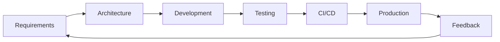

# LANKA Developer Guide

## Table of Contents
1. [Getting Started](#getting-started)
2. [Architecture Overview](#architecture-overview)
3. [Development Workflow](#development-workflow)
4. [Module Development](#module-development)
5. [Testing Strategy](#testing-strategy)
6. [API Documentation](#api-documentation)
7. [Contributing Guidelines](#contributing-guidelines)

## Getting Started

### Prerequisites
- Node.js 18+ 
- Docker and Docker Compose
- Git
- npm or yarn

### Initial Setup

1. **Clone the repository**
```bash
git clone <repository-url>
cd lanka
```

2. **Install dependencies**
```bash
npm install
```

3. **Set up environment variables**
```bash
cp .env.example .env
# Edit .env with your configuration
```

4. **Start infrastructure services**
```bash
docker-compose up -d
```

5. **Initialize the database**
```bash
npm run setup:db
```

6. **Start development server**
```bash
npm run dev
```

## Architecture Overview

### Complete Three-Module Architecture

LANKA now features a complete three-module architecture spanning the entire development lifecycle:

#### Phase 1: Requirements Intelligence Module
Intelligent requirements management with AI-powered analysis and similarity matching.

#### Phase 2: Architecture Intelligence Module
Comprehensive architecture decision management with pattern recommendations and technology optimization.

#### Phase 3: Development Intelligence Module
Complete development workflow automation with AI-powered code generation, testing intelligence, and DevOps automation.

### Module Structure Overview

```
src/
├── modules/
│   ├── requirements/          # Phase 1: Requirements Intelligence
│   │   ├── services/         # Requirements management services
│   │   ├── types/            # Requirements type definitions
│   │   └── graphql/          # Requirements GraphQL API
│   ├── architecture/          # Phase 2: Architecture Intelligence
│   │   ├── services/         # Architecture decision services
│   │   │   ├── architecture.service.ts      # Architecture decision management
│   │   │   ├── pattern.service.ts          # Pattern recommendation engine
│   │   │   ├── technology-stack.service.ts # Technology assessment
│   │   │   └── cloud-optimization.service.ts # Multi-cloud optimization
│   │   ├── types/            # Architecture type definitions
│   │   └── graphql/          # Architecture GraphQL API
│   └── development/           # Phase 3: Development Intelligence
│       ├── services/         # Development automation services (19 services)
│       │   ├── development.service.ts           # Main orchestration
│       │   ├── testing-intelligence.service.ts  # AI-powered testing
│       │   ├── devops-hub.service.ts           # DevOps automation
│       │   ├── code-generation.service.ts      # AI code generation
│       │   ├── code-intelligence.service.ts    # Code analysis
│       │   ├── test-case-generator.service.ts  # Test generation
│       │   ├── coverage-analyzer.service.ts    # Coverage analysis
│       │   ├── quality-predictor.service.ts    # Quality prediction
│       │   ├── test-prioritizer.service.ts     # Test prioritization
│       │   ├── mutation-testing.service.ts     # Mutation testing
│       │   ├── cicd-optimization.service.ts    # CI/CD optimization
│       │   ├── deployment-automation.service.ts # Deployment automation
│       │   ├── infrastructure-as-code.service.ts # IaC generation
│       │   ├── monitoring-configuration.service.ts # Monitoring setup
│       │   ├── incident-response.service.ts    # Incident automation
│       │   └── production-feedback.service.ts  # Production insights
│       ├── types/            # Development type definitions
│       └── graphql/          # Development GraphQL API (850+ lines)
├── services/                 # Cross-module integration services
│   ├── requirements-architecture-integration.service.ts
│   ├── requirements-development-integration.service.ts
│   ├── architecture-development-integration.service.ts
│   ├── development-workflow.service.ts
│   ├── recommendation-engine.service.ts
│   └── alignment-validation.service.ts
├── types/                   # Shared type definitions
└── core/                   # Core infrastructure
```

### Key Components

#### 1. Requirements Intelligence Services (Phase 1)

**Requirements Service** (`requirements.service.ts`)
- Complete CRUD operations for requirements
- AI-powered similarity matching and conflict detection
- Natural language processing for requirement analysis
- Pattern extraction and reuse recommendations

**NLP Service** (`nlp.service.ts`)
- Advanced natural language processing for requirements
- Sentiment analysis and quality scoring
- Automated classification and categorization
- Multi-language support for global teams

#### 2. Architecture Intelligence Services (Phase 2)

**Architecture Decision Service** (`architecture.service.ts`)
- Complete CRUD operations for architecture decisions
- Advanced querying with filters and relationships
- Version control and approval workflows
- Impact analysis and dependency tracking

**Pattern Service** (`pattern.service.ts`)
- Pattern library management
- AI-powered pattern recommendations
- Pattern-to-requirement mapping
- Implementation guidance and templates

**Technology Stack Service** (`technology-stack.service.ts`)
- Technology assessment and comparison
- Stack recommendation based on requirements
- Compatibility and risk analysis
- Cost-benefit evaluation

**Cloud Optimization Service** (`cloud-optimization.service.ts`)
- Multi-cloud strategy optimization
- Cost analysis and recommendations
- Performance optimization strategies
- Migration planning assistance

#### 3. Development Intelligence Services (Phase 3)

**Development Service** (`development.service.ts`)
- Main orchestration service for development workflows
- AI-powered code generation coordination
- Test strategy planning and execution
- DevOps pipeline integration

**Testing Intelligence Service** (`testing-intelligence.service.ts`)
- AI-powered test case generation from source code
- Comprehensive coverage analysis and gap identification
- Quality prediction using machine learning models
- Intelligent test prioritization and optimization
- Mutation testing for test suite effectiveness validation

**DevOps Hub Service** (`devops-hub.service.ts`)
- Complete DevOps pipeline orchestration
- CI/CD optimization based on project characteristics
- Infrastructure as Code generation (Terraform, Kubernetes)
- Monitoring and alerting configuration automation
- Incident response automation with runbook generation

**Code Intelligence Service** (`code-intelligence.service.ts`)
- Comprehensive codebase analysis and metrics
- Pattern detection and anti-pattern identification
- Quality scoring and improvement recommendations
- Technical debt analysis and quantification

#### 4. Integration Layer

**Requirements-Architecture Integration** (`requirements-architecture-integration.service.ts`)
- Seamless cross-module data flow between requirements and architecture
- Intelligent requirement-architecture mapping
- Real-time synchronization and validation
- Change impact assessment

**Requirements-Development Integration** (`requirements-development-integration.service.ts`)
- Requirements to development specification conversion
- Development task generation from requirements
- Code template generation based on requirements
- Implementation progress tracking against requirements
- Validation of implementation against original requirements

**Architecture-Development Integration** (`architecture-development-integration.service.ts`)
- Architecture decisions application to development specifications
- Code structure generation from architecture decisions
- Development guidelines generation from architectural patterns
- Implementation validation against architectural constraints
- Architectural debt identification and recommendations

**Development Workflow Service** (`development-workflow.service.ts`)
- Complete end-to-end development workflow orchestration
- Phase-based workflow execution with dependencies
- Parallel execution support for compatible operations
- Quality gate enforcement at each workflow stage
- Automatic rollback and recovery mechanisms

**AI Recommendation Engine** (`recommendation-engine.service.ts`)
- Context-aware architecture recommendations
- Pattern suggestion based on requirements
- Technology stack optimization
- Implementation strategy planning

**Alignment Validation Service** (`alignment-validation.service.ts`)
- Requirement-architecture alignment verification
- Cross-module data consistency checking
- Automated correction suggestions
- Quality assurance automation

### GraphQL API Architecture

#### Complete API Coverage

LANKA provides comprehensive GraphQL APIs across all three modules:

- **Requirements API:** 30+ types for requirements management
- **Architecture API:** 50+ types for architecture intelligence  
- **Development API:** 100+ types for development automation

#### Development Schema (Phase 3)

The Development module provides the most comprehensive API with 850+ lines of GraphQL schema covering:

- **DevOps Operations:** Complete pipeline management and automation
- **Testing Intelligence:** AI-powered test generation and optimization
- **Code Generation:** Automated code creation and validation
- **Production Feedback:** Real-time insights and improvement recommendations
- **Incident Management:** Automated response and resolution
- **Infrastructure Management:** Complete IaC lifecycle

#### Architecture Schema (Phase 2)
The GraphQL schema includes 50+ types for comprehensive architecture management:

```graphql
type ArchitectureDecision {
  id: ID!
  title: String!
  description: String!
  status: ArchitectureDecisionStatus!
  requirements: [Requirement!]!
  patterns: [ArchitecturePattern!]!
  technologyStack: TechnologyStack
  cloudConfiguration: CloudConfiguration
}

type ArchitecturePattern {
  id: ID!
  name: String!
  category: PatternCategory!
  applicability: [String!]!
  implementation: String!
  tradeOffs: [TradeOff!]!
}

type TechnologyStack {
  id: ID!
  name: String!
  components: [TechnologyComponent!]!
  assessment: StackAssessment!
  recommendations: [TechRecommendation!]!
}
```

#### Cross-Module Relationships
The API supports complex relationships between Requirements and Architecture:

```graphql
query GetProjectArchitecture($projectId: ID!) {
  project(id: $projectId) {
    requirements {
      id
      title
      architectureDecisions {
        id
        title
        patterns {
          id
          name
          applicability
        }
      }
    }
    architectureDecisions {
      id
      title
      requirements {
        id
        title
        priority
      }
    }
  }
}
```

## Development Workflow

### Complete Development Lifecycle

LANKA now supports the complete development lifecycle from requirements to production:



### Development Intelligence Workflows (Phase 3)

#### 1. AI-Powered Development Workflow

```typescript
// Complete workflow orchestration
const workflowResult = await developmentWorkflow.executeCompleteWorkflow(
  projectId,
  requirementId,
  {
    enableParallelExecution: true,
    enableQualityGates: true,
    captureKnowledge: true,
    includeDeploy: true,
    enableAutomaticRollback: true
  }
);

// Workflow includes:
// 1. Requirements analysis and conversion to development specs
// 2. Architecture guidance application
// 3. AI-powered code generation
// 4. Comprehensive test suite generation
// 5. CI/CD pipeline configuration
// 6. Infrastructure as Code generation
// 7. Monitoring and alerting setup
// 8. Production deployment
// 9. Feedback loop establishment
```

#### 2. Testing Intelligence Workflow

```typescript
// AI-powered test generation
const testGeneration = await testingIntelligence.generateTestCases({
  sourceCode: generatedCode,
  language: 'typescript',
  framework: TestFramework.JEST,
  testType: TestCaseType.UNIT,
  complexity: 4
});

// Coverage analysis and optimization
const coverageAnalysis = await testingIntelligence.analyzeCoverage(testSuiteId);
const qualityPrediction = await testingIntelligence.predictQuality(testId);
const prioritizedTests = await testingIntelligence.prioritizeTests(testCases);
const mutationResults = await testingIntelligence.runMutationTesting(config);
```

#### 3. DevOps Automation Workflow

```typescript
// Complete DevOps pipeline setup
const devopsPipeline = await devopsHub.orchestrateDevOpsPipeline({
  project: {
    name: 'my-application',
    type: ProjectType.WEB_APPLICATION,
    technologies: ['typescript', 'react', 'nodejs'],
    environments: ['dev', 'staging', 'production']
  },
  requirements: {
    cicd: { platform: CICDPlatform.GITHUB_ACTIONS },
    deployment: { strategy: DeploymentStrategy.BLUE_GREEN },
    infrastructure: { provider: CloudProvider.AWS },
    monitoring: { metrics: true, alerting: true }
  }
});
```

### Architecture Intelligence Development (Phase 2)

#### 1. Service Development Pattern

When developing new architecture services:

```typescript
// 1. Define types in types/architecture.types.ts
export interface ArchitectureComponent {
  id: string;
  name: string;
  type: ComponentType;
  dependencies: string[];
  configuration: Record<string, any>;
}

// 2. Implement service in services/
@Injectable()
export class ArchitectureComponentService {
  constructor(
    @Inject('NEO4J_DRIVER') private neo4j: Driver,
    private logger: Logger
  ) {}

  async createComponent(input: CreateComponentInput): Promise<ArchitectureComponent> {
    try {
      // Validate input
      this.validateComponentInput(input);
      
      // Execute Neo4j query with proper error handling
      const result = await this.neo4j.executeQuery(query, params);
      
      // Log operation
      this.logger.info(`Created architecture component: ${component.id}`);
      
      return this.mapToComponent(result);
    } catch (error) {
      this.logger.error('Failed to create component', { input, error });
      throw new ArchitectureServiceError('Component creation failed', error);
    }
  }
}

// 3. Add GraphQL resolvers
@Resolver(() => ArchitectureComponent)
export class ArchitectureComponentResolvers {
  constructor(private componentService: ArchitectureComponentService) {}

  @Query(() => [ArchitectureComponent])
  async architectureComponents(@Args('projectId') projectId: string) {
    return this.componentService.findByProject(projectId);
  }

  @Mutation(() => ArchitectureComponent)
  async createArchitectureComponent(
    @Args('input') input: CreateComponentInput
  ) {
    return this.componentService.createComponent(input);
  }
}
```

#### 2. Integration Development Pattern

For cross-module integrations:

```typescript
// Integration service pattern
@Injectable()
export class NewIntegrationService {
  constructor(
    private requirementService: RequirementService,
    private architectureService: ArchitectureService,
    private validationService: AlignmentValidationService
  ) {}

  async integrateRequirementWithArchitecture(
    requirementId: string,
    architectureId: string,
    options: IntegrationOptions
  ): Promise<IntegrationResult> {
    // 1. Validate inputs
    await this.validateIntegrationInputs(requirementId, architectureId);
    
    // 2. Perform integration logic
    const mapping = await this.createMapping(requirementId, architectureId, options);
    
    // 3. Validate result
    const validation = await this.validationService.validateAlignment(mapping);
    
    // 4. Return comprehensive result
    return {
      mapping,
      validation,
      recommendations: await this.generateRecommendations(mapping)
    };
  }
}
```

### Development Intelligence Testing

#### Testing Intelligence Patterns

```typescript
// AI-powered test case generation pattern
export class TestGenerationPattern {
  async generateTestSuite(sourceCode: string, requirements: Requirement[]): Promise<TestSuite> {
    // 1. Analyze source code structure and complexity
    const codeAnalysis = await this.analyzeCode(sourceCode);
    
    // 2. Generate comprehensive test cases
    const testCases = await this.generateTestCases({
      sourceCode,
      requirements,
      analysis: codeAnalysis,
      includeEdgeCases: true,
      includeBoundaryConditions: true,
      includeErrorScenarios: true
    });
    
    // 3. Optimize test execution order
    const prioritizedTests = await this.prioritizeTests(testCases);
    
    // 4. Generate mutation tests for validation
    const mutationTests = await this.generateMutationTests(sourceCode, testCases);
    
    return {
      testCases: prioritizedTests,
      mutationTests,
      expectedCoverage: this.calculateExpectedCoverage(testCases),
      qualityScore: this.predictQualityScore(testCases),
      recommendations: this.generateRecommendations(codeAnalysis, testCases)
    };
  }
}
```

#### DevOps Automation Patterns

```typescript
// Infrastructure as Code generation pattern
export class IaCGenerationPattern {
  async generateInfrastructure(requirements: InfrastructureRequirements): Promise<IaCConfiguration> {
    // 1. Generate Terraform configuration
    const terraformConfig = await this.generateTerraformConfig(requirements);
    
    // 2. Generate Kubernetes manifests
    const k8sManifests = await this.generateKubernetesManifests(requirements);
    
    // 3. Generate monitoring configuration
    const monitoringConfig = await this.generateMonitoringConfig(requirements);
    
    // 4. Generate CI/CD pipeline
    const cicdConfig = await this.generateCICDPipeline(requirements);
    
    return {
      terraform: terraformConfig,
      kubernetes: k8sManifests,
      monitoring: monitoringConfig,
      cicd: cicdConfig,
      deploymentStrategy: this.generateDeploymentStrategy(requirements)
    };
  }
}
```

### Database Development

#### Neo4j Query Patterns

Use these optimized patterns for Neo4j operations:

```typescript
// ✅ Good: Parameterized queries with proper indexing
async findArchitectureDecisionsByRequirement(requirementId: string): Promise<ArchitectureDecision[]> {
  const query = `
    MATCH (r:Requirement {id: $requirementId})-[:ADDRESSED_BY]->(ad:ArchitectureDecision)
    OPTIONAL MATCH (ad)-[:USES_PATTERN]->(ap:ArchitecturePattern)
    OPTIONAL MATCH (ad)-[:HAS_TECH_STACK]->(ts:TechnologyStack)
    RETURN ad, collect(ap) as patterns, ts
    ORDER BY ad.createdAt DESC
  `;
  
  const result = await this.neo4j.executeQuery(query, { requirementId });
  return result.records.map(this.mapToArchitectureDecision);
}

// ✅ Good: Batch operations for performance
async createMultipleMappings(mappings: MappingInput[]): Promise<RequirementArchitectureMapping[]> {
  const query = `
    UNWIND $mappings as mapping
    MATCH (r:Requirement {id: mapping.requirementId})
    MATCH (ad:ArchitectureDecision {id: mapping.architectureDecisionId})
    CREATE (r)-[rel:MAPPED_TO {
      confidence: mapping.confidence,
      mappingType: mapping.mappingType,
      createdAt: datetime()
    }]->(ad)
    RETURN r, rel, ad
  `;
  
  const result = await this.neo4j.executeQuery(query, { mappings });
  return result.records.map(this.mapToMapping);
}
```

## Module Development

### Creating New Development Services

#### 1. Development Intelligence Service Structure

```typescript
// src/modules/development/services/new-development-service.service.ts
@Injectable()
export class NewDevelopmentService {
  private readonly logger = new Logger(NewDevelopmentService.name);

  constructor(
    @Inject('NEO4J_DRIVER') private neo4j: Driver,
    private testingIntelligence: TestingIntelligenceService,
    private codeIntelligence: CodeIntelligenceService
  ) {}

  // Core development operations
  async generateCode(spec: DevelopmentSpecification): Promise<GeneratedCode> {
    try {
      this.logger.log('Generating code from specification', { specId: spec.id });
      
      // 1. Analyze requirements and architecture
      const analysis = await this.analyzeSpecification(spec);
      
      // 2. Generate code structure
      const codeStructure = await this.generateCodeStructure(analysis);
      
      // 3. Generate implementation
      const implementation = await this.generateImplementation(codeStructure);
      
      // 4. Validate generated code
      const validation = await this.validateCode(implementation);
      
      return {
        ...implementation,
        validation,
        metadata: {
          generatedAt: new Date().toISOString(),
          specification: spec.id,
          quality: validation.qualityScore
        }
      };
    } catch (error) {
      this.logger.error('Failed to generate code', { error: error.message, specId: spec.id });
      throw new CodeGenerationError('Code generation failed', error);
    }
  }

  async generateTests(code: GeneratedCode): Promise<TestSuite> {
    return this.testingIntelligence.generateTestCases({
      sourceCode: code.content,
      language: code.language,
      framework: TestFramework.JEST,
      testType: TestCaseType.UNIT,
      complexity: code.complexity
    });
  }

  async optimizeCode(code: GeneratedCode): Promise<OptimizedCode> {
    const analysis = await this.codeIntelligence.analyzeCodebase(code.projectId);
    const improvements = await this.codeIntelligence.suggestImprovements(analysis);
    
    return this.applyOptimizations(code, improvements);
  }
}
```

#### 2. DevOps Service Integration

```typescript
// src/modules/development/services/new-devops-service.service.ts
@Injectable()
export class NewDevOpsService {
  constructor(
    private devopsHub: DevOpsHubService,
    private cicdOptimization: CICDOptimizationService,
    private infrastructureAsCode: InfrastructureAsCodeService
  ) {}

  async setupDevOpsPipeline(project: Project): Promise<DevOpsPipeline> {
    // 1. Analyze project requirements
    const requirements = await this.analyzeProjectRequirements(project);
    
    // 2. Generate optimal DevOps configuration
    const configuration = await this.generateDevOpsConfiguration(requirements);
    
    // 3. Create infrastructure
    const infrastructure = await this.infrastructureAsCode.generateTerraformConfig(requirements);
    
    // 4. Setup CI/CD pipeline
    const pipeline = await this.cicdOptimization.optimizePipeline(configuration.cicd);
    
    // 5. Configure monitoring
    const monitoring = await this.setupMonitoring(project, infrastructure);
    
    return {
      configuration,
      infrastructure,
      pipeline,
      monitoring,
      deploymentStrategy: this.generateDeploymentStrategy(requirements)
    };
  }
}
```

### Creating New Architecture Services (Phase 2)

#### 1. Service Structure

```typescript
// src/modules/architecture/services/new-service.service.ts
@Injectable()
export class NewArchitectureService {
  private readonly logger = new Logger(NewArchitectureService.name);

  constructor(
    @Inject('NEO4J_DRIVER') private neo4j: Driver,
    private cacheService: CacheService // When implemented
  ) {}

  // Core CRUD operations
  async create(input: CreateInput): Promise<Entity> { /* ... */ }
  async findById(id: string): Promise<Entity | null> { /* ... */ }
  async findByProject(projectId: string, filters?: Filters): Promise<Entity[]> { /* ... */ }
  async update(id: string, input: UpdateInput): Promise<Entity> { /* ... */ }
  async delete(id: string): Promise<boolean> { /* ... */ }

  // Business logic methods
  async generateRecommendations(context: Context): Promise<Recommendation[]> { /* ... */ }
  async validateAlignment(entity: Entity): Promise<ValidationResult> { /* ... */ }
  async calculateMetrics(entities: Entity[]): Promise<Metrics> { /* ... */ }

  // Helper methods
  private mapToEntity(record: Neo4jRecord): Entity { /* ... */ }
  private validateInput(input: unknown): ValidatedInput { /* ... */ }
  private buildQuery(filters: Filters): { query: string; params: Record<string, any> } { /* ... */ }
}
```

#### 2. GraphQL Integration

```typescript
// src/modules/architecture/graphql/new-service.resolvers.ts
@Resolver(() => Entity)
export class EntityResolvers {
  constructor(private entityService: NewArchitectureService) {}

  // Queries
  @Query(() => [Entity])
  async entities(
    @Args('projectId') projectId: string,
    @Args('filters', { nullable: true }) filters?: EntityFilters
  ): Promise<Entity[]> {
    return this.entityService.findByProject(projectId, filters);
  }

  @Query(() => Entity, { nullable: true })
  async entity(@Args('id') id: string): Promise<Entity | null> {
    return this.entityService.findById(id);
  }

  // Mutations
  @Mutation(() => Entity)
  async createEntity(@Args('input') input: CreateEntityInput): Promise<Entity> {
    return this.entityService.create(input);
  }

  @Mutation(() => Entity)
  async updateEntity(
    @Args('id') id: string,
    @Args('input') input: UpdateEntityInput
  ): Promise<Entity> {
    return this.entityService.update(id, input);
  }

  // Field resolvers for related data
  @ResolveField(() => [Requirement])
  async requirements(@Parent() entity: Entity): Promise<Requirement[]> {
    return this.entityService.getRelatedRequirements(entity.id);
  }
}
```

#### 3. Type Definitions

```typescript
// src/modules/architecture/types/new-entity.types.ts
export interface Entity {
  id: string;
  name: string;
  description: string;
  projectId: string;
  createdAt: string;
  updatedAt?: string;
}

export interface CreateEntityInput {
  name: string;
  description: string;
  projectId: string;
  configuration?: Record<string, any>;
}

export interface UpdateEntityInput {
  name?: string;
  description?: string;
  configuration?: Record<string, any>;
}

export interface EntityFilters {
  name?: string;
  createdAfter?: string;
  createdBefore?: string;
  limit?: number;
  offset?: number;
}

export interface ValidationResult {
  isValid: boolean;
  errors: ValidationError[];
  warnings: ValidationWarning[];
  score: number;
}
```

## Testing Strategy

### Comprehensive Testing Approach

LANKA employs a comprehensive testing strategy across all three modules:

- **196+ Test Files:** Complete test coverage across all modules
- **Unit Testing:** Individual service and function testing
- **Integration Testing:** Cross-module workflow testing
- **E2E Testing:** Complete user journey validation
- **BDD Testing:** Business requirement validation
- **Performance Testing:** Load and stress testing
- **AI Testing:** Machine learning model validation

### Development Intelligence Testing (Phase 3)

#### 1. Testing Intelligence Validation

```typescript
// Test the AI-powered test generation
describe('TestingIntelligenceService', () => {
  let service: TestingIntelligenceService;
  let mockNeo4j: jest.Mocked<Neo4jService>;

  beforeEach(async () => {
    const module = await Test.createTestingModule({
      providers: [
        TestingIntelligenceService,
        TestCaseGeneratorService,
        CoverageAnalyzerService,
        QualityPredictorService,
        TestPrioritizerService,
        MutationTestingService,
        { provide: 'NEO4J_DRIVER', useValue: mockNeo4j }
      ]
    }).compile();

    service = module.get<TestingIntelligenceService>(TestingIntelligenceService);
  });

  describe('generateTestCases', () => {
    it('should generate comprehensive test cases from source code', async () => {
      // Arrange
      const request: TestGenerationRequest = {
        sourceCode: `
          class UserService {
            async createUser(email: string, password: string): Promise<User> {
              if (!email || !password) throw new Error('Missing credentials');
              return this.userRepository.create({ email, password });
            }
          }
        `,
        language: 'typescript',
        framework: TestFramework.JEST,
        testType: TestCaseType.UNIT,
        complexity: 3
      };

      // Act
      const response = await service.generateTestCases(request);

      // Assert
      expect(response.testCases).toHaveLength(4); // Happy path + 3 edge cases
      expect(response.testCases[0].name).toContain('should create user successfully');
      expect(response.testCases[1].name).toContain('should throw error for missing email');
      expect(response.testCases[2].name).toContain('should throw error for missing password');
      expect(response.coverage.statements.percentage).toBeGreaterThan(90);
      expect(response.confidence).toBeGreaterThan(0.8);
    });

    it('should generate performance tests when requested', async () => {
      const specs = {
        endpoint: '/api/users',
        expectedResponseTime: 200,
        maxConcurrentUsers: 100
      };

      const result = await service.generatePerformanceTests(specs);

      expect(result.testCases).toHaveLength(2);
      expect(result.testCases[0].type).toBe(TestCaseType.PERFORMANCE);
      expect(result.testCases[0].code).toContain('concurrent');
      expect(result.testCases[1].code).toContain('response time');
    });
  });

  describe('optimizeTestExecution', () => {
    it('should provide optimization recommendations', async () => {
      const metrics: TestIntelligenceMetrics = {
        testExecutionTime: 2400, // 40 minutes
        testEfficiency: 45,
        automationRate: 70,
        qualityScore: 85
      };

      const optimization = await service.optimizeTestExecution(metrics);

      expect(optimization.optimizations).toHaveLength(3);
      expect(optimization.optimizations[0].type).toBe(OptimizationType.PARALLEL_EXECUTION);
      expect(optimization.estimatedTimeReduction).toBeGreaterThan(50);
    });
  });
});
```

#### 2. DevOps Automation Testing

```typescript
// Test DevOps pipeline generation and optimization
describe('DevOpsHubService', () => {
  let service: DevOpsHubService;
  
  beforeEach(async () => {
    const module = await Test.createTestingModule({
      providers: [
        DevOpsHubService,
        CICDOptimizationService,
        DeploymentAutomationService,
        InfrastructureAsCodeService,
        MonitoringConfigurationService,
        IncidentResponseService
      ]
    }).compile();

    service = module.get<DevOpsHubService>(DevOpsHubService);
  });

  describe('orchestrateDevOpsPipeline', () => {
    it('should generate complete DevOps pipeline configuration', async () => {
      // Arrange
      const configuration: DevOpsConfiguration = {
        project: {
          name: 'test-app',
          type: ProjectType.WEB_APPLICATION,
          technologies: ['typescript', 'react', 'nodejs'],
          environments: ['dev', 'staging', 'prod']
        },
        requirements: {
          cicd: {
            platform: CICDPlatform.GITHUB_ACTIONS,
            triggers: ['push', 'pull_request'],
            stages: ['test', 'build', 'deploy']
          },
          deployment: {
            strategy: DeploymentStrategy.BLUE_GREEN,
            rollback: true,
            zeroDowntime: true
          },
          infrastructure: {
            provider: CloudProvider.AWS,
            container: ContainerPlatform.KUBERNETES,
            scaling: true
          },
          monitoring: {
            metrics: true,
            logging: true,
            alerting: true
          }
        }
      };

      // Act
      const pipeline = await service.orchestrateDevOpsPipeline(configuration);

      // Assert
      expect(pipeline.configuration).toEqual(configuration);
      expect(pipeline.components.cicd.platform).toBe('github-actions');
      expect(pipeline.components.deployment.strategy.type).toBe('blue-green');
      expect(pipeline.components.infrastructure.terraform.provider).toBe('aws');
      expect(pipeline.components.monitoring.prometheus).toBeDefined();
      expect(pipeline.timeline.length).toBeGreaterThan(4);
      expect(pipeline.validation.tests.length).toBeGreaterThan(3);
    });
  });
});
```

#### 3. Integration Workflow Testing

```typescript
// Test complete development workflow integration
describe('Development Workflow Integration', () => {
  let workflowService: DevelopmentWorkflowService;
  let requirementsIntegration: RequirementsDevelopmentIntegrationService;
  let architectureIntegration: ArchitectureDevelopmentIntegrationService;

  beforeEach(async () => {
    // Setup comprehensive test module with all integrations
    const module = await Test.createTestingModule({
      providers: [
        DevelopmentWorkflowService,
        RequirementsDevelopmentIntegrationService,
        ArchitectureDevelopmentIntegrationService,
        TestingIntelligenceService,
        DevOpsHubService
      ]
    }).compile();

    workflowService = module.get<DevelopmentWorkflowService>(DevelopmentWorkflowService);
  });

  describe('executeCompleteWorkflow', () => {
    it('should execute end-to-end development workflow successfully', async () => {
      const workflowOptions = {
        enableParallelExecution: true,
        enableQualityGates: true,
        captureKnowledge: true,
        includeDeploy: true
      };

      const result = await workflowService.executeCompleteWorkflow(
        'project-123',
        'requirement-456',
        workflowOptions
      );

      // Validate workflow completion
      expect(result.status).toBe('completed');
      expect(result.phases.length).toBeGreaterThan(5);
      expect(result.artifacts.length).toBeGreaterThan(10);
      expect(result.metrics.completionRate).toBe(100);
      expect(result.metrics.qualityScore).toBeGreaterThan(85);
      
      // Validate generated artifacts
      const codeArtifacts = result.artifacts.filter(a => a.type === 'code');
      const testArtifacts = result.artifacts.filter(a => a.type === 'test');
      const infrastructureArtifacts = result.artifacts.filter(a => a.type === 'infrastructure');
      
      expect(codeArtifacts.length).toBeGreaterThan(0);
      expect(testArtifacts.length).toBeGreaterThan(0);
      expect(infrastructureArtifacts.length).toBeGreaterThan(0);
    });
  });
});
```

### Architecture Intelligence Testing (Phase 2)

#### 1. Unit Testing Pattern

```typescript
// tests/unit/architecture/new-service.test.ts
describe('NewArchitectureService', () => {
  let service: NewArchitectureService;
  let mockNeo4j: jest.Mocked<Driver>;
  let mockCacheService: jest.Mocked<CacheService>;

  beforeEach(async () => {
    const module = await Test.createTestingModule({
      providers: [
        NewArchitectureService,
        { provide: 'NEO4J_DRIVER', useValue: mockNeo4j },
        { provide: CacheService, useValue: mockCacheService },
      ],
    }).compile();

    service = module.get<NewArchitectureService>(NewArchitectureService);
  });

  describe('create', () => {
    it('should create entity successfully', async () => {
      // Arrange
      const input = createMockInput();
      const expectedResult = createMockEntity();
      mockNeo4j.executeQuery.mockResolvedValue(createMockNeo4jResult(expectedResult));

      // Act
      const result = await service.create(input);

      // Assert
      expect(result).toEqual(expectedResult);
      expect(mockNeo4j.executeQuery).toHaveBeenCalledWith(
        expect.stringContaining('CREATE'),
        expect.objectContaining(input)
      );
    });

    it('should handle validation errors', async () => {
      // Arrange
      const invalidInput = { ...createMockInput(), name: '' };

      // Act & Assert
      await expect(service.create(invalidInput)).rejects.toThrow(ValidationError);
    });
  });

  describe('generateRecommendations', () => {
    it('should generate relevant recommendations', async () => {
      // Arrange
      const context = createMockContext();
      const expectedRecommendations = createMockRecommendations();
      mockNeo4j.executeQuery.mockResolvedValue(createMockRecommendationResult());

      // Act
      const result = await service.generateRecommendations(context);

      // Assert
      expect(result).toHaveLength(expectedRecommendations.length);
      expect(result[0]).toMatchObject({
        type: 'PATTERN_RECOMMENDATION',
        confidence: expect.any(Number),
        rationale: expect.any(String)
      });
    });
  });
});
```

#### 2. Integration Testing Pattern

```typescript
// tests/integration/architecture-integration.test.ts
describe('Architecture Integration Tests', () => {
  let app: INestApplication;
  let neo4j: Driver;
  let testDataFactory: TestDataFactory;

  beforeAll(async () => {
    app = await createTestApp();
    neo4j = app.get('NEO4J_DRIVER');
    testDataFactory = new TestDataFactory(neo4j);
  });

  beforeEach(async () => {
    await testDataFactory.cleanDatabase();
    await testDataFactory.seedBasicData();
  });

  afterAll(async () => {
    await testDataFactory.cleanDatabase();
    await app.close();
  });

  describe('Architecture Decision Workflow', () => {
    it('should create decision with requirements mapping', async () => {
      // Arrange
      const requirement = await testDataFactory.createRequirement();
      const architectureInput = {
        title: 'Use microservices architecture',
        description: 'Adopt microservices for scalability',
        requirementIds: [requirement.id],
        projectId: requirement.projectId
      };

      // Act
      const query = `
        mutation CreateArchitectureDecision($input: CreateArchitectureDecisionInput!) {
          createArchitectureDecision(input: $input) {
            id
            title
            requirements {
              id
              title
            }
            status
          }
        }
      `;

      const response = await request(app.getHttpServer())
        .post('/graphql')
        .send({ query, variables: { input: architectureInput } })
        .expect(200);

      // Assert
      expect(response.body.data.createArchitectureDecision).toMatchObject({
        title: architectureInput.title,
        requirements: expect.arrayContaining([
          expect.objectContaining({ id: requirement.id })
        ]),
        status: 'DRAFT'
      });

      // Verify in database
      const verificationQuery = `
        MATCH (ad:ArchitectureDecision {id: $id})-[:ADDRESSES]->(r:Requirement)
        RETURN count(r) as requirementCount
      `;
      const result = await neo4j.executeQuery(verificationQuery, {
        id: response.body.data.createArchitectureDecision.id
      });
      expect(result.records[0].get('requirementCount').toNumber()).toBe(1);
    });
  });
});
```

### Test Data Factory Pattern

```typescript
// tests/factories/architecture-test-data.factory.ts
export class ArchitectureTestDataFactory {
  constructor(private neo4j: Driver) {}

  async createArchitectureDecision(overrides?: Partial<ArchitectureDecision>): Promise<ArchitectureDecision> {
    const decision = {
      id: generateUUID(),
      title: 'Test Architecture Decision',
      description: 'Test description',
      status: ArchitectureDecisionStatus.DRAFT,
      projectId: generateUUID(),
      createdAt: new Date().toISOString(),
      ...overrides
    };

    const query = `
      CREATE (ad:ArchitectureDecision $props)
      RETURN ad
    `;

    await this.neo4j.executeQuery(query, { props: decision });
    return decision;
  }

  async createPattern(overrides?: Partial<ArchitecturePattern>): Promise<ArchitecturePattern> {
    const pattern = {
      id: generateUUID(),
      name: 'Test Pattern',
      category: PatternCategory.STRUCTURAL,
      applicability: ['web-applications', 'microservices'],
      implementation: 'Test implementation guide',
      ...overrides
    };

    const query = `
      CREATE (ap:ArchitecturePattern $props)
      RETURN ap
    `;

    await this.neo4j.executeQuery(query, { props: pattern });
    return pattern;
  }

  async linkDecisionToRequirement(decisionId: string, requirementId: string): Promise<void> {
    const query = `
      MATCH (ad:ArchitectureDecision {id: $decisionId})
      MATCH (r:Requirement {id: $requirementId})
      CREATE (ad)-[:ADDRESSES]->(r)
    `;

    await this.neo4j.executeQuery(query, { decisionId, requirementId });
  }

  async cleanDatabase(): Promise<void> {
    await this.neo4j.executeQuery('MATCH (n) DETACH DELETE n');
  }
}
```
```

The server will be available at `http://localhost:3000`
GraphQL Playground: `http://localhost:3000/graphql`

## Architecture Overview

LANKA follows a modular, graph-based architecture with three core modules:

### Core Infrastructure
- **Neo4j**: Graph database for knowledge storage
- **MongoDB**: Document store for unstructured data
- **Redis**: Caching and session management
- **Elasticsearch**: Full-text search and analytics
- **Kafka**: Event streaming and async processing

### Module Structure
```
src/
├── core/           # Core services (database, logging, auth)
├── modules/        # Feature modules
│   ├── requirements/   # CLAUDE001 - Requirements Intelligence
│   ├── architecture/   # CLAUDE002 - Architecture Intelligence
│   └── development/    # CLAUDE003 - Development Intelligence
├── services/       # Shared services
├── api/           # GraphQL API layer
└── utils/         # Utility functions
```

### Key Design Patterns

1. **Graph-First Data Model**: All entities are nodes with semantic relationships
2. **Service Layer Pattern**: Business logic separated from API layer
3. **Repository Pattern**: Data access abstracted through services
4. **Event-Driven Architecture**: Async processing via Kafka
5. **AI-Native Design**: ML models integrated at service level

## Development Workflow

### Git Workflow

We follow Git Flow with feature branches:

1. **Create feature branch**
```bash
git checkout -b feature/your-feature-name
```

2. **Make changes following TDD/BDD**
- Write tests first
- Implement functionality
- Refactor as needed

3. **Commit with conventional commits**
```bash
git commit -m "feat: Add requirement similarity matching"
git commit -m "fix: Resolve Neo4j connection timeout"
git commit -m "docs: Update API documentation"
```

4. **Push and create PR**
```bash
git push origin feature/your-feature-name
```

5. **After review, merge to master**

### Code Style

- TypeScript with strict mode enabled
- ESLint for linting
- Prettier for formatting
- Follow functional programming principles where appropriate

## Module Development

### Creating a New Service

1. **Define types**
```typescript
// src/modules/yourmodule/types/yourmodule.types.ts
export interface YourEntity {
  id: string;
  // ... properties
}
```

2. **Implement service**
```typescript
// src/modules/yourmodule/services/yourmodule.service.ts
export class YourModuleService {
  constructor(private neo4j: Neo4jService) {}
  
  async create(input: CreateInput): Promise<YourEntity> {
    // Implementation
  }
}
```

3. **Add GraphQL schema**
```typescript
// src/modules/yourmodule/graphql/yourmodule.schema.ts
export const yourModuleTypeDefs = `
  type YourEntity {
    id: ID!
    # ... fields
  }
`;
```

4. **Implement resolvers**
```typescript
// src/modules/yourmodule/graphql/yourmodule.resolvers.ts
export const yourModuleResolvers = {
  Query: {
    yourEntity: async (_, args, context) => {
      // Implementation
    }
  }
};
```

### Working with Neo4j

**Creating nodes:**
```typescript
const query = `
  CREATE (n:NodeType {
    id: $id,
    property: $value
  })
  RETURN n
`;
await neo4j.executeQuery(query, params);
```

**Creating relationships:**
```typescript
const query = `
  MATCH (a:NodeA {id: $aId})
  MATCH (b:NodeB {id: $bId})
  CREATE (a)-[:RELATIONSHIP_TYPE {property: $value}]->(b)
`;
```

**Pattern matching:**
```typescript
const query = `
  MATCH (n:Node)-[:RELATES_TO]->(related)
  WHERE n.property = $value
  RETURN n, collect(related) as relatedNodes
`;
```

## Testing Strategy

### Test Types

1. **Unit Tests**: Test individual functions and services (150+ files)
2. **Integration Tests**: Test API endpoints and database interactions (25+ files)
3. **BDD Tests**: Cucumber scenarios for feature validation (15+ feature files)
4. **E2E Tests**: Full system workflow testing (6+ test suites)
5. **AI Testing**: Machine learning model validation and testing intelligence
6. **Performance Tests**: Load testing and optimization validation
7. **DevOps Tests**: CI/CD pipeline and infrastructure testing

### Running Tests

```bash
# Run all tests
npm test

# Run with coverage
npm run test:coverage

# Run BDD tests
npm run test:bdd

# Run specific test file
npm test -- requirements.service.test.ts

# Run in watch mode
npm run test:watch
```

### Writing Tests

**Unit Test Example:**
```typescript
describe('RequirementsService', () => {
  it('should create a requirement', async () => {
    const input = { description: 'Test requirement' };
    const result = await service.createRequirement(input);
    expect(result.id).toBeDefined();
  });
});
```

**BDD Test Example:**
```gherkin
Feature: Requirements Management
  Scenario: Create new requirement
    Given I have a business need
    When I submit the requirement
    Then it should be stored in the graph
```

## API Documentation

### GraphQL Queries

**Get requirement by ID:**
```graphql
query GetRequirement($id: ID!) {
  requirement(id: $id) {
    id
    title
    description
    type
    status
    similarRequirements {
      requirement {
        id
        title
      }
      similarity
    }
  }
}
```

**Find similar requirements:**
```graphql
query FindSimilar($requirementId: ID!) {
  findSimilarRequirements(requirementId: $requirementId) {
    requirement {
      id
      title
    }
    similarity
    adaptationGuidelines
  }
}
```

### GraphQL Mutations

**Create requirement:**
```graphql
mutation CreateRequirement($input: CreateRequirementInput!) {
  createRequirement(input: $input) {
    id
    title
    status
  }
}
```

### REST Endpoints

- `GET /health` - Health check
- `GET /metrics` - System metrics
- `POST /graphql` - GraphQL endpoint

## Contributing Guidelines

### Code Review Checklist

- [ ] Tests written and passing
- [ ] Documentation updated
- [ ] Type definitions complete
- [ ] Error handling implemented
- [ ] Logging added for debugging
- [ ] Performance considered
- [ ] Security reviewed

### Performance Considerations

1. **Use indexes on frequently queried properties**
2. **Batch operations when possible**
3. **Implement caching for expensive operations**
4. **Use pagination for large result sets**
5. **Profile and optimize Cypher queries**

### Security Best Practices

1. **Input validation on all user inputs**
2. **Parameterized queries to prevent injection**
3. **Authentication and authorization checks**
4. **Rate limiting on API endpoints**
5. **Sensitive data encryption**
6. **Audit logging for critical operations**

## Debugging

### Enable debug logging:
```typescript
logger.level = 'debug';
```

### Neo4j query debugging:
```typescript
// Enable query logging
NEO4J_DEBUG=true npm run dev
```

### Common Issues

**Neo4j connection issues:**
- Check Docker container is running: `docker ps`
- Verify credentials in `.env`
- Check Neo4j logs: `docker logs lanka-neo4j`

**GraphQL schema errors:**
- Validate schema: `npm run validate:schema`
- Check resolver implementations match schema

## Resources

- [Neo4j Documentation](https://neo4j.com/docs/)
- [GraphQL Best Practices](https://graphql.org/learn/best-practices/)
- [TypeScript Handbook](https://www.typescriptlang.org/docs/)
- [Jest Testing](https://jestjs.io/docs/getting-started)

## Support

For questions or issues:
1. Check existing issues in GitHub
2. Consult team documentation in `/docs`
3. Ask in team Slack channel
4. Create detailed bug report with reproduction steps