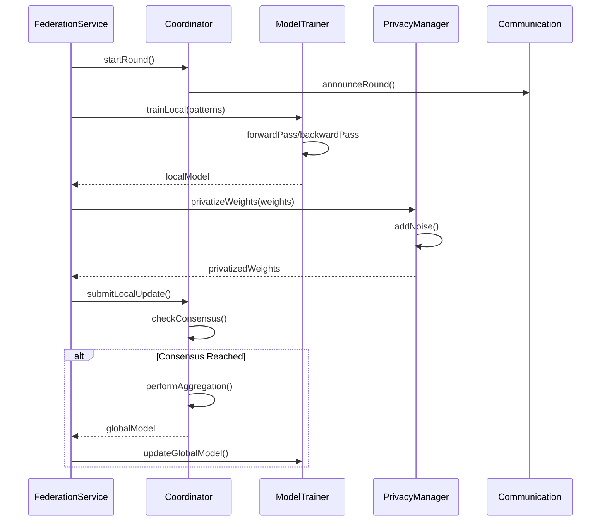
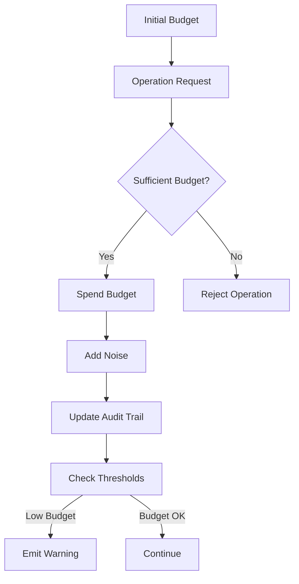
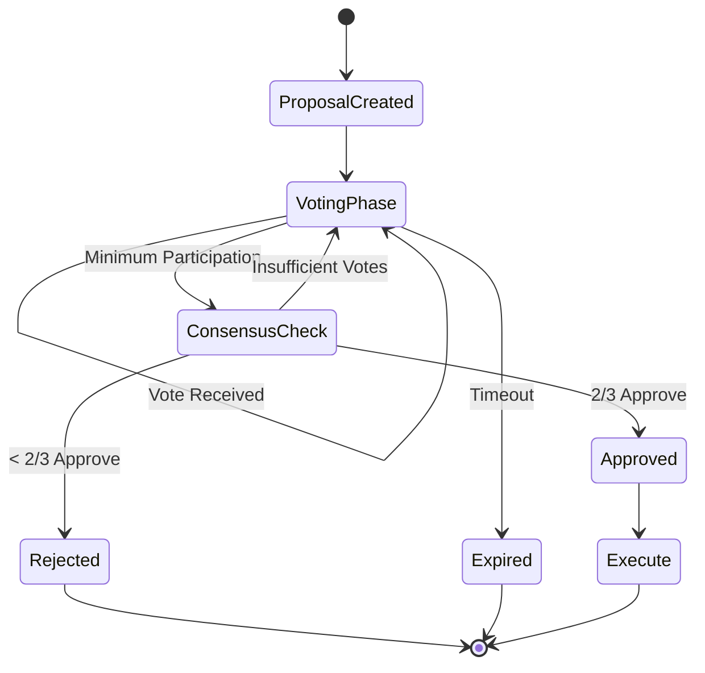

# LANKA Federation Architecture

## Overview

The LANKA Federation system enables privacy-preserving collaborative learning across multiple LANKA instances. It implements federated learning with differential privacy, secure aggregation, and Byzantine fault tolerance to ensure that teams can share insights without exposing proprietary code or sensitive information.

## Architecture Components

### Core Services

#### 1. Federation Service (`FederationService.ts`)
The main orchestrator that coordinates all federation activities:

```typescript
// Initialize federation
const federationService = new FederationService(config);
await federationService.initialize();

// Join network
await federationService.joinFederation(networkId, discoveryNodes);

// Start training
await federationService.startTrainingRound(memoryPatterns);
```

**Key Features:**
- Centralized federation management
- Event-driven architecture
- Configuration management
- Privacy budget tracking
- Opt-in/opt-out mechanisms

#### 2. Federated Coordinator (`FederatedCoordinator.ts`)
Manages training rounds and model aggregation:

```typescript
// Start new round
const roundId = await coordinator.startRound();

// Submit local update
await coordinator.submitLocalUpdate({
  round: roundId,
  instanceId: 'my-instance',
  weights: modelWeights,
  sampleCount: 1000,
  accuracy: 0.85
});
```

**Aggregation Strategies:**
- **FederatedAveraging**: Weighted average based on sample counts
- **Secure Aggregation**: Privacy-preserving multi-party computation
- **Differential Private**: Noise-added federated averaging

#### 3. Consensus Manager (`ConsensusManager.ts`)
Implements Byzantine fault-tolerant consensus for critical decisions:

```typescript
// Propose model update
const proposalId = await consensus.proposeModelUpdate(
  globalWeights, 
  accuracy, 
  round, 
  participantCount
);

// Vote on proposal
await consensus.castVote(proposalId, 'approve', 'Improves global accuracy');
```

**Consensus Features:**
- 2/3 participation requirement
- Reputation-based weighting
- Byzantine fault tolerance
- Proposal timeout handling

### Privacy Components

#### 1. Privacy Manager (`PrivacyManager.ts`)
Central privacy controller with differential privacy guarantees:

```typescript
const privacyManager = new PrivacyManager('moderate', initialBudget);

// Apply differential privacy
const privatizedWeights = await privacyManager.privatizeWeights(
  modelWeights,
  sensitivity,
  'model_update'
);

// Check budget
const canParticipate = privacyManager.canParticipate();
const remaining = privacyManager.getBudgetRemaining();
```

**Privacy Levels:**
- **Strict**: ε=1.0, δ=1e-5, High noise
- **Moderate**: ε=3.0, δ=1e-4, Balanced
- **Relaxed**: ε=6.0, δ=1e-3, Low noise

#### 2. Differential Privacy (`DifferentialPrivacy.ts`)
Implements noise mechanisms for privacy protection:

```typescript
const dp = new DifferentialPrivacy(privacyLevel);

// Add calibrated noise
const noisyWeights = await dp.addNoise(
  weights, 
  sensitivity, 
  epsilon, 
  delta
);
```

**Noise Mechanisms:**
- **Gaussian**: For (ε, δ)-differential privacy
- **Laplace**: For ε-differential privacy
- **Calibrated scaling**: Based on sensitivity analysis

#### 3. Secure Aggregation (`SecureAggregation.ts`)
Multi-party computation for private aggregation:

```typescript
const secureAgg = new SecureAggregation();

// Perform secure aggregation
const result = await secureAgg.aggregate(localUpdates);
```

**Security Features:**
- Shamir's Secret Sharing
- Commitment schemes
- Zero-knowledge proofs
- Byzantine fault tolerance

### Training Components

#### Model Trainer (`ModelTrainer.ts`)
Local neural network training on memory patterns:

```typescript
const trainer = new ModelTrainer(modelConfig);

// Train on memory patterns
const localModel = await trainer.trainLocal(memoryPatterns);

// Update with global model
await trainer.updateGlobalModel(globalModel);

// Perform inference
const predictions = await trainer.predict(newPatterns);
```

**Training Features:**
- Neural network implementation
- Memory pattern preprocessing
- Incremental learning
- Model evaluation
- Transfer learning

### Communication Components

#### Communication Protocol (`CommunicationProtocol.ts`)
Secure peer-to-peer communication:

```typescript
const comm = new CommunicationProtocol(instanceId);

// Register with network
await comm.registerWithNetwork(networkId, discoveryNodes);

// Broadcast message
await comm.broadcastMessage({
  type: 'training_round',
  payload: roundData
});

// Handle incoming messages
comm.on('messageReceived', handleMessage);
```

**Communication Features:**
- Peer discovery
- Message routing
- Cryptographic signatures
- Network topology management
- Gossip protocol

### Analytics Components

#### Federation Analytics (`FederationAnalytics.ts`)
Monitoring and analysis of federation performance:

```typescript
const analytics = new FederationAnalytics();

// Record training round
await analytics.recordRound({
  round: 5,
  participants: ['inst1', 'inst2', 'inst3'],
  globalAccuracy: 0.89,
  convergenceMetrics: metrics
});

// Generate report
const report = analytics.generateReport();
```

**Analytics Features:**
- Convergence tracking
- Privacy compliance monitoring
- Pattern emergence detection
- Participant contribution analysis
- Performance optimization recommendations

## Data Flow Architecture

### 1. Training Round Flow



### 2. Privacy Budget Flow



### 3. Consensus Protocol Flow



## Security Guarantees

### 1. Differential Privacy
- **Mathematical Guarantee**: (ε, δ)-differential privacy
- **Privacy Budget**: Bounded information leakage
- **Noise Calibration**: Based on sensitivity analysis
- **Composition**: Proper privacy accounting across operations

### 2. Byzantine Fault Tolerance
- **Assumption**: Up to 1/3 of participants can be malicious
- **Consensus**: 2/3 majority required for decisions
- **Reputation**: Behavior-based participant scoring
- **Detection**: Anomaly detection for malicious behavior

### 3. Secure Communication
- **Encryption**: End-to-end encrypted messages
- **Authentication**: Digital signatures for message integrity
- **Key Management**: Public key infrastructure
- **Network Security**: Protection against man-in-the-middle attacks

## Performance Characteristics

### Scalability
- **Participants**: Supports up to 100 federated instances
- **Model Size**: Handles models with millions of parameters
- **Communication**: Optimized message batching and compression
- **Computation**: Parallel processing where possible

### Efficiency
- **Training**: Incremental learning reduces computation
- **Communication**: Gossip protocol minimizes network overhead
- **Privacy**: Efficient noise generation algorithms
- **Consensus**: Fast convergence with reputation weighting

## Configuration Examples

### Basic Federation Setup
```typescript
const config: FederationConfig = {
  instanceId: 'company-dev-team',
  federationEnabled: true,
  privacyLevel: 'moderate',
  maxParticipants: 10,
  roundTimeout: 300000,
  minimumParticipants: 3,
  aggregationStrategy: 'fedavg',
  privacyBudget: {
    epsilon: 3.0,
    delta: 1e-4,
    total: 100.0,
    consumed: 0.0
  },
  modelConfig: {
    architecture: 'neural_network',
    inputDimensions: 128,
    hiddenLayers: [64, 32],
    outputDimensions: 16,
    learningRate: 0.001,
    epochs: 10
  }
};
```

### High-Privacy Setup
```typescript
const strictConfig: FederationConfig = {
  ...config,
  privacyLevel: 'strict',
  aggregationStrategy: 'differential_private',
  privacyBudget: {
    epsilon: 1.0,
    delta: 1e-5,
    total: 50.0,
    consumed: 0.0
  }
};
```

### High-Performance Setup
```typescript
const performanceConfig: FederationConfig = {
  ...config,
  privacyLevel: 'relaxed',
  aggregationStrategy: 'secure_agg',
  maxParticipants: 20,
  roundTimeout: 120000,
  modelConfig: {
    ...config.modelConfig,
    epochs: 5,
    learningRate: 0.01
  }
};
```

## Monitoring and Observability

### Key Metrics
- **Convergence Rate**: Speed of global model improvement
- **Privacy Budget Utilization**: Rate of privacy spending
- **Participation Rate**: Active participant percentage
- **Communication Overhead**: Network usage metrics
- **Byzantine Detection**: Malicious behavior incidents

### Alerts and Warnings
- Privacy budget exhaustion warnings
- Low participation alerts
- Consensus timeout notifications
- Byzantine behavior detection
- Model quality degradation alerts

## Deployment Considerations

### Network Requirements
- Stable internet connectivity
- Open ports for peer communication
- NAT traversal for private networks
- DNS resolution for discovery nodes

### Security Requirements
- TLS certificates for secure communication
- Key management infrastructure
- Firewall configuration
- Regular security audits

### Performance Requirements
- Sufficient RAM for model training
- CPU resources for cryptographic operations
- Storage for model checkpoints and audit logs
- Network bandwidth for model synchronization

This architecture ensures that LANKA instances can collaborate effectively while maintaining strong privacy guarantees and security properties essential for enterprise deployment.