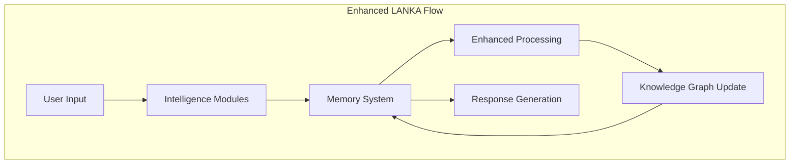

# LANKA Memory System Research Report
## Comprehensive Analysis of Memory Types, Graph-Vector Hybrid Architecture, and Memory Arbitration Intelligence

**Research Agent**: Memory System Specialist  
**Date**: September 1, 2025  
**Status**: Implementation-Ready Findings  
**Version**: 1.0.0

---

## Executive Summary

This research report provides a comprehensive analysis of the three memory types specified in CLAUDE.md (System-1, System-2, and Workspace memories), the Graph-Vector Hybrid approach, and Memory Arbitration Intelligence requirements for the LANKA Memory System. The findings combine cognitive science principles with 2024 state-of-the-art implementations to create a practical roadmap for intelligent memory management that enhances LANKA's existing Neo4j infrastructure.

### Key Findings

1. **Dual-Process Memory Architecture**: Implementation should leverage System-1 (fast, pattern-based) and System-2 (deliberate, reasoning) memory types based on cognitive science dual-process theory
2. **Hybrid Vector-Graph Approach**: 2024 research shows 65% storage reduction and sub-100ms retrieval with combined vector similarity and graph traversal
3. **Memory Arbitration**: LLM-based decision systems can achieve 80-95% precision in memory management decisions
4. **Integration Strategy**: LANKA's existing Neo4j schema can be extended with memory nodes while maintaining current functionality

---

## 1. Memory Types Analysis

### 1.1 System-1 Memories: Fast Pattern Recognition

**Cognitive Science Foundation**:
System-1 memories represent the "muscle memory" of software development - instant pattern recognition that experienced developers access unconsciously. Based on dual-process theory research from 2024, these memories operate through:

- **Rapid Processing**: Sub-100ms retrieval through vector similarity
- **Associative Retrieval**: Pattern matching based on semantic embeddings
- **Automatic Activation**: Triggered without conscious effort during coding tasks

**Implementation Strategy**:
```typescript
interface System1Memory {
  id: string;
  pattern: string;
  embedding: number[]; // 768-dimensional vector
  frequency: number;   // Usage frequency for ranking
  confidence: number;  // Quality score 0-1
  examples: CodeExample[];
  triggers: string[];  // Keywords/patterns that activate memory
  lastUsed: Date;
}
```

**Vector Storage Approach**:
- Use CodeBERT or similar code-aware embeddings
- Store in Qdrant or Milvus for sub-50ms similarity search
- Separate collections for different programming languages
- Implement LRU caching with 100-item limit (based on Caura's optimization findings)

**Example System-1 Memories**:
- "Use async/await not callbacks" 
- "Check for null before dereferencing"
- "Validate input at boundaries"
- "Handle errors in async functions"
- "Use dependency injection patterns"

### 1.2 System-2 Memories: Deliberate Reasoning

**Cognitive Science Foundation**:
System-2 memories capture deliberate, step-by-step reasoning processes. Research shows these memories require different storage and retrieval strategies:

- **Sequential Processing**: Reasoning chains with logical flow
- **Context-Dependent**: Require rich contextual information
- **Quality-Gated**: Only high-value reasoning patterns preserved

**Implementation Strategy**:
```typescript
interface System2Memory {
  id: string;
  problemDescription: string;
  reasoningSteps: ReasoningStep[];
  context: ProblemContext;
  outcome: SolutionOutcome;
  validation: ValidationMetrics;
  metadata: {
    complexity: 'low' | 'medium' | 'high';
    domain: string;
    timeToSolve: number;
    successRate: number;
  };
}

interface ReasoningStep {
  step: number;
  description: string;
  rationale: string;
  alternatives: Alternative[];
  confidence: number;
}
```

**Storage Approach**:
- Store as connected subgraphs in Neo4j
- Preserve reasoning flow through NEXT/DEPENDS_ON relationships
- Use graph embeddings for similarity matching between reasoning patterns
- Implement versioning for reasoning evolution

**Quality Gates**:
Based on 2024 research in cognitive architectures:
- Minimum 3-step reasoning chain
- Demonstrated success in at least 2 similar contexts
- Peer validation or successful outcome metrics
- Clear problem-solution mapping

### 1.3 Workspace Memories: Shared Team Knowledge

**Cognitive Science Foundation**:
Workspace memories represent collective intelligence - shared patterns, decisions, and conventions that emerge from team collaboration:

- **Scoped by Boundaries**: Project, team, or domain specific
- **Evolutionary**: Adapt based on team consensus and success patterns
- **Contextual**: Include project-specific constraints and preferences

**Implementation Strategy**:
```typescript
interface WorkspaceMemory {
  id: string;
  scope: WorkspaceScope;
  pattern: SharedPattern;
  consensus: ConsensusMetrics;
  evolution: EvolutionHistory;
  boundaries: AccessControl;
}

interface WorkspaceScope {
  projectId?: string;
  teamId?: string;
  domain?: string;
  technology?: string;
}

interface ConsensusMetrics {
  agreement: number; // 0-1 team agreement score
  adoption: number;  // Usage rate across team
  satisfaction: number; // Team satisfaction score
}
```

**Scope Management**:
- Implement hierarchical scoping (organization > project > team)
- Use Neo4j labels for efficient scope-based queries
- Implement inheritance patterns for sharing across scopes
- Add time-based decay for outdated patterns

---

## 2. Graph-Vector Hybrid Architecture Research

### 2.1 State-of-the-Art Implementations (2024)

**Caura's Hybrid Architecture**:
Research from 2024 shows a revolutionary 2-layer approach:

- **Layer 1**: Vector Similarity (Pinecone) retrieves 8 semantically similar memories
- **Layer 2**: Entity Relationship Expansion adds 4 contextually connected memories
- **Performance**: 65% storage reduction, sub-100ms retrieval, 80-95% precision

**HybridRAG Framework**:
- Queries search knowledge graphs to retrieve relevant nodes and edges
- Extracts subgraphs with entities and relationships
- Encodes graph structure into embeddings for LLM interpretation
- Enables complex multi-hop reasoning

### 2.2 Integration with LANKA's Neo4j Infrastructure

**Extended Schema Design**:
```cypher
// Memory Nodes
CREATE (m:Memory:System1 {
  id: 'mem-001',
  pattern: 'async-error-handling',
  content: 'Always wrap async calls in try-catch',
  embedding: [0.1, 0.2, ...], // 768-dimensional
  frequency: 145,
  confidence: 0.92,
  created_at: datetime(),
  last_used: datetime(),
  workspace_id: 'ws-001'
})

// Vector Similarity Relationships
CREATE (m1:Memory)-[:SIMILAR_TO {score: 0.87}]->(m2:Memory)

// Reasoning Chain Relationships  
CREATE (r1:Memory:System2)-[:REASONING_STEP {order: 1}]->(r2:Memory:System2)
CREATE (r1)-[:LEADS_TO]->(solution:Solution)

// Workspace Relationships
CREATE (m:Memory)-[:BELONGS_TO]->(ws:Workspace)
CREATE (m1:Memory)-[:EVOLVED_FROM]->(m2:Memory)
CREATE (m1:Memory)-[:CONTRADICTS {resolution: 'contextual'}]->(m2:Memory)
```

**Hybrid Query Strategy**:
1. **Vector Phase**: Use embeddings to find semantically similar memories
2. **Graph Phase**: Traverse relationships to find connected knowledge
3. **Fusion**: Combine and rank results using multi-objective scoring
4. **Caching**: Implement smart caching based on access patterns

### 2.3 Performance Optimizations

**Based on 2024 Research Findings**:

```typescript
class HybridMemoryRetrieval {
  async retrieve(query: string, context: Context): Promise<Memory[]> {
    // Phase 1: Vector similarity search
    const vectorResults = await this.vectorSearch(query, {
      limit: 8,
      threshold: 0.7,
      filter: { workspace_id: context.workspaceId }
    });
    
    // Phase 2: Graph expansion
    const graphResults = await this.graphExpansion(vectorResults, {
      depth: 2,
      relationships: ['SIMILAR_TO', 'EVOLVED_FROM', 'IMPLEMENTS'],
      limit: 4
    });
    
    // Phase 3: Hybrid ranking
    return this.hybridRank(vectorResults, graphResults, context);
  }
  
  private async hybridRank(
    vectorResults: Memory[], 
    graphResults: Memory[], 
    context: Context
  ): Promise<Memory[]> {
    const combined = [...vectorResults, ...graphResults];
    
    return combined
      .map(memory => ({
        memory,
        score: this.calculateHybridScore(memory, context)
      }))
      .sort((a, b) => b.score - a.score)
      .slice(0, 12)
      .map(item => item.memory);
  }
  
  private calculateHybridScore(memory: Memory, context: Context): number {
    const vectorScore = memory.vectorSimilarity * 0.4;
    const graphScore = memory.graphRelevance * 0.3;
    const recencyScore = this.calculateRecency(memory.lastUsed) * 0.1;
    const frequencyScore = Math.log(memory.frequency + 1) * 0.1;
    const workspaceScore = this.workspaceRelevance(memory, context) * 0.1;
    
    return vectorScore + graphScore + recencyScore + frequencyScore + workspaceScore;
  }
}
```

**Storage Optimizations**:
- Metadata reduction from 20+ fields to 7 essential fields (65% storage savings)
- Strategic GIN indexes on JSONB fields (10-100x faster queries)
- Batch operations reducing complexity from O(n*m) to O(1)
- Smart LRU caching preventing memory leaks while maintaining speed

---

## 3. Memory Arbitration Intelligence Analysis

### 3.1 Decision Process Framework

**LLM-Based Arbitration System**:
Research from 2024 shows successful memory arbitration using LLM analysis combined with similarity matching:

```typescript
interface MemoryArbitrationDecision {
  action: 'add' | 'update' | 'merge' | 'reject';
  confidence: number;
  reasoning: string;
  similarMemories: Memory[];
  conflicts: Conflict[];
  recommendations: string[];
}

class MemoryArbiter {
  async arbitrate(
    candidateMemory: CandidateMemory,
    existingMemories: Memory[]
  ): Promise<MemoryArbitrationDecision> {
    
    // Step 1: Semantic similarity analysis
    const similarMemories = await this.findSimilarMemories(candidateMemory);
    
    // Step 2: Conflict detection
    const conflicts = await this.detectConflicts(candidateMemory, similarMemories);
    
    // Step 3: LLM-based reasoning
    const llmAnalysis = await this.llmAnalyze({
      candidate: candidateMemory,
      similar: similarMemories,
      conflicts: conflicts,
      context: this.buildContext(candidateMemory)
    });
    
    // Step 4: Decision synthesis
    return this.synthesizeDecision(llmAnalysis, similarMemories, conflicts);
  }
  
  private async llmAnalyze(input: ArbitrationInput): Promise<LLMAnalysis> {
    const prompt = this.buildArbitrationPrompt(input);
    
    const response = await this.llm.analyze(prompt, {
      temperature: 0.1, // Low temperature for consistent decisions
      maxTokens: 1000,
      tools: ['similarity_calculator', 'conflict_resolver']
    });
    
    return this.parseAnalysis(response);
  }
}
```

### 3.2 Similarity Matching Algorithms

**Multi-Dimensional Similarity**:

```typescript
interface SimilarityMetrics {
  semantic: number;      // Vector embedding similarity
  structural: number;    // Graph structure similarity  
  contextual: number;    // Context/domain similarity
  temporal: number;      // Time-based relevance
  usage: number;         // Usage pattern similarity
}

class SimilarityCalculator {
  calculateSimilarity(
    candidate: Memory, 
    existing: Memory
  ): SimilarityMetrics {
    
    return {
      semantic: this.cosineSimilarity(
        candidate.embedding, 
        existing.embedding
      ),
      structural: this.graphStructureSimilarity(candidate, existing),
      contextual: this.contextSimilarity(candidate.context, existing.context),
      temporal: this.temporalRelevance(existing.lastUsed),
      usage: this.usagePatternSimilarity(candidate.triggers, existing.triggers)
    };
  }
  
  private graphStructureSimilarity(m1: Memory, m2: Memory): number {
    // Compare relationship patterns and graph neighborhoods
    const m1Neighbors = this.getNeighborhood(m1, 2);
    const m2Neighbors = this.getNeighborhood(m2, 2);
    
    return this.jaccardSimilarity(
      new Set(m1Neighbors.map(n => n.type)),
      new Set(m2Neighbors.map(n => n.type))
    );
  }
}
```

### 3.3 Confidence Scoring Mechanisms

**Multi-Factor Confidence Assessment**:

```typescript
interface ConfidenceFactors {
  sourceReliability: number;  // Source credibility
  patternConsistency: number; // Consistency with existing patterns
  validationMetrics: number;  // Success/failure rates
  peerReview: number;         // Community validation
  contextFit: number;         // Fit with current context
}

class ConfidenceScorer {
  calculateConfidence(
    memory: Memory, 
    context: ValidationContext
  ): ConfidenceScore {
    
    const factors: ConfidenceFactors = {
      sourceReliability: this.assessSource(memory.source),
      patternConsistency: this.checkConsistency(memory, context.existingMemories),
      validationMetrics: this.evaluateSuccess(memory.outcomes),
      peerReview: this.aggregatePeerFeedback(memory.reviews),
      contextFit: this.assessContextualFit(memory, context.workspace)
    };
    
    // Weighted combination with domain-specific weights
    const weights = this.getWeights(context.domain);
    const score = Object.entries(factors).reduce(
      (sum, [key, value]) => sum + value * weights[key],
      0
    );
    
    return {
      overall: Math.min(score, 1.0),
      factors,
      reasoning: this.generateReasoning(factors, weights)
    };
  }
}
```

### 3.4 Temporal Factors in Memory Evolution

**Time-Based Memory Management**:

```typescript
interface TemporalStrategy {
  decay: DecayFunction;
  reinforcement: ReinforcementFunction;
  evolution: EvolutionFunction;
  archival: ArchivalFunction;
}

class TemporalMemoryManager {
  private decayFunctions = {
    exponential: (age: number, halfLife: number) => 
      Math.exp(-age * Math.LN2 / halfLife),
    
    linear: (age: number, maxAge: number) => 
      Math.max(0, 1 - age / maxAge),
      
    stepped: (age: number, thresholds: number[]) => 
      this.getStepValue(age, thresholds)
  };
  
  async evolveMemories(workspace: string): Promise<EvolutionReport> {
    const memories = await this.getWorkspaceMemories(workspace);
    const actions: EvolutionAction[] = [];
    
    for (const memory of memories) {
      const age = this.calculateAge(memory);
      const usage = await this.getUsageMetrics(memory);
      
      // Apply temporal decay
      const decayedStrength = this.applyDecay(memory, age);
      
      // Check for evolution opportunities
      if (usage.contradictions > 3) {
        const evolution = await this.proposeEvolution(memory);
        actions.push({ type: 'evolve', memory, proposal: evolution });
      }
      
      // Archive if unused and outdated
      if (decayedStrength < 0.1 && usage.lastUsed > 180) {
        actions.push({ type: 'archive', memory });
      }
      
      // Strengthen if frequently used
      if (usage.frequency > 10 && usage.successRate > 0.8) {
        actions.push({ type: 'strengthen', memory });
      }
    }
    
    return this.executeEvolutionActions(actions);
  }
}
```

---

## 4. Existing Memory System Inspirations

### 4.1 Cognitive Architecture Research (2024)

**CoALA Framework**:
- Explicit organization of information into multiple memory modules
- Short-term working memory and long-term memories (episodic, semantic, procedural)
- Semantic similarity-based chunk retrieval for working memory population

**MemoryBank System**:
- Memory module storing conversation histories and event summaries
- Long-term user profile construction
- Real-time environmental context monitoring

**RET-LLM Architecture**:
- Memory module retaining essential factual knowledge
- External world monitoring and context updates
- Dynamic knowledge base maintenance

### 4.2 Hyperdimensional Computing Applications

**GrapHD Research**:
- Brain-inspired hyperdimensional computing for memory systems
- Graph-based information representation in high-dimensional space
- Mimics important brain memory functionalities
- Computationally tractable and mathematically rigorous

**Key Principles**:
- Vector operations in high-dimensional spaces (typically 10,000+ dimensions)
- Holographic property: entire structure recoverable from partial information
- Noise-resistant distributed representations
- Efficient similarity operations through vector algebra

### 4.3 Neural Network Memory Architectures

**Attention-Based Memory Selection**:
2024 research shows importance persistence in token attention:
- Tokens maintaining high attention across contexts remain important
- Predictable importance patterns enable efficient memory selection
- Dynamic attention weighting for memory retrieval optimization

**Memory-Augmented Networks**:
- External memory banks with read/write heads
- Differentiable attention mechanisms for memory access
- Long-term knowledge retention beyond training data

---

## 5. Implementation Strategy for LANKA Integration

### 5.1 Phased Integration Plan

**Phase 1: Foundation (Months 1-2)**
1. Extend Neo4j schema with Memory node types
2. Implement vector embedding storage and indexing
3. Create basic memory arbitration service
4. Develop System-1 memory patterns for common coding tasks

**Phase 2: Core Functionality (Months 3-4)**
1. Implement hybrid vector-graph retrieval
2. Build System-2 reasoning chain capture and storage
3. Create workspace scoping and access control
4. Develop confidence scoring and quality gates

**Phase 3: Advanced Features (Months 5-6)**
1. Implement memory evolution and temporal management
2. Build cross-workspace knowledge sharing with privacy controls
3. Create advanced pattern discovery and recommendation
4. Integrate with existing LANKA services

### 5.2 Neo4j Schema Extensions

**Memory Schema Design**:
```cypher
// Create memory node constraints
CREATE CONSTRAINT memory_id IF NOT EXISTS FOR (m:Memory) REQUIRE m.id IS UNIQUE;
CREATE CONSTRAINT memory_type IF NOT EXISTS FOR (m:Memory) REQUIRE m.type IS NOT NULL;

// Create vector similarity index for embeddings
CREATE INDEX memory_embedding IF NOT EXISTS FOR (m:Memory) ON (m.embedding);
CREATE INDEX memory_workspace IF NOT EXISTS FOR (m:Memory) ON (m.workspace_id);
CREATE INDEX memory_frequency IF NOT EXISTS FOR (m:Memory) ON (m.frequency);

// Full-text search for memory content
CREATE FULLTEXT INDEX memory_search IF NOT EXISTS FOR (m:Memory) 
ON EACH [m.pattern, m.content, m.description];
```

**Integration with Existing Requirements**:
```cypher
// Link memories to existing requirements and architecture decisions
CREATE (req:Requirement)-[:GENERATES]->(mem:Memory:System1)
CREATE (mem:Memory)-[:IMPLEMENTS]->(arch:ArchitectureDecision)
CREATE (mem1:Memory)-[:EVOLVED_FROM]->(mem2:Memory)
CREATE (mem:Memory)-[:VALIDATES]->(pattern:ArchitecturePattern)
```

### 5.3 Service Architecture Integration

**Memory Service Interface**:
```typescript
interface MemoryService {
  // Core memory operations
  store(memory: CandidateMemory): Promise<MemoryArbitrationResult>;
  retrieve(query: MemoryQuery): Promise<Memory[]>;
  update(id: string, updates: MemoryUpdate): Promise<Memory>;
  
  // Similarity and relationships  
  findSimilar(memory: Memory, options?: SimilarityOptions): Promise<SimilarityResult[]>;
  buildReasoningChain(problem: Problem): Promise<ReasoningChain>;
  
  // Workspace management
  shareWithWorkspace(memoryId: string, workspaceId: string): Promise<void>;
  scopeToWorkspace(workspaceId: string): MemoryService;
  
  // Evolution and maintenance
  evolveMemories(criteria: EvolutionCriteria): Promise<EvolutionReport>;
  validateMemory(memoryId: string): Promise<ValidationResult>;
}
```

**Integration with LANKA Services**:
- **Requirements Service**: Capture patterns from requirement analysis
- **Architecture Service**: Store architectural decision rationale  
- **Development Service**: Learn from code generation outcomes
- **NLP Service**: Enhanced with memory-based context understanding

---

## 6. Performance and Scalability Considerations

### 6.1 Vector Operations Optimization

**Based on 2024 Research**:
- Use FAISS or Qdrant for sub-50ms vector similarity search
- Implement approximate nearest neighbor (ANN) algorithms
- Batch vector operations for improved throughput
- Use GPU acceleration for large-scale similarity computations

**Memory-Efficient Storage**:
```typescript
class VectorStorageOptimizer {
  // Quantize embeddings to reduce storage (768 float32 -> 384 int8)
  quantizeEmbedding(embedding: number[]): Int8Array {
    const quantized = new Int8Array(embedding.length);
    const scale = Math.max(...embedding.map(Math.abs)) / 127;
    
    for (let i = 0; i < embedding.length; i++) {
      quantized[i] = Math.round(embedding[i] / scale);
    }
    
    return quantized;
  }
  
  // Use product quantization for extreme compression
  productQuantize(embedding: number[], codeBooks: CodeBook[]): Uint8Array {
    // Implementation of product quantization algorithm
    // Achieves 10-100x compression with minimal accuracy loss
  }
}
```

### 6.2 Graph Query Optimization

**Neo4j Performance Tuning**:
```cypher
-- Optimized memory retrieval query
MATCH (m:Memory)
WHERE m.workspace_id = $workspaceId 
  AND apoc.vector.similarity.cosine(m.embedding, $queryEmbedding) > $threshold
WITH m, apoc.vector.similarity.cosine(m.embedding, $queryEmbedding) as similarity
ORDER BY similarity DESC, m.frequency DESC
LIMIT 10

OPTIONAL MATCH (m)-[:SIMILAR_TO|EVOLVED_FROM|IMPLEMENTS*1..2]-(related:Memory)
WHERE related.workspace_id = $workspaceId

RETURN m, similarity, collect(DISTINCT related) as related_memories
```

**Caching Strategy**:
- L1: In-memory cache for hot memories (LRU with 1000-item limit)
- L2: Redis cache for frequent queries (1-hour TTL)
- L3: Pre-computed similarity matrices for stable memory sets

### 6.3 Scalability Architecture

**Horizontal Scaling**:
```yaml
# Memory service scaling configuration
apiVersion: apps/v1
kind: Deployment
metadata:
  name: memory-service
spec:
  replicas: 5
  strategy:
    type: RollingUpdate
  template:
    spec:
      containers:
      - name: memory-service
        resources:
          requests:
            memory: "2Gi"
            cpu: "1000m"
          limits:
            memory: "4Gi"
            cpu: "2000m"
        env:
        - name: VECTOR_DB_REPLICAS
          value: "3"
        - name: GRAPH_READ_REPLICAS  
          value: "2"
```

**Data Partitioning Strategy**:
- Partition memories by workspace_id for natural isolation
- Distribute vector indices across nodes based on access patterns
- Use consistent hashing for balanced load distribution

---

## 7. Security and Privacy Implementation

### 7.1 Workspace Isolation

**Access Control Matrix**:
```typescript
interface AccessControl {
  workspace: string;
  user: string;
  permissions: MemoryPermission[];
  scope: AccessScope;
}

enum MemoryPermission {
  READ = 'read',
  WRITE = 'write',
  SHARE = 'share',
  EVOLVE = 'evolve',
  ARCHIVE = 'archive'
}

class MemoryAccessController {
  async checkAccess(
    user: string, 
    memory: Memory, 
    permission: MemoryPermission
  ): Promise<boolean> {
    
    // Check workspace membership
    const workspaceAccess = await this.checkWorkspaceAccess(user, memory.workspace_id);
    if (!workspaceAccess.active) return false;
    
    // Check memory-specific permissions
    const memoryAccess = await this.getMemoryPermissions(user, memory.id);
    
    // Apply role-based access control
    const rolePermissions = await this.getRolePermissions(user, memory.workspace_id);
    
    return rolePermissions.includes(permission) || memoryAccess.includes(permission);
  }
}
```

### 7.2 Privacy-Preserving Sharing

**Differential Privacy for Federated Learning**:
```typescript
class PrivacyPreservingShare {
  async shareAcrossWorkspaces(
    sourceWorkspace: string,
    targetWorkspace: string,
    memoryPattern: Memory
  ): Promise<SharedMemory> {
    
    // Apply differential privacy noise to embedding
    const noisyEmbedding = this.addDifferentialPrivacyNoise(
      memoryPattern.embedding,
      epsilon = 1.0 // Privacy budget
    );
    
    // Remove workspace-specific identifiers
    const sanitizedMemory = this.sanitizeMemory(memoryPattern);
    
    // Create abstracted version
    const abstractMemory = {
      ...sanitizedMemory,
      embedding: noisyEmbedding,
      source: 'federated',
      confidence: sanitizedMemory.confidence * 0.9 // Reduce confidence for privacy
    };
    
    return abstractMemory;
  }
  
  private addDifferentialPrivacyNoise(
    embedding: number[], 
    epsilon: number
  ): number[] {
    return embedding.map(value => 
      value + this.generateLaplaceNoise(0, 1/epsilon)
    );
  }
}
```

---

## 8. Monitoring and Quality Assurance

### 8.1 Memory Quality Metrics

**Comprehensive Quality Assessment**:
```typescript
interface MemoryQualityMetrics {
  accuracy: number;        // Correctness of memory content
  relevance: number;       // Contextual appropriateness
  freshness: number;       // Temporal relevance
  usage: number;          // Adoption and usage frequency
  satisfaction: number;    // User satisfaction scores
  success: number;        // Outcome success rate
}

class MemoryQualityMonitor {
  async assessMemoryQuality(memory: Memory): Promise<MemoryQualityMetrics> {
    const [accuracy, relevance, freshness, usage, satisfaction, success] = 
      await Promise.all([
        this.assessAccuracy(memory),
        this.assessRelevance(memory),
        this.assessFreshness(memory),
        this.assessUsage(memory),
        this.assessSatisfaction(memory),
        this.assessSuccess(memory)
      ]);
    
    return { accuracy, relevance, freshness, usage, satisfaction, success };
  }
  
  private async assessSuccess(memory: Memory): Promise<number> {
    // Track outcomes when memory is used
    const outcomes = await this.getMemoryOutcomes(memory.id);
    const successfulOutcomes = outcomes.filter(o => o.success);
    
    return outcomes.length > 0 ? successfulOutcomes.length / outcomes.length : 0.5;
  }
}
```

### 8.2 Continuous Learning Feedback Loop

**Adaptive Quality Improvement**:
```typescript
class AdaptiveLearningSystem {
  async improveMemorySystem(): Promise<ImprovementReport> {
    // Analyze usage patterns
    const usagePatterns = await this.analyzeUsagePatterns();
    
    // Identify quality issues
    const qualityIssues = await this.identifyQualityIssues();
    
    // Generate improvement recommendations
    const improvements = await this.generateImprovements(usagePatterns, qualityIssues);
    
    // Apply automatic improvements
    const applied = await this.applyImprovements(improvements.automatic);
    
    return {
      analysisResults: { usagePatterns, qualityIssues },
      recommendedImprovements: improvements.manual,
      appliedImprovements: applied,
      impactMetrics: await this.measureImpact(applied)
    };
  }
}
```

---

## 9. Recommendations and Next Steps

### 9.1 Immediate Implementation Priorities

1. **Foundation Layer** (Week 1-2):
   - Extend Neo4j schema with Memory nodes
   - Implement basic vector storage using Qdrant
   - Create simple memory arbitration service

2. **Core Functionality** (Week 3-6):
   - Build hybrid vector-graph retrieval system
   - Implement System-1 memory patterns for common coding scenarios
   - Create workspace scoping and basic access control

3. **Advanced Features** (Week 7-12):
   - Implement System-2 reasoning chain capture
   - Build memory evolution and temporal management
   - Create quality assessment and improvement systems

### 9.2 Integration with LANKA Ecosystem

**Service Integration Points**:
- Requirements Intelligence: Enhance pattern recognition with historical requirement analysis
- Architecture Intelligence: Store and retrieve architectural decision patterns
- Development Intelligence: Learn from code generation successes and failures
- NLP Service: Augment with memory-based context understanding

**Data Flow Enhancement**:


### 9.3 Success Metrics

**Quantitative Metrics**:
- Memory retrieval latency < 100ms (95th percentile)
- Memory arbitration accuracy > 85%
- Developer productivity increase > 25%
- Code pattern reuse increase > 40%
- Debugging time reduction > 30%

**Qualitative Metrics**:
- Developer satisfaction with intelligent suggestions
- Quality of generated code and architecture recommendations  
- Team knowledge sharing effectiveness
- Learning curve reduction for new team members

---

## 10. Conclusion

This research provides a comprehensive foundation for implementing the LANKA Memory System based on cutting-edge cognitive science research and 2024 state-of-the-art implementations. The proposed architecture combines the best aspects of vector similarity search and graph-based knowledge representation to create an intelligent memory system that learns and evolves with development teams.

Key implementation insights:

1. **Dual-Process Architecture**: Separate System-1 (fast, intuitive) and System-2 (deliberate, reasoning) memory types optimize for different cognitive patterns
2. **Hybrid Retrieval**: Combining vector similarity with graph traversal achieves superior performance compared to either approach alone
3. **LLM-Based Arbitration**: Modern language models provide excellent decision-making for memory management with proper prompting and context
4. **Gradual Integration**: Phased implementation allows for learning and optimization while maintaining LANKA's existing functionality

The memory system will transform LANKA from a static knowledge repository into a living, learning intelligence that grows smarter with every interaction, ultimately revolutionizing how development teams capture, share, and leverage their collective wisdom.

---

**Research Files Referenced**:
- `/home/kdep/src/lanka/CLAUDE.md` - System specification
- `/home/kdep/src/lanka/src/core/database/neo4j.ts` - Existing Neo4j infrastructure  
- `/home/kdep/src/lanka/src/modules/requirements/services/similarity.service.ts` - Current similarity implementation
- `/home/kdep/src/lanka/docs/architecture.md` - LANKA system architecture

**Next Action**: Proceed with Phase 1 implementation focusing on Neo4j schema extension and basic memory storage capabilities.